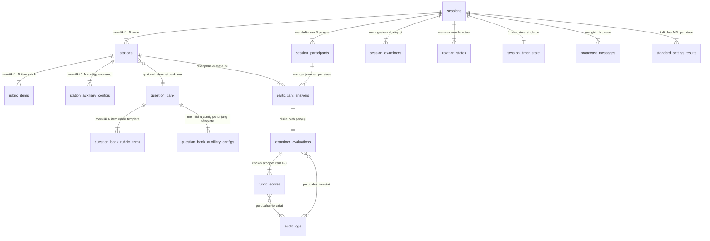

# 🗄️ DATABASE-OSCE.md — Dokumentasi Resmi Schema `osce` (Supabase PostgreSQL)

**Praxis by MedSkill Indonesia** — *Single Source of Truth*
*Terakhir diperbarui: 7 Agustus 2026*

---

## 📑 Daftar Isi

1. [Arsitektur & Filosofi Schema](#1-arsitektur--filosofi-schema)
2. [Entity Relationship Diagram (ERD)](#2-entity-relationship-diagram-erd)
3. [Enum Types](#3-enum-types)
4. [Katalog Tabel](#4-katalog-tabel)
   - [4.1 osce.sessions](#41-oscesessions)
   - [4.2 osce.stations](#42-oscestations)
   - [4.3 osce.rubric_items](#43-oscerubric_items)
   - [4.4 osce.auxiliary_exam_catalog](#44-osceauxiliary_exam_catalog)
   - [4.5 osce.station_auxiliary_configs](#45-oscestation_auxiliary_configs)
   - [4.6 osce.question_bank](#46-oscequestion_bank)
   - [4.7 osce.question_bank_rubric_items](#47-oscequestion_bank_rubric_items)
   - [4.8 osce.question_bank_auxiliary_configs](#48-oscequestion_bank_auxiliary_configs)
   - [4.9 osce.session_participants](#49-oscesession_participants)
   - [4.10 osce.session_examiners](#410-oscesession_examiners)
   - [4.11 osce.rotation_states](#411-oscerotation_states)
   - [4.12 osce.session_timer_state](#412-oscesession_timer_state)
   - [4.13 osce.participant_answers](#413-osceparticipant_answers)
   - [4.14 osce.examiner_evaluations](#414-osceexaminer_evaluations)
   - [4.15 osce.rubric_scores](#415-oscerubric_scores)
   - [4.16 osce.audit_logs](#416-osceaudit_logs)
   - [4.17 osce.broadcast_messages](#417-oscebroadcast_messages)
   - [4.18 osce.standard_setting_results](#418-oscestandard_setting_results)
   - [4.19 osce.station_kiosk_tokens](#419-oscestation_kiosk_tokens)
5. [Materialized Views](#5-materialized-views)
6. [Functions & Triggers](#6-functions--triggers)
7. [Indexes](#7-indexes)
8. [Row Level Security (RLS)](#8-row-level-security-rls)
9. [Supabase Realtime](#9-supabase-realtime)
10. [Migrasi dari Schema Lama](#10-migrasi-dari-schema-lama)
11. [Cara Regenerate TypeScript Types](#11-cara-regenerate-typescript-types)

---

## 1. Arsitektur & Filosofi Schema

Seluruh data operasional ujian OSCE diisolasi dalam **custom PostgreSQL schema** bernama `osce`, terpisah dari schema `public` yang berisi data LMS, Auth, E-Commerce, dan Mannequin Rental.

```
┌─────────────────────────────────────────────────────────────────────────┐
│                         SUPABASE POSTGRESQL                            │
├──────────────────────────────┬──────────────────────────────────────────┤
│       schema: public         │              schema: osce                │
│  (Auth, Profiles, LMS, Shop) │   (Engine Simulasi & Live OSCE)          │
│                              │                                          │
│  • auth.users                │  ┌─ KONFIGURASI ──────────────────────┐  │
│  • profiles                  │  │ sessions              (Sesi Ujian) │  │
│  • mentors                   │  │ stations              (Pos Stase)  │  │
│  • simulation_sets           │  │ rubric_items           (Rubrik)    │  │
│  • mannequins                │  │ auxiliary_exam_catalog  (Katalog)  │  │
│  • orders / bookings         │  │ station_auxiliary_configs (Config) │  │
│                              │  │ question_bank           (Bank)    │  │
│                              │  │ question_bank_rubric_items         │  │
│                              │  │ question_bank_auxiliary_configs     │  │
│                              │  └────────────────────────────────────┘  │
│                              │                                          │
│                              │  ┌─ OPERASIONAL LIVE ─────────────────┐  │
│                              │  │ session_participants   (Peserta)   │  │
│                              │  │ session_examiners      (Penguji)   │  │
│                              │  │ rotation_states        (Rotasi)    │  │
│                              │  │ session_timer_state    (Timer)     │  │
│                              │  │ participant_answers    (Jawaban)   │  │
│                              │  │ examiner_evaluations   (Evaluasi)  │  │
│                              │  │ rubric_scores          (Skor)      │  │
│                              │  │ broadcast_messages     (Broadcast) │  │
│                              │  └────────────────────────────────────┘  │
│                              │                                          │
│                              │  ┌─ ANALISIS & AUDIT ─────────────────┐  │
│                              │  │ audit_logs             (Imutabel)  │  │
│                              │  │ standard_setting_results (NBL)     │  │
│                              │  │ session_results_summary (M.View)   │  │
│                              │  │ station_kiosk_tokens   (Opsional)  │  │
│                              │  └────────────────────────────────────┘  │
└──────────────────────────────┴──────────────────────────────────────────┘
```

### Prinsip Desain

| Prinsip | Penjelasan |
|:---|:---|
| **Schema Isolation** | Data OSCE 100% terpisah dari data publik. `DROP SCHEMA osce CASCADE` tidak mempengaruhi LMS/Auth. |
| **Attempt-Centric** | Setiap jawaban & skor terikat ke `session_id` + `station_id` + `participant_id` + `rotation_round`. Data historis tidak pernah tertimpa. |
| **Immutable Audit** | Setiap perubahan evaluasi/skor tercatat di `audit_logs`. Tidak ada UPDATE/DELETE audit. |
| **Future Timestamp Timer** | Timer disinkronkan menggunakan `target_end_time` (bukan countdown). Kebal latensi jaringan. |
| **Denormalization-Where-Needed** | `station_auxiliary_configs.name` di-denormalize dari catalog untuk performa query realtime. |

---

## 2. Entity Relationship Diagram (ERD)



---

## 3. Enum Types

Schema `osce` mendefinisikan **5 custom enum types**:

### `osce.session_status`
Status lifecycle sesi ujian.

| Value | Deskripsi |
|:---|:---|
| `draft` | Sesi baru dibuat, belum dipublish |
| `scheduled` | Sesi terjadwal, peserta bisa mendaftar |
| `ongoing` | Sesi sedang berlangsung (timer aktif) |
| `paused` | Sesi dijeda oleh admin |
| `completed` | Seluruh rotasi selesai, menunggu review |
| `archived` | Sesi diarsipkan setelah publish hasil |

### `osce.grs_rating`
Global Rating Scale — penilaian holistik penguji.

| Value | Deskripsi |
|:---|:---|
| `UNSATISFACTORY` | Tidak Lulus — performa di bawah standar |
| `BORDERLINE` | Borderline — ragu antara lulus/tidak (untuk kalkulasi NBL) |
| `SATISFACTORY` | Lulus — memenuhi standar kompetensi |
| `SUPERIOR` | Superior — performa sangat mengesankan |

### `osce.rotation_status`
Status ronde rotasi.

| Value | Deskripsi |
|:---|:---|
| `scheduled` | Ronde belum dimulai |
| `running` | Ronde sedang berjalan |
| `paused` | Ronde dijeda |
| `transition` | Fase transisi perpindahan stase |
| `completed` | Ronde selesai |

### `osce.competency_area`
8 area kompetensi standar SKDI nasional.

| Value | Deskripsi | Contoh Bobot |
|:---|:---|:---:|
| `ANAMNESIS` | Anamnesis & riwayat penyakit | 4 |
| `PHYSICAL_EXAM` | Pemeriksaan fisik | 3 |
| `AUXILIARY_EXAM` | Pemeriksaan penunjang | 3 |
| `DIAGNOSIS_DDX` | Diagnosis kerja & banding | 3 |
| `PHARMACOTHERAPY` | Tatalaksana farmakoterapi | 3 |
| `NON_PHARMACOTHERAPY` | Tatalaksana non-farmakoterapi | 3 |
| `COMMUNICATION` | Komunikasi & edukasi pasien | 2 |
| `PROFESSIONALISM` | Perilaku profesional | 2 |

### `osce.exam_type`
Tipe ujian dalam sesi.

| Value | Deskripsi |
|:---|:---|
| `regular` | Ujian utama reguler |
| `remedial` | Ujian remedial / perbaikan |
| `try_out` | Try-out / latihan |

---

## 4. Katalog Tabel

### 4.1 `osce.sessions`
**Konfigurasi utama sesi ujian OSCE** — timer, gelombang, aturan otomatisasi.

| Kolom | Tipe | Nullable | Default | Keterangan |
|:---|:---|:---:|:---|:---|
| `id` | UUID PK | ❌ | `gen_random_uuid()` | Primary key |
| `title` | TEXT | ❌ | — | Judul sesi (*"OSCE Nasional Gel. I 2026"*) |
| `description` | TEXT | ✅ | — | Deskripsi umum |
| `location_building` | TEXT | ✅ | — | Gedung & lantai lokasi |
| `session_date` | DATE | ❌ | — | Tanggal pelaksanaan |
| `start_time` | TIME | ❌ | — | Jam mulai |
| `end_time` | TIME | ✅ | — | Jam selesai (calculated) |
| `status` | `session_status` | ❌ | `'draft'` | Status lifecycle |
| `exam_type` | `exam_type` | ❌ | `'regular'` | Tipe ujian |
| `track_label` | TEXT | ✅ | `'A'` | Label multi-track paralel |
| `total_stations` | INT | ❌ | `8` | Total slot sirkuit (ujian + istirahat) |
| `total_rounds` | INT | ❌ | `8` | Total ronde rotasi |
| `max_participants_per_wave` | INT | ❌ | `8` | Kapasitas per gelombang |
| `station_duration_minutes` | INT | ❌ | `12` | Durasi stase ujian (menit) |
| `break_duration_minutes` | INT | ❌ | `12` | Durasi stase istirahat (menit) |
| `transition_duration_minutes` | INT | ❌ | `2` | Durasi transisi rotasi (menit) |
| `reading_duration_minutes` | INT | ❌ | `1` | Durasi reading time (menit) |
| `single_live_session` | BOOLEAN | ✅ | `TRUE` | Kunci 1 sesi aktif bersamaan |
| `auto_rolling_timer` | BOOLEAN | ✅ | `TRUE` | Auto perpindahan rotasi |
| `auto_lock_answer` | BOOLEAN | ✅ | `TRUE` | Kunci jawaban otomatis saat bel |
| `late_tolerance_minutes` | INT | ✅ | `5` | Toleransi terlambat (menit) |
| `current_wave` | INT | ✅ | `1` | Gelombang aktif (realtime) |
| `current_round` | INT | ✅ | `1` | Ronde aktif (realtime) |
| `started_at` | TIMESTAMPTZ | ✅ | — | Waktu mulai aktual |
| `finished_at` | TIMESTAMPTZ | ✅ | — | Waktu selesai aktual |
| `created_by` | UUID FK | ✅ | — | → `public.profiles(id)` |
| `created_at` | TIMESTAMPTZ | ✅ | `NOW()` | |
| `updated_at` | TIMESTAMPTZ | ✅ | `NOW()` | |

**Relasi**: Parent utama dari seluruh tabel operasional.

---

### 4.2 `osce.stations`
**Pos ruangan / slot stase sirkuit** — ujian aktif atau istirahat.

| Kolom | Tipe | Nullable | Default | Keterangan |
|:---|:---|:---:|:---|:---|
| `id` | UUID PK | ❌ | `gen_random_uuid()` | |
| `session_id` | UUID FK | ❌ | — | → `osce.sessions(id)` CASCADE |
| `station_number` | INT | ❌ | — | Urutan fisik pos (1, 2, 3...) |
| `is_break` | BOOLEAN | ✅ | `FALSE` | `true` = istirahat, `false` = ujian |
| `title` | TEXT | ❌ | — | Auto: *"Stase 1"*, *"Stase Istirahat 1"* |
| `case_title` | TEXT | ✅ | — | Judul kasus medis |
| `system_organ` | TEXT | ✅ | — | Sistem organ (*Kardiovaskular*, dll.) |
| `skdi_level` | TEXT | ✅ | — | Level SKDI (*4A*, *3B*) |
| `scenario` | TEXT | ✅ | — | Skenario klinis lengkap |
| `participant_instructions` | TEXT | ✅ | — | Instruksi peserta |
| `examiner_instructions` | TEXT | ✅ | — | Instruksi penguji |
| `answer_key_diagnosis` | TEXT | ✅ | — | 🔑 Kunci jawaban WDx + DDx |
| `answer_key_prescription` | TEXT | ✅ | — | 🔑 Kunci jawaban resep obat |
| `question_bank_id` | UUID FK | ✅ | — | → `osce.question_bank(id)` SET NULL |
| `room_number` | TEXT | ✅ | — | Nomor ruangan fisik |
| `sort_order` | INT | ✅ | `0` | Urutan drag & drop |
| `created_at` | TIMESTAMPTZ | ✅ | `NOW()` | |
| `updated_at` | TIMESTAMPTZ | ✅ | `NOW()` | |

**Catatan**: Kolom `answer_key_diagnosis` dan `answer_key_prescription` berisi **kunci jawaban baku (Gold Standard)** yang ditampilkan di dashboard penguji sebagai acuan pemberian skor.

---

### 4.3 `osce.rubric_items`
**Item rubrik penilaian per stase** — skor 0-3 dengan bobot & deskriptor.

| Kolom | Tipe | Nullable | Default | Keterangan |
|:---|:---|:---:|:---|:---|
| `id` | UUID PK | ❌ | `gen_random_uuid()` | |
| `station_id` | UUID FK | ❌ | — | → `osce.stations(id)` CASCADE |
| `question_number` | INT | ❌ | — | Nomor urut indikator |
| `question` | TEXT | ❌ | — | Indikator penilaian |
| `answer_key` | TEXT | ❌ | — | Pedoman penskoran (Level 3) |
| `max_points` | INT | ✅ | `3` | Poin maksimal |
| `weight` | NUMERIC | ✅ | `1.0` | Bobot kompetensi |
| `competency_area` | `competency_area` | ✅ | — | Area kompetensi SKDI |
| `descriptors` | JSONB | ✅ | `{score_0:"",..}` | Deskriptor kinerja 4-level |
| `sort_order` | INT | ✅ | `0` | |
| `created_at` | TIMESTAMPTZ | ✅ | `NOW()` | |

**Format `descriptors` JSONB**:
```json
{
  "score_0": "Tidak dilakukan / salah total",
  "score_1": "Minimal / sebagian besar tidak mengarah",
  "score_2": "Cukup / sebagian besar tepat",
  "score_3": "Sempurna / lengkap & tepat"
}
```

**Rumus Skor**: `Skor Item = score_given (0-3) × weight`

---

### 4.4 `osce.auxiliary_exam_catalog`
**Master katalog semua item pemeriksaan penunjang** yang tersedia.

| Kolom | Tipe | Nullable | Default | Keterangan |
|:---|:---|:---:|:---|:---|
| `id` | TEXT PK | ❌ | — | ID unik: `"ekg-01"`, `"rad-thorax-ap"` |
| `name` | TEXT | ❌ | — | Nama penunjang |
| `category` | TEXT | ❌ | — | Kategori: `EKG`, `RADIOLOGI`, `LABORATORIUM` |
| `description` | TEXT | ✅ | — | Deskripsi singkat |
| `sort_order` | INT | ✅ | `0` | |
| `created_at` | TIMESTAMPTZ | ✅ | `NOW()` | |

---

### 4.5 `osce.station_auxiliary_configs`
**Kunci jawaban berkas penunjang per stase** — gambar + laporan teks.

| Kolom | Tipe | Nullable | Default | Keterangan |
|:---|:---|:---:|:---|:---|
| `id` | UUID PK | ❌ | `gen_random_uuid()` | |
| `station_id` | UUID FK | ❌ | — | → `osce.stations(id)` CASCADE |
| `item_id` | TEXT | ❌ | — | ID dari katalog |
| `name` | TEXT | ❌ | — | Nama penunjang (denormalized) |
| `category` | TEXT | ❌ | — | Kategori (denormalized) |
| `image_url` | TEXT | ✅ | — | Direct URL atau signed URL |
| `image_storage_path` | TEXT | ✅ | — | Path di Supabase Storage bucket |
| `report_text` | TEXT | ✅ | — | Laporan ekspertise medis teks |
| `created_at` | TIMESTAMPTZ | ✅ | `NOW()` | |

**Logika Penunjang**:
- Peserta mencentang item → sistem cek apakah `item_id` ada di `station_auxiliary_configs`
- ✅ Ada & image/report tersedia → Tampilkan hasil penunjang
- ❌ Tidak ada di config → Tampilkan *"Tidak ada data / Pemeriksaan tidak diindikasikan"*

---

### 4.6 `osce.question_bank`
**Master bank soal medis** — template siap pakai untuk 1-click auto-fill ke stase.

| Kolom | Tipe | Nullable | Default | Keterangan |
|:---|:---|:---:|:---|:---|
| `id` | UUID PK | ❌ | `gen_random_uuid()` | |
| `title` | TEXT | ❌ | — | Judul paket soal |
| `system_organ` | TEXT | ❌ | — | Sistem organ |
| `skdi_level` | TEXT | ❌ | — | Level SKDI |
| `case_title` | TEXT | ❌ | — | Topik kasus klinis |
| `scenario` | TEXT | ❌ | — | Skenario lengkap |
| `participant_instructions` | TEXT | ❌ | — | Instruksi peserta |
| `examiner_instructions` | TEXT | ❌ | — | Instruksi penguji |
| `answer_key_diagnosis` | TEXT | ✅ | — | Kunci WDx + DDx |
| `answer_key_prescription` | TEXT | ✅ | — | Kunci resep |
| `checklist_items_json` | JSONB | ✅ | `[]` | Legacy JSONB (deprecated) |
| `auxiliary_configs_json` | JSONB | ✅ | `[]` | Legacy JSONB (deprecated) |
| `created_by` | UUID FK | ✅ | — | → `public.profiles(id)` |
| `created_at` | TIMESTAMPTZ | ✅ | `NOW()` | |
| `updated_at` | TIMESTAMPTZ | ✅ | `NOW()` | |

---

### 4.7 `osce.question_bank_rubric_items`
**Sub-tabel rubrik per soal bank** — normalisasi dari `checklist_items_json`.

Kolom identik dengan `osce.rubric_items`, kecuali FK ke `question_bank_id` alih-alih `station_id`.

---

### 4.8 `osce.question_bank_auxiliary_configs`
**Sub-tabel penunjang per soal bank** — normalisasi dari `auxiliary_configs_json`.

| Kolom | Tipe | Keterangan |
|:---|:---|:---|
| `id` | UUID PK | |
| `question_bank_id` | UUID FK | → `osce.question_bank(id)` CASCADE |
| `item_id` | TEXT | ID dari katalog |
| `name` | TEXT | Nama penunjang |
| `category` | TEXT | Kategori |
| `image_storage_path` | TEXT | Path Supabase Storage |
| `report_text` | TEXT | Laporan ekspertise |
| `sort_order` | INT | |

---

### 4.9 `osce.session_participants`
**Registrasi peserta per sesi** — gelombang & stase awal.

| Kolom | Tipe | Nullable | Default | Keterangan |
|:---|:---|:---:|:---|:---|
| `id` | UUID PK | ❌ | `gen_random_uuid()` | |
| `session_id` | UUID FK | ❌ | — | → `osce.sessions(id)` CASCADE |
| `user_id` | UUID FK | ❌ | — | → `public.profiles(id)` CASCADE |
| `nim` | TEXT | ❌ | — | Nomor Induk Mahasiswa |
| `full_name` | TEXT | ❌ | — | Nama lengkap |
| `wave_number` | INT | ✅ | `1` | Gelombang ujian |
| `starting_station_number` | INT | ❌ | — | Stase awal mulai sirkuit |
| `status` | TEXT | ✅ | `'registered'` | `registered`, `active`, `completed`, `absent` |
| `created_at` | TIMESTAMPTZ | ✅ | `NOW()` | |

**Constraint**: `UNIQUE(session_id, user_id)` — 1 peserta max 1 kali per sesi.

---

### 4.10 `osce.session_examiners`
**Penugasan dokter penguji per sesi & stase**.

| Kolom | Tipe | Nullable | Default | Keterangan |
|:---|:---|:---:|:---|:---|
| `id` | UUID PK | ❌ | `gen_random_uuid()` | |
| `session_id` | UUID FK | ❌ | — | → `osce.sessions(id)` CASCADE |
| `user_id` | UUID FK | ❌ | — | → `public.profiles(id)` CASCADE |
| `full_name` | TEXT | ❌ | — | Nama + gelar |
| `specialty` | TEXT | ✅ | — | Spesialisasi (*Sp.JP*, *Sp.PD*) |
| `assigned_station_number` | INT | ❌ | — | Nomor stase penugasan |
| `status` | TEXT | ✅ | `'active'` | `active`, `offline` |
| `created_at` | TIMESTAMPTZ | ✅ | `NOW()` | |

**Constraint**: `UNIQUE(session_id, user_id)` — 1 penguji = 1 stase per sesi.

---

### 4.11 `osce.rotation_states`
**State matriks rotasi sirkuit live** — per gelombang & ronde.

| Kolom | Tipe | Nullable | Default | Keterangan |
|:---|:---|:---:|:---|:---|
| `id` | UUID PK | ❌ | `gen_random_uuid()` | |
| `session_id` | UUID FK | ❌ | — | → `osce.sessions(id)` CASCADE |
| `wave_number` | INT | ❌ | `1` | Gelombang |
| `round_number` | INT | ❌ | `1` | Ronde |
| `status` | `rotation_status` | ✅ | `'scheduled'` | |
| `time_remaining_seconds` | INT | ❌ | `720` | 12 menit default |
| `started_at` | TIMESTAMPTZ | ✅ | — | |
| `paused_at` | TIMESTAMPTZ | ✅ | — | |
| `created_at` | TIMESTAMPTZ | ✅ | `NOW()` | |

---

### 4.12 `osce.session_timer_state`
**Server-side timer — Future Timestamp Pattern**.

| Kolom | Tipe | Nullable | Default | Keterangan |
|:---|:---|:---:|:---|:---|
| `id` | UUID PK | ❌ | `gen_random_uuid()` | |
| `session_id` | UUID FK | ❌ | — | → `osce.sessions(id)` CASCADE |
| `wave_number` | INT | ❌ | `1` | |
| `round_number` | INT | ❌ | `1` | |
| `phase` | TEXT | ❌ | `'idle'` | `idle`, `reading`, `action`, `transition`, `break`, `paused` |
| `target_end_time` | TIMESTAMPTZ | ✅ | — | ⏱️ Kapan phase berakhir (UTC) |
| `paused_remaining_ms` | INT | ✅ | — | Sisa ms jika paused |
| `bell_sequence` | INT | ✅ | `0` | Counter bel |
| `updated_by` | UUID FK | ✅ | — | → `public.profiles(id)` |
| `updated_at` | TIMESTAMPTZ | ✅ | `NOW()` | |

**Constraint**: `UNIQUE(session_id)` — **Singleton**: 1 sesi = 1 timer state.

**Cara kerja timer**:
```
Admin klik [Start] → Edge Function:
  UPDATE session_timer_state
  SET phase = 'reading',
      target_end_time = NOW() + interval '1 minute'

Client menghitung:
  remaining = target_end_time - Date.now()
  // Kebal latensi, kebal tab throttling
```

---

### 4.13 `osce.participant_answers`
**Lembar jawaban peserta per stase** — flow 4-halaman berurutan.

| Kolom | Tipe | Nullable | Default | Keterangan |
|:---|:---|:---:|:---|:---|
| `id` | UUID PK | ❌ | `gen_random_uuid()` | |
| `session_id` | UUID FK | ❌ | — | → `osce.sessions(id)` CASCADE |
| `station_id` | UUID FK | ❌ | — | → `osce.stations(id)` CASCADE |
| `participant_id` | UUID FK | ❌ | — | → `public.profiles(id)` CASCADE |
| `rotation_round` | INT | ❌ | — | Ronde rotasi |
| `current_step` | TEXT | ✅ | `'PAGE_1_SCENARIO'` | Posisi halaman aktif |
| `anamnesis_notes` | TEXT | ✅ | — | Catatan anamnesis |
| `physical_exam_notes` | TEXT | ✅ | — | Catatan pemeriksaan fisik |
| `requested_auxiliary_json` | JSONB | ✅ | `[]` | Array ID penunjang diminta |
| `working_diagnosis` | TEXT | ✅ | — | 🩺 Diagnosis Kerja (WDx) |
| `differential_dx_1` | TEXT | ✅ | — | DDx 1 |
| `differential_dx_2` | TEXT | ✅ | — | DDx 2 |
| `differential_dx_3` | TEXT | ✅ | — | DDx 3 |
| `prescription_text` | TEXT | ✅ | — | 💊 Resep obat (long text) |
| `therapy_notes` | TEXT | ✅ | — | Tatalaksana non-farmako |
| `education_notes` | TEXT | ✅ | — | Catatan edukasi pasien |
| `diagnosis_notes` | TEXT | ✅ | — | Legacy blob (deprecated) |
| `status` | TEXT | ✅ | `'in_progress'` | `in_progress`, `submitted`, `locked` |
| `started_at` | TIMESTAMPTZ | ✅ | `NOW()` | |
| `submitted_at` | TIMESTAMPTZ | ✅ | — | |

**Constraint**: `UNIQUE(session_id, station_id, participant_id, rotation_round)`

**Flow `current_step`**:
```
PAGE_1_SCENARIO → PAGE_2_ANAMNESIS_PHYSICAL → PAGE_3_AUXILIARY_EXAM → PAGE_4_DIAGNOSIS_THERAPY → SUBMITTED
```

---

### 4.14 `osce.examiner_evaluations`
**Evaluasi penguji per peserta per stase** — GRS, feedback, skor terbobot.

| Kolom | Tipe | Nullable | Default | Keterangan |
|:---|:---|:---:|:---|:---|
| `id` | UUID PK | ❌ | `gen_random_uuid()` | |
| `session_id` | UUID FK | ❌ | — | CASCADE |
| `station_id` | UUID FK | ❌ | — | CASCADE |
| `participant_id` | UUID FK | ❌ | — | CASCADE |
| `examiner_id` | UUID FK | ❌ | — | CASCADE |
| `rotation_round` | INT | ❌ | — | |
| `grs_rating` | `grs_rating` | ❌ | `'SATISFACTORY'` | Penilaian holistik |
| `examiner_notes` | TEXT | ✅ | — | Feedback kualitatif |
| `total_points_earned` | NUMERIC | ❌ | `0` | Σ(Poin × Bobot) |
| `max_points_possible` | NUMERIC | ❌ | `0` | Σ(3 × Bobot) |
| `final_score_percentage` | NUMERIC | ❌ | `0` | (earned/possible) × 100 |
| `is_locked` | BOOLEAN | ✅ | `FALSE` | Dikunci setelah submit final |
| `submitted_at` | TIMESTAMPTZ | ✅ | `NOW()` | |

**Constraint**: `UNIQUE(session_id, station_id, participant_id, examiner_id, rotation_round)`

---

### 4.15 `osce.rubric_scores`
**Nilai detail per item rubrik** (0, 1, 2, atau 3).

| Kolom | Tipe | Nullable | Default | Keterangan |
|:---|:---|:---:|:---|:---|
| `id` | UUID PK | ❌ | `gen_random_uuid()` | |
| `evaluation_id` | UUID FK | ❌ | — | → `examiner_evaluations(id)` CASCADE |
| `rubric_item_id` | UUID FK | ❌ | — | → `rubric_items(id)` CASCADE |
| `score_given` | INT | ❌ | `0` | Skor 0-3 |
| `feedback` | TEXT | ✅ | — | Feedback per item |
| `scored_at` | TIMESTAMPTZ | ✅ | `NOW()` | Kapan skor di-input |

**Constraint**: `UNIQUE(evaluation_id, rubric_item_id)`

---

### 4.16 `osce.audit_logs`
**Audit trail imutabel** — INSERT ONLY, tidak boleh UPDATE/DELETE.

| Kolom | Tipe | Nullable | Default | Keterangan |
|:---|:---|:---:|:---|:---|
| `id` | UUID PK | ❌ | `gen_random_uuid()` | |
| `table_name` | TEXT | ❌ | — | Schema-qualified: `osce.examiner_evaluations` |
| `record_id` | UUID | ❌ | — | PK record yang diubah |
| `action` | TEXT | ❌ | — | `INSERT`, `UPDATE`, `DELETE` |
| `old_data` | JSONB | ✅ | — | Snapshot sebelum |
| `new_data` | JSONB | ✅ | — | Snapshot sesudah |
| `changed_by` | UUID | ✅ | — | auth.uid() |
| `ip_address` | INET | ✅ | — | |
| `user_agent` | TEXT | ✅ | — | |
| `created_at` | TIMESTAMPTZ | ✅ | `NOW()` | |

---

### 4.17 `osce.broadcast_messages`
**Pesan broadcast admin** ke layar peserta/penguji.

| Kolom | Tipe | Nullable | Default | Keterangan |
|:---|:---|:---:|:---|:---|
| `id` | UUID PK | ❌ | `gen_random_uuid()` | |
| `session_id` | UUID FK | ❌ | — | CASCADE |
| `message` | TEXT | ❌ | — | Isi pesan |
| `priority` | TEXT | ✅ | `'info'` | `info`, `warning`, `urgent` |
| `target_role` | TEXT | ✅ | `'all'` | `all`, `participants`, `examiners` |
| `sent_by` | UUID FK | ✅ | — | → `public.profiles(id)` |
| `created_at` | TIMESTAMPTZ | ✅ | `NOW()` | |

---

### 4.18 `osce.standard_setting_results`
**Hasil kalkulasi Nilai Batas Lulus (NBL)** — Borderline Regression Method.

| Kolom | Tipe | Nullable | Default | Keterangan |
|:---|:---|:---:|:---|:---|
| `id` | UUID PK | ❌ | `gen_random_uuid()` | |
| `session_id` | UUID FK | ❌ | — | CASCADE |
| `station_id` | UUID FK | ❌ | — | CASCADE |
| `method` | TEXT | ✅ | `'BORDERLINE_REGRESSION'` | Metode standard setting |
| `cut_score_percentage` | NUMERIC | ❌ | — | NBL hasil kalkulasi |
| `regression_intercept` | NUMERIC | ✅ | — | BRM intercept |
| `regression_slope` | NUMERIC | ✅ | — | BRM slope |
| `r_squared` | NUMERIC | ✅ | — | R² goodness of fit |
| `n_examinees` | INT | ✅ | — | Jumlah peserta |
| `calculated_at` | TIMESTAMPTZ | ✅ | `NOW()` | |
| `calculated_by` | UUID FK | ✅ | — | |

**Constraint**: `UNIQUE(session_id, station_id, method)`

---

### 4.19 `osce.station_kiosk_tokens`
**(Opsional)** Token autentikasi kiosk mode per stase.

| Kolom | Tipe | Nullable | Default | Keterangan |
|:---|:---|:---:|:---|:---|
| `id` | UUID PK | ❌ | `gen_random_uuid()` | |
| `session_id` | UUID FK | ❌ | — | CASCADE |
| `station_id` | UUID FK | ❌ | — | CASCADE |
| `token` | TEXT | ❌ | — | Token QR unik |
| `is_active` | BOOLEAN | ✅ | `TRUE` | |
| `created_at` | TIMESTAMPTZ | ✅ | `NOW()` | |
| `expires_at` | TIMESTAMPTZ | ✅ | — | Auto-expire |

---

## 5. Materialized Views

### `osce.session_results_summary`
Rekapitulasi nilai peserta per sesi — digunakan oleh `ReportsPage.jsx`.

| Kolom Output | Deskripsi |
|:---|:---|
| `session_id` | ID sesi |
| `participant_id` | ID peserta |
| `participant_name` | Nama lengkap |
| `nim` | NIM |
| `wave_number` | Gelombang |
| `stations_completed` | Jumlah stase selesai |
| `avg_score_percentage` | Rata-rata persentase skor |
| `total_earned` | Total poin earned |
| `total_possible` | Total poin possible |
| `grs_ratings` | Array GRS dari semua stase |
| `fail_count` | Jumlah UNSATISFACTORY |
| `borderline_count` | Jumlah BORDERLINE |
| `pass_count` | Jumlah SATISFACTORY |
| `superior_count` | Jumlah SUPERIOR |

**Refresh**: `SELECT osce.fn_refresh_results_summary();` — panggil saat admin menekan "Finalize Results".

---

## 6. Functions & Triggers

### Functions

| Function | Tipe | Deskripsi |
|:---|:---|:---|
| `osce.fn_is_admin()` | BOOLEAN | Cek apakah user aktif adalah admin |
| `osce.fn_get_user_role()` | TEXT | Ambil role user dari `public.profiles` |
| `osce.fn_audit_trigger()` | TRIGGER | Generic: catat perubahan ke `audit_logs` |
| `osce.fn_refresh_results_summary()` | VOID | Refresh materialized view rekap nilai |

### Triggers

| Trigger | Tabel | Event | Fungsi |
|:---|:---|:---|:---|
| `audit_examiner_evaluations` | `examiner_evaluations` | INSERT/UPDATE/DELETE | `fn_audit_trigger` |
| `audit_rubric_scores` | `rubric_scores` | INSERT/UPDATE/DELETE | `fn_audit_trigger` |
| `audit_sessions_status` | `sessions` | UPDATE (status berubah) | `fn_audit_trigger` |
| `audit_participant_answers` | `participant_answers` | UPDATE (status berubah) | `fn_audit_trigger` |

---

## 7. Indexes

Total **18+ indexes** untuk optimasi query realtime:

| Index | Tabel | Kolom | Tujuan |
|:---|:---|:---|:---|
| `idx_stations_session` | stations | `(session_id, station_number)` | Lookup stase per sesi |
| `idx_answers_session_station_participant` | participant_answers | `(session_id, station_id, participant_id)` | **Hot path** realtime |
| `idx_evaluations_session_station_participant` | examiner_evaluations | `(session_id, station_id, participant_id)` | Lookup evaluasi |
| `idx_evaluations_session_locked` | examiner_evaluations | `(session_id, is_locked)` | Filter evaluasi terkunci |
| `idx_rotation_session_wave_round` | rotation_states | `(session_id, wave_number, round_number)` | Matriks rotasi |
| `idx_sessions_active` | sessions | `(id) WHERE status IN (ongoing, paused)` | **Partial index** dashboard |
| `idx_qbank_organ_level` | question_bank | `(system_organ, skdi_level)` | Pencarian bank soal |
| `idx_audit_table_record` | audit_logs | `(table_name, record_id)` | Query audit |

*(Lihat [014_indexes.sql](migration/014_indexes.sql) untuk daftar lengkap)*

---

## 8. Row Level Security (RLS)

Seluruh tabel memiliki **RLS aktif** dengan kebijakan **deny-by-default**.

### Matriks Akses

| Tabel | Admin | Examiner | Participant | Anon |
|:---|:---:|:---:|:---:|:---:|
| `sessions` | CRUD | SELECT | SELECT | ❌ |
| `stations` | CRUD | SELECT (assigned) | SELECT (enrolled) | ❌ |
| `rubric_items` | CRUD | SELECT (assigned station) | ❌ | ❌ |
| `auxiliary_exam_catalog` | CRUD | SELECT | SELECT | ❌ |
| `station_auxiliary_configs` | CRUD | SELECT (session) | SELECT (session) | ❌ |
| `question_bank` | CRUD | ❌ | ❌ | ❌ |
| `session_participants` | CRUD | SELECT (session) | SELECT (own) | ❌ |
| `session_examiners` | CRUD | SELECT (own) | ❌ | ❌ |
| `participant_answers` | SELECT | SELECT (assigned station) | INSERT/UPDATE (own, unlocked) | ❌ |
| `examiner_evaluations` | SELECT | INSERT/UPDATE (own, unlocked) | ❌ | ❌ |
| `rubric_scores` | SELECT | CRUD (own eval, unlocked) | ❌ | ❌ |
| `rotation_states` | CRUD | SELECT | SELECT | ❌ |
| `session_timer_state` | CRUD | SELECT | SELECT | ❌ |
| `broadcast_messages` | CRUD | SELECT | SELECT | ❌ |
| `audit_logs` | SELECT ONLY | ❌ | ❌ | ❌ |
| `standard_setting_results` | CRUD | ❌ | ❌ | ❌ |

*(Lihat [015_rls_policies.sql](migration/015_rls_policies.sql) untuk detail kebijakan)*

---

## 9. Supabase Realtime

6 tabel terdaftar ke `supabase_realtime` publication:

| Tabel | Event yang Di-broadcast | Consumer |
|:---|:---|:---|
| `sessions` | Status change (start/stop/pause) | Admin, Peserta, Penguji |
| `session_timer_state` | Phase & target_end_time update | **Semua client** (timer sync) |
| `rotation_states` | Round advance | Admin dashboard |
| `participant_answers` | Step progress (PAGE_1→4) | Penguji (live monitoring) |
| `examiner_evaluations` | Score locked notification | Admin dashboard |
| `broadcast_messages` | New message insert | Peserta & Penguji layar |

---

## 10. Migrasi dari Schema Lama

### Tabel Lama yang Dihapus (`public.osce_*`)

Migration [018_cleanup_legacy_tables.sql](migration/018_cleanup_legacy_tables.sql) menghapus **9 tabel lama**:

| # | Tabel Lama | Pengganti Baru |
|:---:|:---|:---|
| 1 | `public.osce_sessions` | `osce.sessions` |
| 2 | `public.osce_stages` | `osce.stations` |
| 3 | `public.osce_stage_questions` | `osce.rubric_items` + `osce.station_auxiliary_configs` |
| 4 | `public.osce_cases` | `osce.question_bank` |
| 5 | `public.osce_case_sections` | `osce.question_bank_rubric_items` |
| 6 | `public.osce_case_items` | `osce.question_bank_auxiliary_configs` |
| 7 | `public.osce_session_members` | `osce.session_participants` + `osce.session_examiners` |
| 8 | `public.osce_answers` | `osce.participant_answers` |
| 9 | `public.osce_scores` | `osce.examiner_evaluations` + `osce.rubric_scores` |

> ⚠️ **Urutan eksekusi**: Jalankan migrasi `001`→`017` terlebih dahulu, verifikasi, lalu jalankan `018` untuk menghapus tabel lama.

---

## 11. Cara Regenerate TypeScript Types

Setelah menjalankan semua migrasi, perbarui TypeScript types:

```bash
# Login Supabase CLI
npx supabase login

# Generate types dari schema osce
npx supabase gen types typescript \
  --project-id djigelqahkzfmwvpncvr \
  --schema osce \
  > frontend/src/types/osce.types.ts
```

File output akan otomatis menggantikan [osce.types.ts](frontend/src/types/osce.types.ts) yang ada saat ini.

---

*Dokumen ini merupakan referensi tunggal kebenaran (*Single Source of Truth*) untuk schema database `osce` pada platform **MedSkill Praxis OSCE**.* 🚀
