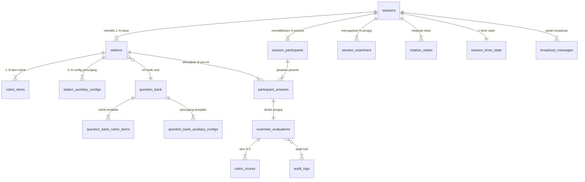

# 🗄️ Master Database & Schema Specification (DATABASE-SPEC.md)
**Praxis by MedSkill Indonesia** — *Single Source of Truth PostgreSQL Schema `osce` (Supabase)*

---

## 📌 1. Filosofi & Arsitektur Database

Seluruh data operasional engine simulasi ujian OSCE diisolasi secara murni ke dalam **PostgreSQL Custom Schema `osce`** di Supabase remote (`Project Ref: djigelqahkzfmwvpncvr`), memisahkan data core LMS (`public`) dengan engine simulasi live.

```
┌─────────────────────────────────────────────────────────────────────────┐
│                         SUPABASE POSTGRESQL                            │
├──────────────────────────────┬──────────────────────────────────────────┤
│       schema: public         │              schema: osce                │
│  (Auth, Profiles, LMS, Shop) │   (Engine Simulasi & Live OSCE)          │
│                              │                                          │
│  • auth.users                │  • osce.sessions                         │
│  • profiles                  │  • osce.stations                         │
│  • mentors                   │  • osce.rubric_items                     │
│  • simulation_sets           │  • osce.auxiliary_exam_catalog            │
│  • mannequins                │  • osce.station_auxiliary_configs       │
│  • orders / bookings         │  • osce.question_bank                    │
│                              │  • osce.question_bank_rubric_items       │
│                              │  • osce.question_bank_auxiliary_configs   │
│                              │  • osce.session_participants             │
│                              │  • osce.session_examiners                │
│                              │  • osce.rotation_states                  │
│                              │  • osce.session_timer_state              │
│                              │  • osce.participant_answers              │
│                              │  • osce.examiner_evaluations             │
│                              │  • osce.rubric_scores                    │
│                              │  • osce.audit_logs                       │
│                              │  • osce.broadcast_messages               │
│                              │  • osce.standard_setting_results         │
│                              │  • osce.station_kiosk_tokens             │
│                              │  • osce.session_results_summary (MView)   │
└──────────────────────────────┴──────────────────────────────────────────┘
```

---

## 🔀 2. Entity Relationship Diagram (ERD)



---

## 📑 3. Katalog 19 Tabel & Materialized View Schema `osce`

| No | Tabel / View | Tipe | Deskripsi Fungsionalitas | Status Kode Frontend |
|:---:|:---|:---:|:---|:---:|
| 1 | `osce.sessions` | Table | Master data sesi ujian, tanggal, durasi stase/break/transisi, status sesi. | ✅ ACTIVE |
| 2 | `osce.stations` | Table | Pos stase sirkuit (stase ujian medis & `is_break`), skenario, kunci baku. | ✅ ACTIVE |
| 3 | `osce.rubric_items` | Table | Item indikator rubrik (skor 0-3), bobot, area kompetensi SKDI, & deskriptor. | ✅ ACTIVE |
| 4 | `osce.auxiliary_exam_catalog` | Table | Katalog master pilihan pemeriksaan penunjang (Radiologi, EKG, Lab). | ✅ ACTIVE |
| 5 | `osce.station_auxiliary_configs` | Table | Berkas penunjang aktif (gambar + laporan ekspertise) per stase. | ✅ ACTIVE |
| 6 | `osce.question_bank` | Table | Master Bank Soal & Kasus Medis terpusat untuk 1-click import. | ✅ ACTIVE |
| 7 | `osce.question_bank_rubric_items` | Table | Indikator rubrik pada master kasus bank soal. | ✅ ACTIVE |
| 8 | `osce.question_bank_auxiliary_configs` | Table | Konfigurasi penunjang pada master kasus bank soal. | ✅ ACTIVE |
| 9 | `osce.session_participants` | Table | Registrasi peserta per sesi, gelombang, & `starting_station_number`. | ✅ ACTIVE |
| 10 | `osce.session_examiners` | Table | Penugasan dokter penguji ke nomor stase penugasan per sesi. | ✅ ACTIVE |
| 11 | `osce.rotation_states` | Table | State perputaran rotasi sirkuit live per gelombang & ronde. | ✅ ACTIVE |
| 12 | `osce.session_timer_state` | Table | Server-side timer Future Timestamp (`target_end_time`, `phase`). | ✅ ACTIVE |
| 13 | `osce.participant_answers` | Table | Progres 4-halaman jawaban peserta (WDx, DDx 1-3, Resep, Penunjang). | ✅ ACTIVE |
| 14 | `osce.examiner_evaluations` | Table | Evaluasi penguji per peserta (GRS rating, feedback, skor terbobot, locked). | ✅ ACTIVE |
| 15 | `osce.rubric_scores` | Table | Rincian poin 0-3 per indikator rubrik yang diberikan penguji. | ✅ ACTIVE |
| 16 | `osce.broadcast_messages` | Table | Pesan pengumuman/darurat real-time dari admin ke peserta & penguji. | ✅ ACTIVE |
| 17 | `osce.audit_logs` | Table | Log audit imutabel (INSERT-ONLY) melacak setiap pengubahan skor. | ⏳ EXPANSION |
| 18 | `osce.standard_setting_results` | Table | Hasil kalkulasi Nilai Batas Lulus (NBL) metode Borderline Regression. | ⏳ EXPANSION |
| 19 | `osce.station_kiosk_tokens` | Table | Token autentikasi QR/Kiosk mode per stase fisik. | ⏳ EXPANSION |
| 20 | `osce.session_results_summary` | MView | Materialized View rekapitulasi nilai & persentase kelulusan sesi. | ⏳ EXPANSION |

---

## ⚡ 4. Realtime Channels & Future Timestamp Timer Pattern

### 4.1 Supabase Realtime Publication
Tabel berikut terdaftar ke `supabase_realtime`:
- `osce.sessions` (status change)
- `osce.session_timer_state` (timer sync)
- `osce.rotation_states` (round advance)
- `osce.participant_answers` (step progress & typing feed)
- `osce.examiner_evaluations` (score locked notification)
- `osce.broadcast_messages` (toast alerts)

### 4.2 Future Timestamp Pattern
Timer tidak mengirim sisa detik setiap detik, melainkan menyimpan `target_end_time` (UTC timestamp). Client menghitung countdown secara lokal:
$$\text{Remaining MS} = \text{target\_end\_time} - \text{Date.now()}$$

---

## 📜 5. Full DDL SQL Schema (`schema_osce.sql`)

```sql
-- =================================================================
-- MEDSKILL SUPABASE SCHEMA OSCE (FULL PRODUCTION DDL)
-- =================================================================

CREATE SCHEMA IF NOT EXISTS osce;

-- ENUM TYPES
DO $$ BEGIN
    CREATE TYPE osce.session_status AS ENUM ('draft', 'scheduled', 'ongoing', 'paused', 'completed', 'archived');
    CREATE TYPE osce.grs_rating AS ENUM ('UNSATISFACTORY', 'BORDERLINE', 'SATISFACTORY', 'SUPERIOR');
    CREATE TYPE osce.rotation_status AS ENUM ('scheduled', 'running', 'paused', 'transition', 'completed');
    CREATE TYPE osce.competency_area AS ENUM ('ANAMNESIS', 'PHYSICAL_EXAM', 'AUXILIARY_EXAM', 'DIAGNOSIS_DDX', 'PHARMACOTHERAPY', 'NON_PHARMACOTHERAPY', 'COMMUNICATION', 'PROFESSIONALISM');
    CREATE TYPE osce.exam_type AS ENUM ('regular', 'remedial', 'try_out');
EXCEPTION WHEN duplicate_object THEN null; END $$;

-- 1. SESSIONS
CREATE TABLE IF NOT EXISTS osce.sessions (
    id UUID PRIMARY KEY DEFAULT gen_random_uuid(),
    title TEXT NOT NULL,
    description TEXT,
    location_building TEXT,
    session_date DATE NOT NULL,
    start_time TIME NOT NULL,
    end_time TIME,
    status osce.session_status NOT NULL DEFAULT 'draft',
    exam_type osce.exam_type NOT NULL DEFAULT 'regular',
    track_label TEXT DEFAULT 'A',
    total_stations INT NOT NULL DEFAULT 8,
    total_rounds INT NOT NULL DEFAULT 8,
    max_participants_per_wave INT NOT NULL DEFAULT 8,
    station_duration_minutes INT NOT NULL DEFAULT 12,
    break_duration_minutes INT NOT NULL DEFAULT 12,
    transition_duration_minutes INT NOT NULL DEFAULT 2,
    reading_duration_minutes INT NOT NULL DEFAULT 1,
    single_live_session BOOLEAN DEFAULT TRUE,
    auto_rolling_timer BOOLEAN DEFAULT TRUE,
    auto_lock_answer BOOLEAN DEFAULT TRUE,
    late_tolerance_minutes INT DEFAULT 5,
    current_wave INT DEFAULT 1,
    current_round INT DEFAULT 1,
    started_at TIMESTAMPTZ,
    finished_at TIMESTAMPTZ,
    created_by UUID REFERENCES public.profiles(id) ON DELETE SET NULL,
    created_at TIMESTAMPTZ DEFAULT NOW(),
    updated_at TIMESTAMPTZ DEFAULT NOW()
);

-- 2. STATIONS
CREATE TABLE IF NOT EXISTS osce.stations (
    id UUID PRIMARY KEY DEFAULT gen_random_uuid(),
    session_id UUID NOT NULL REFERENCES osce.sessions(id) ON DELETE CASCADE,
    station_number INT NOT NULL,
    is_break BOOLEAN DEFAULT FALSE,
    title TEXT NOT NULL,
    case_title TEXT,
    system_organ TEXT,
    skdi_level TEXT,
    scenario TEXT,
    participant_instructions TEXT,
    examiner_instructions TEXT,
    answer_key_diagnosis TEXT,
    answer_key_prescription TEXT,
    question_bank_id UUID,
    room_number TEXT,
    sort_order INT DEFAULT 0,
    created_at TIMESTAMPTZ DEFAULT NOW(),
    updated_at TIMESTAMPTZ DEFAULT NOW()
);

-- 3. RUBRIC ITEMS
CREATE TABLE IF NOT EXISTS osce.rubric_items (
    id UUID PRIMARY KEY DEFAULT gen_random_uuid(),
    station_id UUID NOT NULL REFERENCES osce.stations(id) ON DELETE CASCADE,
    question_number INT NOT NULL,
    question TEXT NOT NULL,
    answer_key TEXT NOT NULL,
    max_points INT DEFAULT 3,
    weight NUMERIC DEFAULT 1.0,
    competency_area osce.competency_area,
    descriptors JSONB DEFAULT '{"score_0":"", "score_1":"", "score_2":"", "score_3":""}'::jsonb,
    sort_order INT DEFAULT 0,
    created_at TIMESTAMPTZ DEFAULT NOW()
);

-- 4. AUXILIARY EXAM CATALOG
CREATE TABLE IF NOT EXISTS osce.auxiliary_exam_catalog (
    id TEXT PRIMARY KEY,
    name TEXT NOT NULL,
    category TEXT NOT NULL,
    description TEXT,
    sort_order INT DEFAULT 0,
    created_at TIMESTAMPTZ DEFAULT NOW()
);

-- 5. STATION AUXILIARY CONFIGS
CREATE TABLE IF NOT EXISTS osce.station_auxiliary_configs (
    id UUID PRIMARY KEY DEFAULT gen_random_uuid(),
    station_id UUID NOT NULL REFERENCES osce.stations(id) ON DELETE CASCADE,
    item_id TEXT NOT NULL,
    name TEXT NOT NULL,
    category TEXT NOT NULL,
    image_url TEXT,
    image_storage_path TEXT,
    report_text TEXT,
    created_at TIMESTAMPTZ DEFAULT NOW()
);

-- 6. QUESTION BANK
CREATE TABLE IF NOT EXISTS osce.question_bank (
    id UUID PRIMARY KEY DEFAULT gen_random_uuid(),
    title TEXT NOT NULL,
    system_organ TEXT NOT NULL,
    skdi_level TEXT NOT NULL,
    case_title TEXT NOT NULL,
    scenario TEXT NOT NULL,
    participant_instructions TEXT NOT NULL,
    examiner_instructions TEXT NOT NULL,
    answer_key_diagnosis TEXT,
    answer_key_prescription TEXT,
    created_by UUID REFERENCES public.profiles(id) ON DELETE SET NULL,
    created_at TIMESTAMPTZ DEFAULT NOW(),
    updated_at TIMESTAMPTZ DEFAULT NOW()
);

-- 7. QUESTION BANK RUBRIC ITEMS
CREATE TABLE IF NOT EXISTS osce.question_bank_rubric_items (
    id UUID PRIMARY KEY DEFAULT gen_random_uuid(),
    question_bank_id UUID NOT NULL REFERENCES osce.question_bank(id) ON DELETE CASCADE,
    question_number INT NOT NULL,
    question TEXT NOT NULL,
    answer_key TEXT NOT NULL,
    max_points INT DEFAULT 3,
    weight NUMERIC DEFAULT 1.0,
    competency_area osce.competency_area,
    descriptors JSONB DEFAULT '{}'::jsonb,
    sort_order INT DEFAULT 0
);

-- 8. QUESTION BANK AUXILIARY CONFIGS
CREATE TABLE IF NOT EXISTS osce.question_bank_auxiliary_configs (
    id UUID PRIMARY KEY DEFAULT gen_random_uuid(),
    question_bank_id UUID NOT NULL REFERENCES osce.question_bank(id) ON DELETE CASCADE,
    item_id TEXT NOT NULL,
    name TEXT NOT NULL,
    category TEXT NOT NULL,
    image_storage_path TEXT,
    report_text TEXT,
    sort_order INT DEFAULT 0
);

-- 9. SESSION PARTICIPANTS
CREATE TABLE IF NOT EXISTS osce.session_participants (
    id UUID PRIMARY KEY DEFAULT gen_random_uuid(),
    session_id UUID NOT NULL REFERENCES osce.sessions(id) ON DELETE CASCADE,
    user_id UUID NOT NULL REFERENCES public.profiles(id) ON DELETE CASCADE,
    nim TEXT NOT NULL,
    full_name TEXT NOT NULL,
    wave_number INT DEFAULT 1,
    starting_station_number INT NOT NULL,
    status TEXT DEFAULT 'registered',
    created_at TIMESTAMPTZ DEFAULT NOW(),
    UNIQUE(session_id, user_id)
);

-- 10. SESSION EXAMINERS
CREATE TABLE IF NOT EXISTS osce.session_examiners (
    id UUID PRIMARY KEY DEFAULT gen_random_uuid(),
    session_id UUID NOT NULL REFERENCES osce.sessions(id) ON DELETE CASCADE,
    user_id UUID NOT NULL REFERENCES public.profiles(id) ON DELETE CASCADE,
    full_name TEXT NOT NULL,
    specialty TEXT,
    assigned_station_number INT NOT NULL,
    status TEXT DEFAULT 'active',
    created_at TIMESTAMPTZ DEFAULT NOW(),
    UNIQUE(session_id, user_id)
);

-- 11. ROTATION STATES
CREATE TABLE IF NOT EXISTS osce.rotation_states (
    id UUID PRIMARY KEY DEFAULT gen_random_uuid(),
    session_id UUID NOT NULL REFERENCES osce.sessions(id) ON DELETE CASCADE,
    wave_number INT NOT NULL DEFAULT 1,
    round_number INT NOT NULL DEFAULT 1,
    status osce.rotation_status DEFAULT 'scheduled',
    time_remaining_seconds INT NOT NULL DEFAULT 720,
    started_at TIMESTAMPTZ,
    paused_at TIMESTAMPTZ,
    created_at TIMESTAMPTZ DEFAULT NOW()
);

-- 12. SESSION TIMER STATE
CREATE TABLE IF NOT EXISTS osce.session_timer_state (
    id UUID PRIMARY KEY DEFAULT gen_random_uuid(),
    session_id UUID NOT NULL REFERENCES osce.sessions(id) ON DELETE CASCADE,
    wave_number INT NOT NULL DEFAULT 1,
    round_number INT NOT NULL DEFAULT 1,
    phase TEXT NOT NULL DEFAULT 'idle',
    target_end_time TIMESTAMPTZ,
    paused_remaining_ms INT,
    bell_sequence INT DEFAULT 0,
    updated_by UUID REFERENCES public.profiles(id),
    updated_at TIMESTAMPTZ DEFAULT NOW(),
    UNIQUE(session_id)
);

-- 13. PARTICIPANT ANSWERS
CREATE TABLE IF NOT EXISTS osce.participant_answers (
    id UUID PRIMARY KEY DEFAULT gen_random_uuid(),
    session_id UUID NOT NULL REFERENCES osce.sessions(id) ON DELETE CASCADE,
    station_id UUID NOT NULL REFERENCES osce.stations(id) ON DELETE CASCADE,
    participant_id UUID NOT NULL REFERENCES public.profiles(id) ON DELETE CASCADE,
    rotation_round INT NOT NULL,
    current_step TEXT DEFAULT 'PAGE_1_SCENARIO',
    anamnesis_notes TEXT,
    physical_exam_notes TEXT,
    requested_auxiliary_json JSONB DEFAULT '[]'::jsonb,
    working_diagnosis TEXT,
    differential_dx_1 TEXT,
    differential_dx_2 TEXT,
    differential_dx_3 TEXT,
    prescription_text TEXT,
    therapy_notes TEXT,
    education_notes TEXT,
    status TEXT DEFAULT 'in_progress',
    started_at TIMESTAMPTZ DEFAULT NOW(),
    submitted_at TIMESTAMPTZ,
    UNIQUE(session_id, station_id, participant_id, rotation_round)
);

-- 14. EXAMINER EVALUATIONS
CREATE TABLE IF NOT EXISTS osce.examiner_evaluations (
    id UUID PRIMARY KEY DEFAULT gen_random_uuid(),
    session_id UUID NOT NULL REFERENCES osce.sessions(id) ON DELETE CASCADE,
    station_id UUID NOT NULL REFERENCES osce.stations(id) ON DELETE CASCADE,
    participant_id UUID NOT NULL REFERENCES public.profiles(id) ON DELETE CASCADE,
    examiner_id UUID NOT NULL REFERENCES public.profiles(id) ON DELETE CASCADE,
    rotation_round INT NOT NULL,
    grs_rating osce.grs_rating NOT NULL DEFAULT 'SATISFACTORY',
    examiner_notes TEXT,
    total_points_earned NUMERIC NOT NULL DEFAULT 0,
    max_points_possible NUMERIC NOT NULL DEFAULT 0,
    final_score_percentage NUMERIC NOT NULL DEFAULT 0,
    is_locked BOOLEAN DEFAULT FALSE,
    submitted_at TIMESTAMPTZ DEFAULT NOW(),
    UNIQUE(session_id, station_id, participant_id, examiner_id, rotation_round)
);

-- 15. RUBRIC SCORES
CREATE TABLE IF NOT EXISTS osce.rubric_scores (
    id UUID PRIMARY KEY DEFAULT gen_random_uuid(),
    evaluation_id UUID NOT NULL REFERENCES osce.examiner_evaluations(id) ON DELETE CASCADE,
    rubric_item_id UUID NOT NULL REFERENCES osce.rubric_items(id) ON DELETE CASCADE,
    score_given INT NOT NULL DEFAULT 0,
    feedback TEXT,
    scored_at TIMESTAMPTZ DEFAULT NOW(),
    UNIQUE(evaluation_id, rubric_item_id)
);

-- 16. AUDIT LOGS
CREATE TABLE IF NOT EXISTS osce.audit_logs (
    id UUID PRIMARY KEY DEFAULT gen_random_uuid(),
    table_name TEXT NOT NULL,
    record_id UUID NOT NULL,
    action TEXT NOT NULL,
    old_data JSONB,
    new_data JSONB,
    changed_by UUID REFERENCES public.profiles(id),
    ip_address INET,
    user_agent TEXT,
    created_at TIMESTAMPTZ DEFAULT NOW()
);

-- 17. BROADCAST MESSAGES
CREATE TABLE IF NOT EXISTS osce.broadcast_messages (
    id UUID PRIMARY KEY DEFAULT gen_random_uuid(),
    session_id UUID NOT NULL REFERENCES osce.sessions(id) ON DELETE CASCADE,
    message TEXT NOT NULL,
    priority TEXT DEFAULT 'info',
    target_role TEXT DEFAULT 'all',
    sent_by UUID REFERENCES public.profiles(id),
    created_at TIMESTAMPTZ DEFAULT NOW()
);

-- 18. STANDARD SETTING RESULTS
CREATE TABLE IF NOT EXISTS osce.standard_setting_results (
    id UUID PRIMARY KEY DEFAULT gen_random_uuid(),
    session_id UUID NOT NULL REFERENCES osce.sessions(id) ON DELETE CASCADE,
    station_id UUID NOT NULL REFERENCES osce.stations(id) ON DELETE CASCADE,
    method TEXT DEFAULT 'BORDERLINE_REGRESSION',
    cut_score_percentage NUMERIC NOT NULL,
    regression_intercept NUMERIC,
    regression_slope NUMERIC,
    r_squared NUMERIC,
    n_examinees INT,
    calculated_at TIMESTAMPTZ DEFAULT NOW(),
    calculated_by UUID REFERENCES public.profiles(id),
    UNIQUE(session_id, station_id, method)
);

-- 19. STATION KIOSK TOKENS
CREATE TABLE IF NOT EXISTS osce.station_kiosk_tokens (
    id UUID PRIMARY KEY DEFAULT gen_random_uuid(),
    session_id UUID NOT NULL REFERENCES osce.sessions(id) ON DELETE CASCADE,
    station_id UUID NOT NULL REFERENCES osce.stations(id) ON DELETE CASCADE,
    token TEXT NOT NULL UNIQUE,
    is_active BOOLEAN DEFAULT TRUE,
    created_at TIMESTAMPTZ DEFAULT NOW(),
    expires_at TIMESTAMPTZ
);

-- MATERIALIZED VIEW: SESSION RESULTS SUMMARY
CREATE MATERIALIZED VIEW IF NOT EXISTS osce.session_results_summary AS
SELECT
  ee.session_id,
  ee.participant_id,
  p.full_name AS participant_name,
  sp.nim,
  sp.wave_number,
  COUNT(DISTINCT ee.station_id) AS stations_completed,
  ROUND(AVG(ee.final_score_percentage), 2) AS avg_score_percentage,
  ROUND(SUM(ee.total_points_earned), 2) AS total_earned,
  ROUND(SUM(ee.max_points_possible), 2) AS total_possible,
  ARRAY_AGG(DISTINCT ee.grs_rating) AS grs_ratings,
  COUNT(CASE WHEN ee.grs_rating = 'UNSATISFACTORY' THEN 1 END) AS fail_count,
  COUNT(CASE WHEN ee.grs_rating = 'BORDERLINE' THEN 1 END) AS borderline_count,
  COUNT(CASE WHEN ee.grs_rating = 'SATISFACTORY' THEN 1 END) AS pass_count,
  COUNT(CASE WHEN ee.grs_rating = 'SUPERIOR' THEN 1 END) AS superior_count
FROM osce.examiner_evaluations ee
JOIN public.profiles p ON p.id = ee.participant_id
JOIN osce.session_participants sp ON sp.user_id = ee.participant_id AND sp.session_id = ee.session_id
WHERE ee.is_locked = TRUE
GROUP BY ee.session_id, ee.participant_id, p.full_name, sp.nim, sp.wave_number;

-- INDEXES
CREATE INDEX IF NOT EXISTS idx_stations_session ON osce.stations(session_id, station_number);
CREATE INDEX IF NOT EXISTS idx_answers_session_station_participant ON osce.participant_answers(session_id, station_id, participant_id);
CREATE INDEX IF NOT EXISTS idx_evaluations_session_station_participant ON osce.examiner_evaluations(session_id, station_id, participant_id);
CREATE INDEX IF NOT EXISTS idx_evaluations_session_locked ON osce.examiner_evaluations(session_id, is_locked);
CREATE INDEX IF NOT EXISTS idx_rotation_active ON osce.rotation_states(session_id, wave_number, round_number);
CREATE INDEX IF NOT EXISTS idx_audit_table_record ON osce.audit_logs(table_name, record_id);

-- RLS POLICIES & REALTIME
ALTER TABLE osce.sessions ENABLE ROW LEVEL SECURITY;
ALTER TABLE osce.stations ENABLE ROW LEVEL SECURITY;
ALTER TABLE osce.participant_answers ENABLE ROW LEVEL SECURITY;
ALTER TABLE osce.examiner_evaluations ENABLE ROW LEVEL SECURITY;

CREATE POLICY "Allow read access to sessions" ON osce.sessions FOR SELECT TO authenticated USING (true);
CREATE POLICY "Allow read access to stations" ON osce.stations FOR SELECT TO authenticated USING (true);

ALTER PUBLICATION supabase_realtime ADD TABLE osce.sessions;
ALTER PUBLICATION supabase_realtime ADD TABLE osce.session_timer_state;
ALTER PUBLICATION supabase_realtime ADD TABLE osce.rotation_states;
ALTER PUBLICATION supabase_realtime ADD TABLE osce.participant_answers;
ALTER PUBLICATION supabase_realtime ADD TABLE osce.examiner_evaluations;
ALTER PUBLICATION supabase_realtime ADD TABLE osce.broadcast_messages;
```

---

## 🛠️ 6. Cara Regenerate TypeScript Types
```bash
npx supabase login
npx supabase gen types typescript --project-id djigelqahkzfmwvpncvr --schema osce > frontend/src/types/osce.types.ts
```
