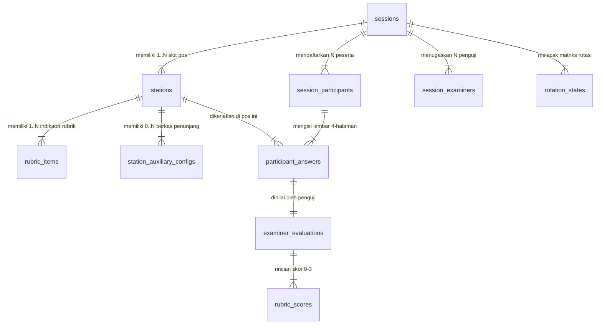

# 🗄️ DATABASE.md - Panduan Arsitektur Database & Schema Supabase OSCE (MedSkill Praxis)

Dokumen ini berisi panduan resmi arsitektur database, skema PostgreSQL, integrasi **Supabase Realtime**, aturan keamanan **Row Level Security (RLS)**, serta DDL SQL lengkap untuk platform simulasi ujian klinis **MedSkill OSCE**.

---

## 📌 1. Filosofi Arsitektur Database

Seluruh data operasional ujian simulasi OSCE diisolasi ke dalam **PostgreSQL Custom Schema** bernama `osce` di Supabase. Isolasi ini memisahkan data core LMS (`public`) dengan engine simulasi ujian (`osce`).

```
┌────────────────────────────────────────────────────────────────────────┐
│                        SUPABASE POSTGRESQL                             │
├───────────────────────────────────┬────────────────────────────────────┤
│           schema: public          │            schema: osce            │
│  (Auth, User Profiles, E-Commerce) │   (Engine Simulasi & Live OSCE)    │
│                                   │                                    │
│  • profiles (auth.users)          │  • osce.sessions                   │
│  • mentors                        │  • osce.stations                   │
│  • simulation_sets                │  • osce.rubric_items               │
│  • mannequins & orders            │  • osce.station_auxiliary_configs  │
│                                   │  • osce.question_bank              │
│                                   │  • osce.session_participants       │
│                                   │  • osce.session_examiners          │
│                                   │  • osce.rotation_states            │
│                                   │  • osce.participant_answers        │
│                                   │  • osce.examiner_evaluations       │
│                                   │  • osce.rubric_scores              │
└───────────────────────────────────┴────────────────────────────────────┘
```

---

## 🔀 2. Alur Relasi Entitas & Matriks Rotasi Sirkuit (ERD)

### Formulasi Sirkuit Rotasi:
1. $\text{Total Slot Sirkuit} = \text{Stase Ujian Medis} + \text{Stase Istirahat (Break)}$.
2. $\text{Total Ronde Rotasi} = \text{Total Slot Sirkuit}$.
3. $\text{Kapasitas Gelombang Peserta} = \text{Total Slot Sirkuit}$ peserta.
4. **Penamaan Stase Otomatis**: Slot Ujian (`Stase 1`, `Stase 2`, `Stase 3`) & Slot Istirahat (`Stase Istirahat 1`, `Stase Istirahat 2`).



---

## 📋 3. Rincian Tabel & Struktur Data Schema `osce`

### 1️⃣ `osce.sessions` (Konfigurasi Sesi Ujian & Timer)
Menyimpan konfigurasi utama sesi OSCE, gelombang, parameter durasi timer, dan aturan otomatisasi.

| Nama Kolom | Tipe Data | Keterangan / Default |
| :--- | :--- | :--- |
| `id` | `UUID PRIMARY KEY` | `gen_random_uuid()` |
| `title` | `TEXT NOT NULL` | Judul Sesi OSCE (misal: *OSCE Nasional Gelombang I 2026*) |
| `description` | `TEXT` | Deskripsi umum & petunjuk sesi |
| `location_building` | `TEXT` | Gedung & Lantai Lokasi Sirkuit |
| `session_date` | `DATE NOT NULL` | Tanggal pelaksanaan |
| `start_time` | `TIME NOT NULL` | Jam mulai sesi |
| `status` | `ENUM` | `'draft'`, `'scheduled'`, `'ongoing'`, `'paused'`, `'completed'`, `'archived'` |
| `total_stations` | `INT DEFAULT 8` | Total slot sirkuit (Ujian + Istirahat) |
| `total_rounds` | `INT DEFAULT 8` | Total ronde rotasi (= total_stations) |
| `max_participants_per_wave` | `INT DEFAULT 8` | Kapasitas gelombang (= total_stations) |
| `station_duration_minutes` | `INT DEFAULT 12` | Durasi Stase Ujian (menit) |
| `break_duration_minutes` | `INT DEFAULT 12` | Durasi Stase Istirahat (menit) |
| `transition_duration_minutes` | `INT DEFAULT 2` | Durasi Transisi Rotasi antar-pos (menit) |
| `single_live_session` | `BOOLEAN DEFAULT TRUE` | Kunci proteksi 1 sesi aktif bersamaan |
| `auto_rolling_timer` | `BOOLEAN DEFAULT TRUE` | Otomatisasi perpindahan rotasi bel |
| `auto_lock_answer` | `BOOLEAN DEFAULT TRUE` | Kunci otomatis jawaban siswa saat bel |
| `late_tolerance_minutes` | `INT DEFAULT 5` | Toleransi keterlambatan peserta (menit) |
| `current_wave` | `INT DEFAULT 1` | Gelombang aktif saat ini |
| `current_round` | `INT DEFAULT 1` | Ronde rotasi aktif saat ini |

---

### 2️⃣ `osce.stations` (Slot Pos Ruangan & Break)
Menyimpan daftar slot stase dalam sirkuit. Mendukung penamaan otomatis (`Stase 1`, `Stase Istirahat 1`) tanpa mengunci judul spesialisasi.

| Nama Kolom | Tipe Data | Keterangan |
| :--- | :--- | :--- |
| `id` | `UUID PRIMARY KEY` | `gen_random_uuid()` |
| `session_id` | `UUID FK` | References `osce.sessions(id) ON DELETE CASCADE` |
| `station_number` | `INT NOT NULL` | Urutan fisik pos (1, 2, 3...) |
| `is_break` | `BOOLEAN DEFAULT FALSE` | `true` = Stase Istirahat, `false` = Stase Ujian |
| `title` | `TEXT NOT NULL` | Auto-Name: `Stase 1`, `Stase 2`, `Stase Istirahat 1` |
| `case_title` | `TEXT` | Judul Kasus Medis (misal: *STEMI Anteroseptal*) |
| `system_organ` | `TEXT` | System Organ (*Kardiovaskular*, *Respirasi*, dll.) |
| `skdi_level` | `TEXT` | Tingkat Kompetensi SKDI (*4A*, *3B*, dll.) |
| `scenario` | `TEXT` | Skenario klinis lengkap |
| `participant_instructions` | `TEXT` | Instruksi tugas peserta ujian |
| `examiner_instructions` | `TEXT` | Panduan & instruksi khusus dokter penguji |
| `sort_order` | `INT DEFAULT 0` | Urutan DND (Drag & Drop) |

---

### 3️⃣ `osce.rubric_items` (Checklist Penilaian Medis)
Menyimpan indikator rubrik penilaian objektif per stase dengan skor 0, 1, 2, 3.

| Nama Kolom | Tipe Data | Keterangan |
| :--- | :--- | :--- |
| `id` | `UUID PRIMARY KEY` | `gen_random_uuid()` |
| `station_id` | `UUID FK` | References `osce.stations(id) ON DELETE CASCADE` |
| `question_number` | `INT NOT NULL` | Nomor urut indikator |
| `question` | `TEXT NOT NULL` | Indikator penilaian (misal: *Anamnesis PQRST*) |
| `answer_key` | `TEXT NOT NULL` | Kunci jawaban & pedoman penskoran |
| `max_points` | `INT DEFAULT 3` | Poin maksimal (biasanya 3 atau 4) |
| `weight` | `NUMERIC DEFAULT 1.0` | Bobot nilai indikator |

---

### 4️⃣ `osce.station_auxiliary_configs` (Kunci Jawaban Pemeriksaan Penunjang)
Menyimpan berkas penunjang (EKG, X-Ray, Lab) yang dikonfigurasi admin untuk dikirimkan ke peserta yang meminta penunjang pada stase ini.

| Nama Kolom | Tipe Data | Keterangan |
| :--- | :--- | :--- |
| `id` | `UUID PRIMARY KEY` | `gen_random_uuid()` |
| `station_id` | `UUID FK` | References `osce.stations(id) ON DELETE CASCADE` |
| `item_id` | `TEXT NOT NULL` | ID item dari katalog (misal: `ekg-01`, `rad-01`) |
| `name` | `TEXT NOT NULL` | Nama penunjang (*EKG 12 Lead*) |
| `category` | `TEXT NOT NULL` | Kategori (*RADIOLOGI*, *EKG*, *LAB*) |
| `image_url` | `TEXT` | Direct URL / Uploaded Base64 Data URL Gambar Hasil |
| `report_text` | `TEXT` | Laporan Ekspertise Medis Teks |

---

### 5️⃣ `osce.question_bank` (Master Bank Soal Medis)
Menyimpan modul soal medis baku yang dapat digunakan ulang (1-click Auto-Fill).

| Nama Kolom | Tipe Data | Keterangan |
| :--- | :--- | :--- |
| `id` | `UUID PRIMARY KEY` | `gen_random_uuid()` |
| `title` | `TEXT NOT NULL` | Judul Paket Soal Bank |
| `system_organ` | `TEXT NOT NULL` | Kategori organ (*Kardiovaskular*, *Respirasi*, dll.) |
| `skdi_level` | `TEXT NOT NULL` | Level SKDI (*4A*, *3B*) |
| `case_title` | `TEXT NOT NULL` | Topik kasus klinis |
| `scenario` | `TEXT NOT NULL` | Skenario kasus |
| `participant_instructions` | `TEXT NOT NULL` | Instruksi peserta |
| `examiner_instructions` | `TEXT NOT NULL` | Instruksi penguji |
| `checklist_items_json` | `JSONB` | Array struct item rubrik & poin |
| `auxiliary_configs_json` | `JSONB` | Array struct berkas penunjang & gambar |

---

### 6️⃣ `osce.participant_answers` (Lembar Progres 4-Halaman Peserta)
Menyimpan progres real-time & jawaban pengerjaan peserta pada flow 4-halaman:
* **Halaman 1**: Read Skenario
* **Halaman 2**: Catatan Anamnesis & Fisik
* **Halaman 3**: Permintaan Berkas Penunjang
* **Halaman 4**: Tatalaksana, Resep & Edukasi

| Nama Kolom | Tipe Data | Keterangan |
| :--- | :--- | :--- |
| `id` | `UUID PRIMARY KEY` | `gen_random_uuid()` |
| `session_id` | `UUID FK` | References `osce.sessions(id)` |
| `station_id` | `UUID FK` | References `osce.stations(id)` |
| `participant_id` | `UUID FK` | References `public.profiles(id)` |
| `rotation_round` | `INT NOT NULL` | Ronde rotasi pengerjaan |
| `current_step` | `TEXT` | `'PAGE_1_SCENARIO'`, `'PAGE_2_ANAMNESIS_PHYSICAL'`, `'PAGE_3_AUXILIARY_EXAM'`, `'PAGE_4_DIAGNOSIS_THERAPY'`, `'SUBMITTED'` |
| `anamnesis_notes` | `TEXT` | Input jawaban anamnesis & fisik |
| `diagnosis_notes` | `TEXT` | Input diagnosis kerja & diferensial |
| `therapy_notes` | `TEXT` | Input resep & tatalaksana |
| `requested_auxiliary_json` | `JSONB` | Array ID berkas penunjang yang diminta |
| `status` | `TEXT` | `'in_progress'`, `'submitted'`, `'locked'` |

---

### 7️⃣ `osce.examiner_evaluations` & `osce.rubric_scores` (Penilaian Penguji)
Menyimpan skor penilaian dokter penguji real-time (Skor Rubrik 0-3, GRS Rating, & Catatan Evaluasi).

* **`osce.examiner_evaluations`**:
  * `id`: `UUID PRIMARY KEY`
  * `session_id`, `station_id`, `participant_id`, `examiner_id`: `UUID FK`
  * `rotation_round`: `INT`
  * `grs_rating`: `ENUM ('UNSATISFACTORY', 'BORDERLINE', 'SATISFACTORY', 'SUPERIOR')`
  * `examiner_notes`: `TEXT` (Catatan evaluasi kualitatif)
  * `total_points_earned`: `NUMERIC`
  * `max_points_possible`: `NUMERIC`
  * `final_score_percentage`: `NUMERIC`
  * `is_locked`: `BOOLEAN DEFAULT FALSE`

* **`osce.rubric_scores`**:
  * `id`: `UUID PRIMARY KEY`
  * `evaluation_id`: `UUID FK` references `osce.examiner_evaluations(id)`
  * `rubric_item_id`: `UUID FK` references `osce.rubric_items(id)`
  * `score_given`: `INT` (0, 1, 2, atau 3)

---

## ⚡ 4. Integrasi Supabase Realtime Channels

Untuk mendukung fitur **Live Control Room Admin**, **Broadcast Audio Bel Rotasi**, dan **Matriks Pergerakan Rotasi Real-time**, tabel-tabel berikut didaftarkan ke dalam **Supabase Realtime Publication**:

```sql
-- Mengaktifkan Supabase Realtime untuk Schema OSCE
ALTER PUBLICATION supabase_realtime ADD TABLE osce.sessions;
ALTER PUBLICATION supabase_realtime ADD TABLE osce.rotation_states;
ALTER PUBLICATION supabase_realtime ADD TABLE osce.participant_answers;
ALTER PUBLICATION supabase_realtime ADD TABLE osce.examiner_evaluations;
```

### Event Realtime Broadcast:
1. **`TIMER_TICK`**: Sinkronisasi sisa detik timer rotasi ke seluruh layar penguji & peserta.
2. **`BELL_RING_TRIGGER`**: Trigger bunyi bel audio web-audio API (Panjang / Pendek) saat transisi rotasi.
3. **`STATION_STEP_UPDATE`**: Pembaruan status langkah halaman peserta (Halaman 1 → 2 → 3 → 4) di matriks admin.
4. **`LOCK_SCORE_NOTIFY`**: Notifikasi saat dokter penguji mengunci nilai (*Lock Evaluation*).

---

## 📜 5. Script Full DDL SQL Schema Supabase (`schema_osce.sql`)

Jalankan script DDL berikut di **Supabase SQL Editor** untuk membuat seluruh schema, tabel, enum, indeks, dan RLS policies:

```sql
-- =================================================================
-- MEDSKILL SUPABASE SCHEMA OSCE (FULL PRODUCTION DDL)
-- =================================================================

-- 1. Buat Schema Khusus OSCE
CREATE SCHEMA IF NOT EXISTS osce;

-- 2. ENUM TYPES
DO $$ BEGIN
    CREATE TYPE osce.session_status AS ENUM (
        'draft', 'scheduled', 'ongoing', 'paused', 'completed', 'archived'
    );
EXCEPTION WHEN duplicate_object THEN null; END $$;

DO $$ BEGIN
    CREATE TYPE osce.grs_rating AS ENUM (
        'UNSATISFACTORY', 'BORDERLINE', 'SATISFACTORY', 'SUPERIOR'
    );
EXCEPTION WHEN duplicate_object THEN null; END $$;

DO $$ BEGIN
    CREATE TYPE osce.rotation_status AS ENUM (
        'scheduled', 'running', 'paused', 'transition', 'completed'
    );
EXCEPTION WHEN duplicate_object THEN null; END $$;

-- 3. TABEL SESSIONS
CREATE TABLE IF NOT EXISTS osce.sessions (
    id UUID PRIMARY KEY DEFAULT gen_random_uuid(),
    title TEXT NOT NULL,
    description TEXT,
    location_building TEXT,
    session_date DATE NOT NULL,
    start_time TIME NOT NULL,
    end_time TIME,
    status osce.session_status NOT NULL DEFAULT 'draft',
    total_stations INT NOT NULL DEFAULT 8,
    total_rounds INT NOT NULL DEFAULT 8,
    max_participants_per_wave INT NOT NULL DEFAULT 8,
    station_duration_minutes INT NOT NULL DEFAULT 12,
    break_duration_minutes INT NOT NULL DEFAULT 12,
    transition_duration_minutes INT NOT NULL DEFAULT 2,
    single_live_session BOOLEAN DEFAULT TRUE,
    auto_rolling_timer BOOLEAN DEFAULT TRUE,
    auto_lock_answer BOOLEAN DEFAULT TRUE,
    late_tolerance_minutes INT DEFAULT 5,
    current_wave INT DEFAULT 1,
    current_round INT DEFAULT 1,
    started_at TIMESTAMPTZ,
    finished_at TIMESTAMPTZ,
    created_by UUID REFERENCES public.profiles(id) ON DELETE SET NULL,
    created_at TIMESTAMPTZ DEFAULT NOW(),
    updated_at TIMESTAMPTZ DEFAULT NOW()
);

-- 4. TABEL STATIONS (POS RUANGAN & BREAK)
CREATE TABLE IF NOT EXISTS osce.stations (
    id UUID PRIMARY KEY DEFAULT gen_random_uuid(),
    session_id UUID NOT NULL REFERENCES osce.sessions(id) ON DELETE CASCADE,
    station_number INT NOT NULL,
    is_break BOOLEAN DEFAULT FALSE,
    title TEXT NOT NULL,
    case_title TEXT,
    system_organ TEXT,
    skdi_level TEXT,
    scenario TEXT,
    participant_instructions TEXT,
    examiner_instructions TEXT,
    sort_order INT DEFAULT 0,
    created_at TIMESTAMPTZ DEFAULT NOW(),
    updated_at TIMESTAMPTZ DEFAULT NOW()
);

-- 5. TABEL RUBRIC ITEMS
CREATE TABLE IF NOT EXISTS osce.rubric_items (
    id UUID PRIMARY KEY DEFAULT gen_random_uuid(),
    station_id UUID NOT NULL REFERENCES osce.stations(id) ON DELETE CASCADE,
    question_number INT NOT NULL,
    question TEXT NOT NULL,
    answer_key TEXT NOT NULL,
    max_points INT DEFAULT 3,
    weight NUMERIC DEFAULT 1.0,
    sort_order INT DEFAULT 0,
    created_at TIMESTAMPTZ DEFAULT NOW()
);

-- 6. TABEL AUXILIARY EXAM CATALOG
CREATE TABLE IF NOT EXISTS osce.auxiliary_exam_catalog (
    id TEXT PRIMARY KEY,
    name TEXT NOT NULL,
    category TEXT NOT NULL,
    description TEXT,
    created_at TIMESTAMPTZ DEFAULT NOW()
);

-- 7. TABEL STATION AUXILIARY CONFIGS
CREATE TABLE IF NOT EXISTS osce.station_auxiliary_configs (
    id UUID PRIMARY KEY DEFAULT gen_random_uuid(),
    station_id UUID NOT NULL REFERENCES osce.stations(id) ON DELETE CASCADE,
    item_id TEXT NOT NULL,
    name TEXT NOT NULL,
    category TEXT NOT NULL,
    image_url TEXT,
    report_text TEXT,
    created_at TIMESTAMPTZ DEFAULT NOW()
);

-- 8. TABEL QUESTION BANK
CREATE TABLE IF NOT EXISTS osce.question_bank (
    id UUID PRIMARY KEY DEFAULT gen_random_uuid(),
    title TEXT NOT NULL,
    system_organ TEXT NOT NULL,
    skdi_level TEXT NOT NULL,
    case_title TEXT NOT NULL,
    scenario TEXT NOT NULL,
    participant_instructions TEXT NOT NULL,
    examiner_instructions TEXT NOT NULL,
    checklist_items_json JSONB DEFAULT '[]'::jsonb,
    auxiliary_configs_json JSONB DEFAULT '[]'::jsonb,
    created_by UUID REFERENCES public.profiles(id) ON DELETE SET NULL,
    created_at TIMESTAMPTZ DEFAULT NOW(),
    updated_at TIMESTAMPTZ DEFAULT NOW()
);

-- 9. TABEL SESSION PARTICIPANTS
CREATE TABLE IF NOT EXISTS osce.session_participants (
    id UUID PRIMARY KEY DEFAULT gen_random_uuid(),
    session_id UUID NOT NULL REFERENCES osce.sessions(id) ON DELETE CASCADE,
    user_id UUID NOT NULL REFERENCES public.profiles(id) ON DELETE CASCADE,
    nim TEXT NOT NULL,
    full_name TEXT NOT NULL,
    wave_number INT DEFAULT 1,
    starting_station_number INT NOT NULL,
    status TEXT DEFAULT 'registered',
    created_at TIMESTAMPTZ DEFAULT NOW()
);

-- 10. TABEL SESSION EXAMINERS
CREATE TABLE IF NOT EXISTS osce.session_examiners (
    id UUID PRIMARY KEY DEFAULT gen_random_uuid(),
    session_id UUID NOT NULL REFERENCES osce.sessions(id) ON DELETE CASCADE,
    user_id UUID NOT NULL REFERENCES public.profiles(id) ON DELETE CASCADE,
    full_name TEXT NOT NULL,
    specialty TEXT,
    assigned_station_number INT NOT NULL,
    status TEXT DEFAULT 'active',
    created_at TIMESTAMPTZ DEFAULT NOW()
);

-- 11. TABEL ROTATION STATES (MATRIKS LIVE)
CREATE TABLE IF NOT EXISTS osce.rotation_states (
    id UUID PRIMARY KEY DEFAULT gen_random_uuid(),
    session_id UUID NOT NULL REFERENCES osce.sessions(id) ON DELETE CASCADE,
    wave_number INT NOT NULL DEFAULT 1,
    round_number INT NOT NULL DEFAULT 1,
    status osce.rotation_status DEFAULT 'scheduled',
    time_remaining_seconds INT NOT NULL DEFAULT 720,
    started_at TIMESTAMPTZ,
    paused_at TIMESTAMPTZ,
    created_at TIMESTAMPTZ DEFAULT NOW()
);

-- 12. TABEL PARTICIPANT ANSWERS
CREATE TABLE IF NOT EXISTS osce.participant_answers (
    id UUID PRIMARY KEY DEFAULT gen_random_uuid(),
    session_id UUID NOT NULL REFERENCES osce.sessions(id) ON DELETE CASCADE,
    station_id UUID NOT NULL REFERENCES osce.stations(id) ON DELETE CASCADE,
    participant_id UUID NOT NULL REFERENCES public.profiles(id) ON DELETE CASCADE,
    rotation_round INT NOT NULL,
    current_step TEXT DEFAULT 'PAGE_1_SCENARIO',
    anamnesis_notes TEXT,
    physical_exam_notes TEXT,
    diagnosis_notes TEXT,
    therapy_notes TEXT,
    requested_auxiliary_json JSONB DEFAULT '[]'::jsonb,
    status TEXT DEFAULT 'in_progress',
    started_at TIMESTAMPTZ DEFAULT NOW(),
    submitted_at TIMESTAMPTZ
);

-- 13. TABEL EXAMINER EVALUATIONS
CREATE TABLE IF NOT EXISTS osce.examiner_evaluations (
    id UUID PRIMARY KEY DEFAULT gen_random_uuid(),
    session_id UUID NOT NULL REFERENCES osce.sessions(id) ON DELETE CASCADE,
    station_id UUID NOT NULL REFERENCES osce.stations(id) ON DELETE CASCADE,
    participant_id UUID NOT NULL REFERENCES public.profiles(id) ON DELETE CASCADE,
    examiner_id UUID NOT NULL REFERENCES public.profiles(id) ON DELETE CASCADE,
    rotation_round INT NOT NULL,
    grs_rating osce.grs_rating NOT NULL DEFAULT 'SATISFACTORY',
    examiner_notes TEXT,
    total_points_earned NUMERIC NOT NULL DEFAULT 0,
    max_points_possible NUMERIC NOT NULL DEFAULT 0,
    final_score_percentage NUMERIC NOT NULL DEFAULT 0,
    is_locked BOOLEAN DEFAULT FALSE,
    submitted_at TIMESTAMPTZ DEFAULT NOW()
);

-- 14. TABEL RUBRIC SCORES
CREATE TABLE IF NOT EXISTS osce.rubric_scores (
    id UUID PRIMARY KEY DEFAULT gen_random_uuid(),
    evaluation_id UUID NOT NULL REFERENCES osce.examiner_evaluations(id) ON DELETE CASCADE,
    rubric_item_id UUID NOT NULL REFERENCES osce.rubric_items(id) ON DELETE CASCADE,
    score_given INT NOT NULL DEFAULT 0,
    feedback TEXT
);

-- =================================================================
-- INDEKS PERFORMA QUERY REALTIME
-- =================================================================
CREATE INDEX IF NOT EXISTS idx_osce_stations_session ON osce.stations(session_id, station_number);
CREATE INDEX IF NOT EXISTS idx_osce_answers_participant ON osce.participant_answers(session_id, station_id, participant_id);
CREATE INDEX IF NOT EXISTS idx_osce_evaluations_participant ON osce.examiner_evaluations(session_id, station_id, participant_id);
CREATE INDEX IF NOT EXISTS idx_osce_rotation_active ON osce.rotation_states(session_id, wave_number, round_number);

-- =================================================================
-- ROW LEVEL SECURITY (RLS) POLICIES
-- =================================================================
ALTER TABLE osce.sessions ENABLE ROW LEVEL SECURITY;
ALTER TABLE osce.stations ENABLE ROW LEVEL SECURITY;
ALTER TABLE osce.participant_answers ENABLE ROW LEVEL SECURITY;
ALTER TABLE osce.examiner_evaluations ENABLE ROW LEVEL SECURITY;

-- Allow read access for authenticated users
CREATE POLICY "Allow read access to sessions for authenticated users"
ON osce.sessions FOR SELECT TO authenticated USING (true);

CREATE POLICY "Allow read access to stations for authenticated users"
ON osce.stations FOR SELECT TO authenticated USING (true);

-- Allow full access to Admin users
CREATE POLICY "Allow admin full access to osce schema"
ON osce.sessions FOR ALL TO authenticated
USING ((SELECT role FROM public.profiles WHERE id = auth.uid()) = 'admin');

-- Allow participants to read and insert their own answers
CREATE POLICY "Allow participant answer access"
ON osce.participant_answers FOR ALL TO authenticated
USING (participant_id = auth.uid());

-- Allow examiners to insert & lock evaluations
CREATE POLICY "Allow examiner evaluation access"
ON osce.examiner_evaluations FOR ALL TO authenticated
USING (examiner_id = auth.uid());
```

---

## 🛠️ 6. Cara Menggunakan Supabase CLI & Regenerate Types

Jika Anda memperbarui tabel database di Supabase Remote, Anda dapat memperbarui otomatis `types/osce.types.ts` menggunakan perintah CLI berikut:

```bash
# Login Supabase CLI
npx supabase login

# Generate TypeScript types dari schema osce
npx supabase gen types typescript --project-id djigelqahkzfmwvpncvr --schema osce > frontend/src/types/osce.types.ts
```

---

Dokumen ini merupakan referensi tunggal kebenaran (*Single Source of Truth*) untuk pengembangan backend database Supabase pada sistem **MedSkill Praxis OSCE**. 🚀
