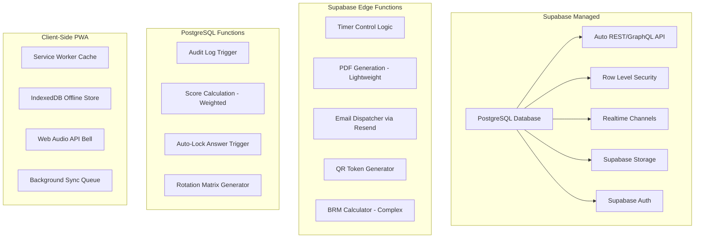
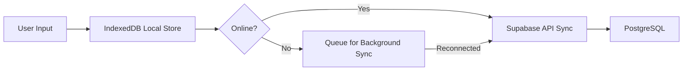

# 🏥 DATABASE_RECOMEND.md — Rekomendasi Optimasi Database & Arsitektur Backend untuk OSCE Tingkat Nasional

**Praxis by MedSkill Indonesia**
*Dianalisis berdasarkan seluruh dokumentasi `.md`, mockup frontend, `osce.types.ts`, `schema.sql`, serta referensi standar AIPKI / Kemenkes RI.*

---

## 📑 Daftar Isi

1. [Executive Summary](#1-executive-summary)
2. [Audit Gap: Schema Supabase Saat Ini vs Fitur Frontend](#2-audit-gap-schema-supabase-saat-ini-vs-fitur-frontend)
3. [Rekomendasi Tabel & Kolom Baru](#3-rekomendasi-tabel--kolom-baru)
4. [Rekomendasi Perbaikan Tabel Existing](#4-rekomendasi-perbaikan-tabel-existing)
5. [Penilaian: Apakah Supabase Cukup atau Perlu Custom Backend?](#5-penilaian-apakah-supabase-cukup-atau-perlu-custom-backend)
6. [Arsitektur Realtime & Timer Synchronization](#6-arsitektur-realtime--timer-synchronization)
7. [Keamanan: RLS Policies & Audit Trail](#7-keamanan-rls-policies--audit-trail)
8. [Offline-First & Resiliensi Jaringan](#8-offline-first--resiliensi-jaringan)
9. [Skalabilitas untuk Ujian Nasional](#9-skalabilitas-untuk-ujian-nasional)
10. [Rekomendasi Prioritas Implementasi (Roadmap)](#10-rekomendasi-prioritas-implementasi-roadmap)

---

## 1. Executive Summary

Sistem MedSkill OSCE saat ini memiliki **frontend mockup yang sudah sangat matang (90%+ coverage fitur)** namun terdapat **gap signifikan** antara schema database existing (`public.osce_*` di `schema.sql`) dengan schema target yang sudah didefinisikan di `DATABASE.md` (`osce.*` schema terpisah).

### Temuan Kritis:

| Aspek | Status | Keterangan |
|:---|:---:|:---|
| **Schema Isolation (`osce.*` terpisah)** | ⚠️ Belum Diterapkan | `schema.sql` masih menggunakan `public.osce_*` (prefix di public schema). `DATABASE.md` sudah merancang custom schema `osce` yang benar. |
| **Rubric Descriptors (Level 0-3)** | ❌ Tidak Ada | `PENILAIAN.md` mewajibkan deskriptor 4-level per item rubrik, namun tabel `rubric_items` belum memiliki kolom `descriptors`. |
| **Weighted Scoring** | ⚠️ Parsial | Kolom `weight` ada di `DATABASE.md` namun frontend belum menggunakannya dalam kalkulasi. |
| **Audit Trail** | ❌ Tidak Ada | Untuk ujian nasional, setiap perubahan skor WAJIB memiliki log imutabel (timestamp + user). |
| **Timer Synchronization** | ❌ Belum Ada Backend | Frontend menggunakan `setInterval` lokal tanpa sinkronisasi server-side. |
| **Standard Setting (NBL/BRM)** | ❌ Belum Ada | `ReportsPage.jsx` masih placeholder. Kalkulasi Borderline Regression Method belum ada. |
| **File Storage** | ⚠️ Base64 di DB | Gambar penunjang disimpan sebagai Base64 di `image_url`, bukan Supabase Storage. |

> [!CAUTION]
> **Migrasi `public.osce_*` → `osce.*`** harus menjadi prioritas pertama sebelum development backend lebih lanjut. Schema lama di `public` (`osce_sessions`, `osce_stages`, `osce_stage_questions`, `osce_cases`, dll.) memiliki struktur yang sangat berbeda dengan desain baru di `DATABASE.md` dan TypeScript types.

---

## 2. Audit Gap: Schema Supabase Saat Ini vs Fitur Frontend

### A. Tabel yang SUDAH Ada di `schema.sql` (public) vs Desain Baru di `DATABASE.md` (osce)

| Tabel Lama (`public`) | Tabel Baru (`osce.*`) | Gap Analysis |
|:---|:---|:---|
| `osce_sessions` | `osce.sessions` | Lama tidak punya `transition_duration_minutes`, `auto_rolling_timer`, `auto_lock_answer`, `late_tolerance_minutes`, `current_wave`. **Migrasi struktur total diperlukan.** |
| `osce_stages` | `osce.stations` | Lama hanya punya `station_number` + `title`. Baru punya `is_break`, `case_title`, `system_organ`, `skdi_level`, `scenario`, instruksi peserta/penguji, dll. **Redesign total.** |
| `osce_stage_questions` | `osce.rubric_items` + `station_auxiliary_configs` | Lama menyimpan semua dalam 1 tabel dengan JSONB `checklist`. Baru memisahkan rubrik dan penunjang ke tabel terpisah. **Lebih baik.** |
| `osce_cases` + `osce_case_sections` + `osce_case_items` | `osce.question_bank` | Lama menggunakan 3 tabel hierarkis. Baru menggunakan 1 tabel flat dengan JSONB. **Trade-off: flat lebih simple, tapi hierarchal lebih queryable.** |
| `osce_session_members` | `osce.session_participants` + `osce.session_examiners` | Lama menggabungkan peserta & penguji dalam 1 tabel dengan kolom `role`. Baru memisahkan ke 2 tabel. **Lebih baik.** |
| `osce_answers` | `osce.participant_answers` | Lama sangat minimalis (hanya ref ke `case_id`). Baru menyimpan flow 4-halaman lengkap. **Upgrade besar.** |
| `osce_scores` | `osce.examiner_evaluations` + `osce.rubric_scores` | Lama hanya `is_correct` + `note`. Baru mendukung GRS, weighted scoring, locked state. **Upgrade total.** |
| *(Tidak Ada)* | `osce.rotation_states` | **Tabel baru** untuk matriks rotasi live realtime. |
| *(Tidak Ada)* | `osce.auxiliary_exam_catalog` | **Tabel baru** untuk master katalog item penunjang. |

### B. Fitur Frontend yang BELUM Didukung Database

| Fitur Frontend (Mockup) | Tabel/Kolom yang Dibutuhkan | Status |
|:---|:---|:---:|
| **Question Bank Auto-Fill** (`QuestionBankSelectModal.jsx`) | `osce.question_bank` | ✅ Ada di `DATABASE.md` |
| **Upload Gambar Penunjang per Item** (`AdminAuxiliaryExamBuilder.jsx`) | `station_auxiliary_configs.image_url` | ⚠️ Perlu Supabase Storage |
| **Laporan Teks Ekspertise** | `station_auxiliary_configs.report_text` | ✅ Ada |
| **Matriks Rotasi Live** (`LiveMonitorPage.jsx`) | `osce.rotation_states` | ✅ Ada di `DATABASE.md` |
| **Detail Monitoring per Stase** (`StationMonitorDetailPage.jsx`) | Dropdown nilai peserta dalam stase live | ⚠️ Perlu JOIN query optimized |
| **Jawaban Peserta 4-Halaman** (`ParticipantSessionPage.jsx`) | `osce.participant_answers` (multi-step) | ✅ Ada |
| **GRS Rating + Feedback Penguji** (`ExaminerStagePage.jsx`) | `osce.examiner_evaluations` | ✅ Ada |
| **Reports & PDF Export** (`ReportsPage.jsx`) | Tabel rekapitulasi + stored procedure | ❌ Belum Ada |
| **Standard Setting NBL/BRM** | Stored procedure + view | ❌ Belum Ada |
| **Broadcast Message Admin** (Live Control Room) | Realtime channel / tabel broadcast | ❌ Belum Ada |
| **Kiosk Mode / QR Scan** (`RECOMEND.md`) | Session token per station | ❌ Belum Ada |
| **Offline-First Auto-Sync** | Service Worker + IndexedDB | ❌ Belum Ada |
| **Multi-Track Parallel Circuit** (`RECOMEND.md`) | `osce.sessions.track_id` atau `circuit_tracks` | ❌ Belum Ada |

---

## 3. Rekomendasi Tabel & Kolom Baru

### 3.1 `osce.rubric_descriptors` — Deskriptor Kriteria Penilaian 4-Level

> Berdasarkan `PENILAIAN.md` Section B, setiap item rubrik WAJIB memiliki deskriptor level 0, 1, 2, 3 sesuai standar AIPKI.

```sql
-- Alternatif A: Kolom JSONB di rubric_items (LEBIH SIMPLE)
ALTER TABLE osce.rubric_items ADD COLUMN descriptors JSONB DEFAULT '{
  "score_0": "",
  "score_1": "",
  "score_2": "",
  "score_3": ""
}'::jsonb;

-- Alternatif B: Kolom TEXT terpisah (LEBIH QUERYABLE)
ALTER TABLE osce.rubric_items ADD COLUMN descriptor_0 TEXT;
ALTER TABLE osce.rubric_items ADD COLUMN descriptor_1 TEXT;
ALTER TABLE osce.rubric_items ADD COLUMN descriptor_2 TEXT;
ALTER TABLE osce.rubric_items ADD COLUMN descriptor_3 TEXT;
```

> [!TIP]
> **Rekomendasi: Alternatif A (JSONB)**. Lebih fleksibel jika nantinya skala berubah (misal 0-4 atau 0-5) dan tidak menambah kolom fisik. Frontend cukup `JSON.parse()`.

---

### 3.2 `osce.rubric_items.competency_area` — Area Kompetensi SKDI

```sql
-- 8 Area Kompetensi sesuai PENILAIAN.md
CREATE TYPE osce.competency_area AS ENUM (
  'ANAMNESIS',
  'PHYSICAL_EXAM',
  'AUXILIARY_EXAM',
  'DIAGNOSIS_DDX',
  'PHARMACOTHERAPY',
  'NON_PHARMACOTHERAPY',
  'COMMUNICATION',
  'PROFESSIONALISM'
);

ALTER TABLE osce.rubric_items ADD COLUMN competency_area osce.competency_area;
```

---

### 3.3 `osce.audit_logs` — Audit Trail Imutabel (WAJIB Ujian Nasional)

```sql
CREATE TABLE IF NOT EXISTS osce.audit_logs (
  id UUID PRIMARY KEY DEFAULT gen_random_uuid(),
  table_name TEXT NOT NULL,                    -- 'examiner_evaluations', 'rubric_scores', dll.
  record_id UUID NOT NULL,                     -- PK dari record yang diubah
  action TEXT NOT NULL,                        -- 'INSERT', 'UPDATE', 'DELETE'
  old_data JSONB,                              -- Snapshot data sebelum perubahan
  new_data JSONB,                              -- Snapshot data setelah perubahan
  changed_by UUID REFERENCES public.profiles(id),
  ip_address INET,
  user_agent TEXT,
  created_at TIMESTAMPTZ DEFAULT NOW()
);

-- Index untuk query audit berdasarkan tabel dan record
CREATE INDEX idx_audit_table_record ON osce.audit_logs(table_name, record_id);
CREATE INDEX idx_audit_changed_by ON osce.audit_logs(changed_by);
```

> [!IMPORTANT]
> Untuk ujian nasional, **setiap perubahan nilai (score modification) HARUS tercatat** di audit log. Ini penting untuk:
> - Proses banding peserta (*appeal process*)
> - Analisis psikometrik pasca-ujian
> - Compliance audit oleh AIPKI/KKI

---

### 3.4 `osce.session_timer_state` — Server-Side Timer Synchronization

```sql
CREATE TABLE IF NOT EXISTS osce.session_timer_state (
  id UUID PRIMARY KEY DEFAULT gen_random_uuid(),
  session_id UUID NOT NULL REFERENCES osce.sessions(id) ON DELETE CASCADE,
  wave_number INT NOT NULL DEFAULT 1,
  round_number INT NOT NULL DEFAULT 1,
  phase TEXT NOT NULL DEFAULT 'idle',           -- 'idle', 'reading', 'action', 'transition', 'break', 'paused'
  target_end_time TIMESTAMPTZ,                 -- Future timestamp kapan phase saat ini berakhir
  paused_remaining_ms INT,                     -- Sisa ms jika di-pause
  bell_sequence INT DEFAULT 0,                 -- Counter bel (1x=reading end, 2x=2min warning, 3x=rotation)
  updated_by UUID REFERENCES public.profiles(id),
  updated_at TIMESTAMPTZ DEFAULT NOW(),
  UNIQUE(session_id)                           -- 1 session = 1 timer state
);

-- Realtime subscription
ALTER PUBLICATION supabase_realtime ADD TABLE osce.session_timer_state;
```

> [!TIP]
> **Pattern "Future Timestamp"**: Simpan `target_end_time` (kapan timer berakhir), bukan `remaining_seconds`. Client menghitung countdown secara lokal dengan `remaining = target_end_time - Date.now()`. Ini kebal terhadap latensi jaringan dan browser tab throttling.

---

### 3.5 `osce.broadcast_messages` — Pesan Broadcast Admin ke Peserta/Penguji

```sql
CREATE TABLE IF NOT EXISTS osce.broadcast_messages (
  id UUID PRIMARY KEY DEFAULT gen_random_uuid(),
  session_id UUID NOT NULL REFERENCES osce.sessions(id) ON DELETE CASCADE,
  message TEXT NOT NULL,
  priority TEXT DEFAULT 'info',                -- 'info', 'warning', 'urgent'
  target_role TEXT DEFAULT 'all',              -- 'all', 'participants', 'examiners'
  sent_by UUID REFERENCES public.profiles(id),
  created_at TIMESTAMPTZ DEFAULT NOW()
);

ALTER PUBLICATION supabase_realtime ADD TABLE osce.broadcast_messages;
```

---

### 3.6 `osce.station_kiosk_tokens` — Token Autentikasi Kiosk Mode (Opsional)

```sql
CREATE TABLE IF NOT EXISTS osce.station_kiosk_tokens (
  id UUID PRIMARY KEY DEFAULT gen_random_uuid(),
  session_id UUID NOT NULL REFERENCES osce.sessions(id) ON DELETE CASCADE,
  station_id UUID NOT NULL REFERENCES osce.stations(id) ON DELETE CASCADE,
  token TEXT NOT NULL UNIQUE,                  -- Token QR yang di-scan peserta
  is_active BOOLEAN DEFAULT TRUE,
  created_at TIMESTAMPTZ DEFAULT NOW(),
  expires_at TIMESTAMPTZ
);
```

---

### 3.7 `osce.session_results_summary` — View Rekapitulasi Nilai (Materialized View)

```sql
CREATE MATERIALIZED VIEW osce.session_results_summary AS
SELECT
  ee.session_id,
  ee.participant_id,
  p.full_name AS participant_name,
  sp.nim,
  sp.wave_number,
  COUNT(DISTINCT ee.station_id) AS stations_completed,
  ROUND(AVG(ee.final_score_percentage), 2) AS avg_score_percentage,
  ROUND(SUM(ee.total_points_earned), 2) AS total_earned,
  ROUND(SUM(ee.max_points_possible), 2) AS total_possible,
  ARRAY_AGG(DISTINCT ee.grs_rating) AS grs_ratings,
  COUNT(CASE WHEN ee.grs_rating = 'UNSATISFACTORY' THEN 1 END) AS fail_count,
  COUNT(CASE WHEN ee.grs_rating = 'BORDERLINE' THEN 1 END) AS borderline_count,
  COUNT(CASE WHEN ee.grs_rating = 'SATISFACTORY' THEN 1 END) AS pass_count,
  COUNT(CASE WHEN ee.grs_rating = 'SUPERIOR' THEN 1 END) AS superior_count
FROM osce.examiner_evaluations ee
JOIN public.profiles p ON p.id = ee.participant_id
JOIN osce.session_participants sp ON sp.user_id = ee.participant_id AND sp.session_id = ee.session_id
WHERE ee.is_locked = TRUE
GROUP BY ee.session_id, ee.participant_id, p.full_name, sp.nim, sp.wave_number;

-- Refresh saat admin menekan "Finalize Results"
-- REFRESH MATERIALIZED VIEW osce.session_results_summary;
```

---

### 3.8 `osce.standard_setting_results` — Hasil Kalkulasi NBL/BRM

```sql
CREATE TABLE IF NOT EXISTS osce.standard_setting_results (
  id UUID PRIMARY KEY DEFAULT gen_random_uuid(),
  session_id UUID NOT NULL REFERENCES osce.sessions(id) ON DELETE CASCADE,
  station_id UUID NOT NULL REFERENCES osce.stations(id) ON DELETE CASCADE,
  method TEXT DEFAULT 'BORDERLINE_REGRESSION',  -- 'BORDERLINE_REGRESSION', 'BORDERLINE_GROUP', 'ANGOFF'
  cut_score_percentage NUMERIC NOT NULL,        -- Nilai Batas Lulus (NBL) hasil kalkulasi
  regression_intercept NUMERIC,                 -- Intercept regresi linear
  regression_slope NUMERIC,                     -- Slope regresi linear
  r_squared NUMERIC,                            -- R² goodness of fit
  n_examinees INT,                              -- Jumlah peserta dalam kalkulasi
  calculated_at TIMESTAMPTZ DEFAULT NOW(),
  calculated_by UUID REFERENCES public.profiles(id)
);
```

---

## 4. Rekomendasi Perbaikan Tabel Existing

### 4.1 `osce.sessions` — Kolom Tambahan

```sql
-- Multi-Track / Parallel Circuit Support
ALTER TABLE osce.sessions ADD COLUMN track_label TEXT DEFAULT 'A';  -- 'A', 'B', 'C'
ALTER TABLE osce.sessions ADD COLUMN institution_id UUID;           -- FK ke tabel institusi (multi-tenant)
ALTER TABLE osce.sessions ADD COLUMN exam_type TEXT DEFAULT 'regular'; -- 'regular', 'remedial', 'try_out'

-- Reading Time sebagai parameter terpisah (berbeda dari station_duration)
ALTER TABLE osce.sessions ADD COLUMN reading_duration_minutes INT DEFAULT 1;
```

---

### 4.2 `osce.stations` — Kolom Tambahan

```sql
-- Reference ke Question Bank (1-click import)
ALTER TABLE osce.stations ADD COLUMN question_bank_id UUID REFERENCES osce.question_bank(id) ON DELETE SET NULL;

-- Room/Location specific
ALTER TABLE osce.stations ADD COLUMN room_number TEXT;         -- "Ruang 101", "Skill Lab Lt.2"

-- Kunci Jawaban Baku (Gold Standard Answer Key)
ALTER TABLE osce.stations ADD COLUMN answer_key_diagnosis TEXT;     -- Kunci WDx + DDx
ALTER TABLE osce.stations ADD COLUMN answer_key_prescription TEXT;  -- Kunci Resep Obat
```

---

### 4.3 `osce.question_bank` — Normalisasi JSONB

> [!WARNING]
> Saat ini `checklist_items_json` dan `auxiliary_configs_json` disimpan sebagai JSONB blob. Ini menyulitkan pencarian dan analisis lintas bank soal. **Rekomendasi: Buat tabel relasional terpisah.**

```sql
-- Normalisasi rubric items dari bank soal
CREATE TABLE IF NOT EXISTS osce.question_bank_rubric_items (
  id UUID PRIMARY KEY DEFAULT gen_random_uuid(),
  question_bank_id UUID NOT NULL REFERENCES osce.question_bank(id) ON DELETE CASCADE,
  question_number INT NOT NULL,
  question TEXT NOT NULL,
  answer_key TEXT NOT NULL,
  max_points INT DEFAULT 3,
  weight NUMERIC DEFAULT 1.0,
  competency_area osce.competency_area,
  descriptors JSONB DEFAULT '{}'::jsonb,
  sort_order INT DEFAULT 0
);

-- Normalisasi auxiliary configs dari bank soal
CREATE TABLE IF NOT EXISTS osce.question_bank_auxiliary_configs (
  id UUID PRIMARY KEY DEFAULT gen_random_uuid(),
  question_bank_id UUID NOT NULL REFERENCES osce.question_bank(id) ON DELETE CASCADE,
  item_id TEXT NOT NULL,
  name TEXT NOT NULL,
  category TEXT NOT NULL,
  image_storage_path TEXT,             -- Path di Supabase Storage (bukan Base64!)
  report_text TEXT,
  sort_order INT DEFAULT 0
);
```

---

### 4.4 `osce.participant_answers` — Structured Diagnosis Fields

```sql
-- Pisahkan WDx dan DDx dari blob text menjadi kolom terstruktur
ALTER TABLE osce.participant_answers ADD COLUMN working_diagnosis TEXT;   -- 1 WDx
ALTER TABLE osce.participant_answers ADD COLUMN differential_dx_1 TEXT;   -- DDx 1
ALTER TABLE osce.participant_answers ADD COLUMN differential_dx_2 TEXT;   -- DDx 2
ALTER TABLE osce.participant_answers ADD COLUMN differential_dx_3 TEXT;   -- DDx 3
ALTER TABLE osce.participant_answers ADD COLUMN prescription_text TEXT;   -- Resep obat (long text)

-- Tambahkan education_notes untuk non-farmakoterapi
ALTER TABLE osce.participant_answers ADD COLUMN education_notes TEXT;
```

---

### 4.5 `osce.rubric_scores` — Timestamp & Notes

```sql
-- Tambahkan timestamp untuk tracking kapan skor di-input
ALTER TABLE osce.rubric_scores ADD COLUMN scored_at TIMESTAMPTZ DEFAULT NOW();

-- Per-item feedback sudah ada, pastikan digunakan
```

---

## 5. Penilaian: Apakah Supabase Cukup atau Perlu Custom Backend?

### Matriks Evaluasi Fitur

| Fitur | Supabase Native | Edge Function | Custom Backend | Rekomendasi |
|:---|:---:|:---:|:---:|:---|
| **CRUD Operations** | ✅ Auto API | — | — | Supabase |
| **Auth & RBAC** | ✅ Auth + RLS | — | — | Supabase |
| **Realtime Broadcast** | ✅ Channels | — | — | Supabase |
| **Timer Sync (Future Timestamp)** | ✅ DB + Realtime | ✅ Kontrol logic | — | **Supabase + Edge Function** |
| **File Upload (Penunjang)** | ✅ Storage Buckets | — | — | Supabase Storage |
| **PDF Generation** | ❌ | ⚠️ Terbatas (10s exec) | ✅ | **Custom Backend / Supabase Edge (ringan)** |
| **Email Dispatch (Bulk)** | ❌ | ✅ + Resend/Mailgun | ✅ | **Edge Function + Email API** |
| **Borderline Regression (BRM)** | ✅ PL/pgSQL Function | ✅ Deno compute | ✅ | **PostgreSQL Function** |
| **Audit Log Trigger** | ✅ DB Trigger | — | — | **PostgreSQL Trigger** |
| **Offline Sync** | ❌ | — | ⚠️ Kompleks | **PowerSync / Custom Service Worker** |
| **QR Code Generation** | ❌ | ✅ | ✅ | **Edge Function** |
| **Web Audio Bell** | ✅ Client-side | — | — | Frontend (Web Audio API) |
| **Item Analysis / Psikometrik** | ⚠️ PL/pgSQL | ✅ | ✅ | **Edge Function / PL/pgSQL** |

### Kesimpulan

> [!IMPORTANT]
> **Supabase CUKUP** untuk 90% kebutuhan sistem OSCE ini, **TANPA perlu custom backend server** (Node.js/Express/Go/Python). Berikut strategi penanganan 10% sisanya:



### Kapan PERLU Custom Backend?

Custom backend (misalnya Supabase self-hosted atau VPS) diperlukan **hanya jika**:
1. **PDF Generation sangat kompleks** (transkrip multi-halaman dengan grafik) — Edge Function memiliki batas eksekusi 10 detik.
2. **Bulk Email > 100 peserta** secara bersamaan — Perlu queue worker (bisa diganti dengan Supabase Edge Function + Supabase Queue / pg_cron).
3. **Advanced Psikometrik** (Cronbach Alpha, Factor Analysis) — Perlu library statistik Python/R.

> [!TIP]
> **Strategi Hybrid**: Gunakan Supabase sebagai backend utama. Jika nantinya perlu heavy processing, deploy 1 microservice (misalnya Deno Deploy / Cloudflare Workers) khusus untuk PDF dan psikometrik. Ini jauh lebih efisien daripada membangun dan me-maintain full backend dari awal.

---

## 6. Arsitektur Realtime & Timer Synchronization

### Pattern yang Direkomendasikan: "Future Timestamp Sync"

```
┌─────────────────────────────────────────────────────────────────────┐
│                        ADMIN DASHBOARD                               │
│  [Start] → Edge Function → UPDATE session_timer_state               │
│            SET target_end_time = NOW() + interval '12 minutes'       │
│            → Supabase Realtime BROADCAST to all clients              │
└────────────────────────────┬────────────────────────────────────────┘
                             │ Realtime Channel: "session:{id}"
                             ▼
┌──────────────────┐  ┌──────────────────┐  ┌──────────────────┐
│ Peserta Client 1 │  │ Peserta Client 2 │  │ Penguji Client 1 │
│                  │  │                  │  │                  │
│ remaining =      │  │ remaining =      │  │ remaining =      │
│ end_time - now() │  │ end_time - now() │  │ end_time - now() │
│                  │  │                  │  │                  │
│ Countdown UI     │  │ Countdown UI     │  │ Countdown UI     │
└──────────────────┘  └──────────────────┘  └──────────────────┘
```

### Supabase Realtime Channel Schema

```javascript
// Channel untuk timer & kontrol session
const sessionChannel = supabase.channel(`session:${sessionId}`)

// Tipe event yang di-broadcast:
// 1. TIMER_STATE_CHANGE  → { phase, target_end_time, round, wave }
// 2. BELL_RING           → { type: '1x' | '2x' | '3x' }
// 3. BROADCAST_MESSAGE   → { message, priority }
// 4. FORCE_LOCK_ANSWERS  → { station_id, round }
// 5. ROTATION_ADVANCE    → { new_round, participant_mapping }
```

### PostgreSQL Trigger untuk Auto-Lock

```sql
-- Trigger: Kunci otomatis jawaban peserta saat timer habis
CREATE OR REPLACE FUNCTION osce.fn_auto_lock_answers()
RETURNS TRIGGER AS $$
BEGIN
  IF NEW.phase = 'transition' AND OLD.phase = 'action' THEN
    UPDATE osce.participant_answers
    SET status = 'locked', submitted_at = COALESCE(submitted_at, NOW())
    WHERE session_id = NEW.session_id
      AND rotation_round = NEW.round_number
      AND status = 'in_progress';
  END IF;
  RETURN NEW;
END;
$$ LANGUAGE plpgsql;

CREATE TRIGGER trg_auto_lock_answers
AFTER UPDATE ON osce.session_timer_state
FOR EACH ROW EXECUTE FUNCTION osce.fn_auto_lock_answers();
```

---

## 7. Keamanan: RLS Policies & Audit Trail

### RLS Policy Matrix (Granular)

| Tabel | Admin | Examiner | Participant | Anon |
|:---|:---:|:---:|:---:|:---:|
| `sessions` | CRUD | SELECT | SELECT | ❌ |
| `stations` | CRUD | SELECT (assigned only) | SELECT (current only) | ❌ |
| `rubric_items` | CRUD | SELECT (assigned station) | ❌ | ❌ |
| `participant_answers` | SELECT ALL | SELECT (assigned station) | INSERT/UPDATE (own) | ❌ |
| `examiner_evaluations` | SELECT ALL | INSERT/UPDATE (own) | ❌ | ❌ |
| `rubric_scores` | SELECT ALL | INSERT/UPDATE (own eval) | ❌ | ❌ |
| `rotation_states` | CRUD | SELECT | SELECT | ❌ |
| `audit_logs` | SELECT | ❌ | ❌ | ❌ |

### Contoh RLS Policy Granular

```sql
-- Penguji hanya bisa melihat stase yang ditugaskan kepadanya
CREATE POLICY "examiner_station_read"
ON osce.stations FOR SELECT TO authenticated
USING (
  EXISTS (
    SELECT 1 FROM osce.session_examiners se
    WHERE se.user_id = auth.uid()
      AND se.session_id = stations.session_id
      AND se.assigned_station_number = stations.station_number
  )
  OR
  (SELECT role FROM public.profiles WHERE id = auth.uid()) = 'admin'
);

-- Peserta hanya bisa UPDATE jawaban miliknya sendiri yang belum locked
CREATE POLICY "participant_answer_update"
ON osce.participant_answers FOR UPDATE TO authenticated
USING (
  participant_id = auth.uid()
  AND status = 'in_progress'
);
```

### Audit Trigger Otomatis

```sql
CREATE OR REPLACE FUNCTION osce.fn_audit_trigger()
RETURNS TRIGGER AS $$
BEGIN
  INSERT INTO osce.audit_logs (table_name, record_id, action, old_data, new_data, changed_by)
  VALUES (
    TG_TABLE_NAME,
    COALESCE(NEW.id, OLD.id),
    TG_OP,
    CASE WHEN TG_OP = 'DELETE' THEN to_jsonb(OLD) ELSE NULL END,
    CASE WHEN TG_OP = 'DELETE' THEN NULL ELSE to_jsonb(NEW) END,
    auth.uid()
  );
  RETURN COALESCE(NEW, OLD);
END;
$$ LANGUAGE plpgsql SECURITY DEFINER;

-- Pasang di tabel kritis
CREATE TRIGGER audit_evaluations AFTER INSERT OR UPDATE OR DELETE
ON osce.examiner_evaluations FOR EACH ROW EXECUTE FUNCTION osce.fn_audit_trigger();

CREATE TRIGGER audit_rubric_scores AFTER INSERT OR UPDATE OR DELETE
ON osce.rubric_scores FOR EACH ROW EXECUTE FUNCTION osce.fn_audit_trigger();
```

---

## 8. Offline-First & Resiliensi Jaringan

### Strategi Offline-First untuk OSCE



### Implementasi yang Direkomendasikan

| Layer | Teknologi | Fungsi |
|:---|:---|:---|
| **App Shell Cache** | Service Worker + Cache API | UI selalu tersedia offline |
| **Data Persistence** | IndexedDB via **Dexie.js** | Simpan jawaban peserta & skor penguji lokal |
| **Sync Engine** | Custom Background Sync API | Sinkronisasi data lokal → Supabase saat online |
| **Conflict Resolution** | Last-Write-Wins + Timestamp | Peserta: LWW sederhana. Penguji: manual merge jika konflik |

### Prioritas Data Offline

| Data | Prioritas Offline | Strategi |
|:---|:---:|:---|
| Jawaban peserta (form teks) | 🔴 Kritis | Auto-save ke IndexedDB setiap keystroke |
| Skor rubrik penguji | 🔴 Kritis | Auto-save setiap klik skor |
| Timer state | 🟡 Penting | Cache `target_end_time`, hitung lokal |
| Skenario & instruksi stase | 🟢 Prefetch | Cache saat session dimulai |
| Gambar penunjang | 🟢 Prefetch | Pre-download saat session dimulai |

---

## 9. Skalabilitas untuk Ujian Nasional

### Estimasi Beban

| Parameter | Skala Institusi | Skala Nasional |
|:---|:---:|:---:|
| Peserta / sesi | 6 – 50 | 100 – 500 |
| Penguji / sesi | 6 – 8 | 12 – 50 |
| Sesi paralel | 1 | 5 – 20 (multi-track) |
| Concurrent users | ~60 | ~1.000 |
| Write ops/detik (peak) | ~10 | ~200 |
| Realtime subscribers | ~60 | ~1.000 |

### Rekomendasi Optimasi

1. **Connection Pooling**: Supabase Pro/Enterprise sudah menyediakan PgBouncer. Pastikan menggunakan pool mode `transaction`.

2. **Index Optimization**:
```sql
-- Index komposit untuk query paling sering
CREATE INDEX CONCURRENTLY idx_answers_session_station_participant
ON osce.participant_answers(session_id, station_id, participant_id);

CREATE INDEX CONCURRENTLY idx_evaluations_session_locked
ON osce.examiner_evaluations(session_id, is_locked);

-- Partial index untuk active sessions only
CREATE INDEX CONCURRENTLY idx_sessions_active
ON osce.sessions(id) WHERE status IN ('ongoing', 'paused');
```

3. **Materialized View untuk Reports**:
```sql
-- Refresh hanya saat admin meminta laporan
REFRESH MATERIALIZED VIEW CONCURRENTLY osce.session_results_summary;
```

4. **Supabase Plan Requirement**:
   - **Institusi kecil (< 50 user)**: Free/Pro sudah cukup
   - **Nasional (> 500 user)**: **Pro plan minimum**, pertimbangkan **Team/Enterprise** untuk:
     - Connection pooling lebih besar
     - Realtime connection limit lebih tinggi
     - Support SLA

---

## 10. Rekomendasi Prioritas Implementasi (Roadmap)

### 🔴 Phase 1: Foundation (Minggu 1-2)

| No | Task | Prioritas |
|:---:|:---|:---:|
| 1 | **Migrasi schema** `public.osce_*` → `osce.*` sesuai `DATABASE.md` | 🔴 Kritis |
| 2 | Jalankan DDL script dari `DATABASE.md` Section 5 | 🔴 Kritis |
| 3 | Setup Supabase Storage bucket `osce-media` untuk gambar penunjang | 🔴 Kritis |
| 4 | Implementasi RLS policies granular (matrix di Section 7) | 🔴 Kritis |
| 5 | Tambahkan kolom `descriptors` JSONB ke `rubric_items` | 🟡 Penting |
| 6 | Tambahkan kolom `competency_area` ke `rubric_items` | 🟡 Penting |

### 🟡 Phase 2: Realtime Engine (Minggu 3-4)

| No | Task | Prioritas |
|:---:|:---|:---:|
| 7 | Buat tabel `session_timer_state` + Edge Function timer controller | 🔴 Kritis |
| 8 | Implementasi Realtime Broadcast channel `session:{id}` | 🔴 Kritis |
| 9 | Buat trigger `fn_auto_lock_answers` | 🟡 Penting |
| 10 | Buat tabel `broadcast_messages` + Realtime subscription | 🟡 Penting |
| 11 | Implementasi Web Audio Bell System di frontend | 🟢 Nice-to-have |

### 🟢 Phase 3: Scoring & Reports (Minggu 5-6)

| No | Task | Prioritas |
|:---:|:---|:---:|
| 12 | Buat `audit_logs` + trigger otomatis | 🔴 Kritis |
| 13 | Implementasi Materialized View `session_results_summary` | 🟡 Penting |
| 14 | Buat PostgreSQL Function untuk kalkulasi BRM (Borderline Regression) | 🟡 Penting |
| 15 | Buat Edge Function untuk PDF generation (per peserta) | 🟡 Penting |
| 16 | Buat Edge Function untuk bulk email dispatch | 🟢 Nice-to-have |

### 🔵 Phase 4: Resiliensi & Scale (Minggu 7-8)

| No | Task | Prioritas |
|:---:|:---|:---:|
| 17 | Implementasi Service Worker + IndexedDB offline store | 🟡 Penting |
| 18 | Background sync queue untuk jawaban peserta & skor | 🟡 Penting |
| 19 | Normalisasi `question_bank` JSONB → tabel relasional | 🟢 Nice-to-have |
| 20 | Multi-track parallel circuit support | 🟢 Nice-to-have |
| 21 | Station Kiosk Mode + QR token | 🟢 Nice-to-have |

---

## Catatan Penutup

> [!IMPORTANT]
> **Supabase sepenuhnya mendukung** kebutuhan platform OSCE tingkat nasional ini **tanpa memerlukan custom backend server**. Kombinasi **PostgreSQL Functions** (untuk business logic), **Edge Functions** (untuk orchestration), **Realtime Channels** (untuk live sync), dan **Storage** (untuk media penunjang) sudah mencakup seluruh kebutuhan teknis.
>
> Satu-satunya area yang *mungkin* memerlukan microservice terpisah di masa depan adalah **PDF generation kompleks** dan **analisis psikometrik lanjutan**. Namun, hal ini bisa ditunda hingga system sudah berjalan dan kebutuhannya tervalidasi.

---

*Dokumen ini merupakan rekomendasi teknis arsitektur database & backend untuk platform MedSkill Praxis OSCE tingkat nasional. Disusun berdasarkan analisis komprehensif terhadap seluruh dokumentasi sistem, frontend mockup, schema existing, dan referensi standar ujian OSCE nasional (AIPKI/KKI/Kemenkes RI).* 🚀
