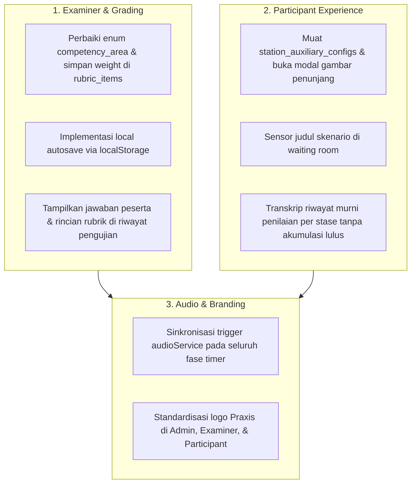

# 📋 Hasil Analisis & Rencana Tindak Lanjut Rapat Ke-2 (MEETING 2)
> **Praxis by MedSkill Indonesia — OSCE Engine & Clinical Assessment Platform**  
> *Tanggal Rapat: 23 Agustus 2026*  
> *Fokus: Perbaikan Modul Examiner, Participant Kiosk, Audio & Branding, serta Engine Penilaian & Riwayat*

---

## 📑 1. Ringkasan Catatan Rapat Ke-2 (Original Notes)

| Kategori | Catatan Evaluasi Rapat |
| :--- | :--- |
| **1. Administrator** | Persiapan integrasi kontrol & monitor kelengkapan nilai stase. |
| **2. Examiner** | • Bobot-bobot tidak tersimpan pada penilaian ujian stase. • Lembar penilaian perlu autosave lokal & sinkronisasi `localStorage`. • Riwayat pengujian: nilai peserta dan jawaban peserta saat pengerjaan tidak muncul. |
| **3. Participant** | • Pengumpulan berkas penunjang (saat benar) belum memunculkan modal *image/preview* berkas. • Judul stase/kasus belum muncul saat pengujian stase berlangsung. |
| **5. General** | • Seluruh efek suara (*audio/bell cues*) disiapkan & diintegrasikan secara merata. • Standardisasi logo Praxis di seluruh layout & antarmuka sistem. |
| **6. Penilaian & Riwayat** | • Riwayat pengujian murni menampilkan rincian penilaian stase penguji hingga detail item rubrik. • Tanpa akumulasi status kelulusan (Lulus/Tidak Lulus) maupun kalkulasi rata-rata. • Stase istirahat (*rest station*) ditampilkan dengan jelas sebagai stase jeda. |

---

## 🔍 2. Penjabaran & Analisis Akar Masalah (Root Cause Analysis)

### A. Modul Examiner (Dokter Penguji)

#### 1. Bobot Penilaian Tidak Tersimpan (`rubric_items.weight` & `examiner_evaluations`)
* **Akar Masalah**:
  1. Pada [`ExaminerStagePage.jsx`](file:///c:/KAIRAV/project/2026/medskill/praxis/frontend/src/features/examiner/pages/ExaminerStagePage.jsx#L330-L405), proses fallback inisialisasi rubrik menggunakan string area kompetensi yang tidak valid dalam enum database `osce.competency_area` (seperti `"KLINIS"`, `"PEMERIKSAAN_FISIK"`, `"DIAGNOSIS"`, `"RESEP_MEDIS"`). Hal ini memicu error constraint Postgres saat query insert ke `osce.rubric_items`.
  2. Ketika insert gagal, data rubrik hanya hidup di memori dengan ID non-UUID (`r1`, `r2`), sehingga saat disubmit, filter `validUuidRegex` pada [`examinerService.js`](file:///c:/KAIRAV/project/2026/medskill/praxis/frontend/src/services/examinerService.js#L124-L135) menolak item tersebut dan tabel `osce.rubric_scores` tidak terisi.
  3. Formula kalkulasi skor terbobot $\sum (\text{skor} \times \text{bobot}) / \sum (3 \times \text{bobot}) \times 100\%$ tidak terekam ke Supabase dengan bobot aktual karena kolom bobot terlewati saat pembacaan stase.
* **Solusi Teknis**:
  * Validasi mapping enum `osce.competency_area` (`'ANAMNESIS'`, `'PHYSICAL_EXAM'`, `'AUXILIARY_EXAM'`, `'DIAGNOSIS_DDX'`, `'PHARMACOTHERAPY'`, `'NON_PHARMACOTHERAPY'`, `'COMMUNICATION'`, `'PROFESSIONALISM'`).
  * Pastikan bobot (`weight: NUMERIC`) selalu tersimpan di tabel `osce.rubric_items` saat pembuatan/edit stase dan dibaca secara presisi oleh `examinerService.js`.
  * Hitung `total_points_earned`, `max_points_possible`, dan `final_score_percentage` dengan bobot yang valid.

#### 2. Mekanisme Dual-Tier Lembar Penilaian (`localStorage Draft` ➔ `Supabase Sync`)
* **Konsep Alur Kerja (Workflow)**:
  * **Tahap 1 (Saat Pengisian / Draft di Browser)**:  
    Sebelum tombol simpan ditekan, sistem secara otomatis menyimpan setiap perubahan (skor rubrik 0–3, pilihan GRS rating, dan teks umpan balik) ke `localStorage` (debounced autosave). Hal ini berfungsi sebagai *fail-safe* lokal agar input tidak hilang jika browser ter-refresh tidak sengaja atau koneksi terputus sesaat di tengah pengujian.
  * **Tahap 2 (Saat Disimpan / Submit Final ke Database)**:  
    Begitu dokter penguji menekan tombol **"Simpan / Submit Penilaian"**:
    1. Payload dikirim dan disinkronkan secara permanen ke database Supabase (`osce.examiner_evaluations` dan `osce.rubric_scores`) dengan status `is_locked: true`.
    2. Setelah konfirmasi berhasil dari Supabase, draft lokal di `localStorage` dibersihkan (*cleared*) atau ditandai sebagai *synced*.
    3. Status nilai langsung ter-update ke Admin Live Monitor Control Room.
* **Prioritas Pemuatan (Load State Priority)**:
  * *Prioritas 1*: Data resmi yang sudah tersimpan di Supabase database (`osce.examiner_evaluations`).
  * *Prioritas 2*: Data draft lokal di `localStorage` (jika penguji belum sempat menekan tombol simpan sebelum reload).
  * *Prioritas 3*: Inisialisasi default awal.

#### 3. Riwayat Pengujian: Jawaban & Rincian Nilai Peserta Kosong
* **Akar Masalah**:
  Pada [`ExaminerHistoryDetailPage.jsx`](file:///c:/KAIRAV/project/2026/medskill/praxis/frontend/src/features/examiner/pages/ExaminerHistoryDetailPage.jsx#L114-L125), `student_answers` (`wdx`, `ddx`, `recipe`) dan `auxiliary_requested` diisi *mock hardcoded* `"-"` dan array kosong `[]`. Nama item rubrik juga di-hardcode `"Item Evaluasi Rubrik SKDI"`. Query ke tabel `osce.participant_answers` dan relasi `rubric_items` belum terhubung.
* **Solusi Teknis**:
  * Integrasikan query ke tabel `osce.participant_answers` berdasarkan `session_id`, `station_id`, dan `participant_id`.
  * Join data `osce.rubric_scores` dengan master `osce.rubric_items` untuk menampilkan teks indikator penilaian, bobot indikator, dan skor 0–3 yang diberikan.

---

### B. Modul Participant (Peserta Ujian)

#### 1. Modal Berkas Penunjang (Foto/Hasil Medis) Belum Muncul Saat Benar
* **Akar Masalah**:
  1. Pada [`ParticipantSessionPage.jsx`](file:///c:/KAIRAV/project/2026/medskill/praxis/frontend/src/features/participant/pages/ParticipantSessionPage.jsx#L910-L938), fungsi `handleSubmitAuxiliaryRequests` hanya mencocokkan ID dengan katalog statis `AUXILIARY_EXAM_CATALOG` yang tidak memuat file gambar/teks laporan stase.
  2. Query `stations` di awal tidak mengikutsertakan relasi `station_auxiliary_configs (*)`.
  3. Komponen [`AuxiliaryExamResultModal.jsx`](file:///c:/KAIRAV/project/2026/medskill/praxis/frontend/src/components/AuxiliaryExamResultModal.jsx) telah tersedia lengkap dengan zoom & embed viewer, namun tidak menerima data berkas yang terkonfigurasi pada stase tersebut.
* **Solusi Teknis**:
  * Query `osce.station_auxiliary_configs` saat stase aktif dimuat.
  * Cocokkan permintaan penunjang peserta dengan `station_auxiliary_configs`.
  * Buka `AuxiliaryExamResultModal` dengan daftar berkas yang cocok (`image_url`, `report_text`, `name`, `category`), serta simpan daftar berkas yang diajukan ke `osce.participant_answers.requested_auxiliary_json`.

#### 2. Judul Stase / Kasus Tidak Muncul di Layar Pengerjaan Peserta
* **Akar Masalah**:
  Di [`ParticipantSessionPage.jsx`](file:///c:/KAIRAV/project/2026/medskill/praxis/frontend/src/features/participant/pages/ParticipantSessionPage.jsx#L1727), komponen judul stase hanya menampilkan teks nomor:  
  ``{`Stase ${activeStationInfo.station_number}`}``. Properti `activeStationInfo.case_title` atau `system_organ` tidak dirender. Di bagian navbar atas, judul stase memiliki class `hidden sm:inline` sehingga hilang di layar mobile/tablet.
* **Solusi Teknis**:
  * Perbaiki header kartu stase agar menampilkan:  
    `Stase [No]: [Judul Stase / Sistem Organ] — [Judul Kasus Medis]` (contoh: *Stase 1: Kardiovaskular — Sindrom Koroner Akut (STEMI Anteroseptal)*).
  * Untuk stase istirahat, tampilkan badge khusus: `Stase [No]: Istirahat (Rest Station)`.

---

### C. Modul General & Branding

#### 1. Kesiapan & Integrasi Efek Suara (Audio Cues)
* **Status**:
  File MP3 telah lengkap di [`frontend/public/sounds/`](file:///c:/KAIRAV/project/2026/medskill/praxis/frontend/public/sounds), synthesizer fallback tersedia di [`audioService.js`](file:///c:/KAIRAV/project/2026/medskill/praxis/frontend/src/services/audioService.js), dan katalog terdokumentasi di [`SOUND.md`](file:///c:/KAIRAV/project/2026/medskill/praxis/SOUND.md).
* **Solusi Teknis**:
  * Pastikan event pemicu audio dipanggil seragam saat perubahan fase timer:
    * `start_exam` (`bell_start`): Saat transisi awal/stase selesai dan waktu pengerjaan dimulai.
    * `warning_2min` / `warning_1min`: Saat waktu tersisa 120s dan 60s.
    * `stop_transit` (`bell_rotation`): Saat waktu stase 00:00 (rotasi).
    * `finish_exam` (`bell_completed`): Saat ronde terakhir tuntas.
    * `admin_broadcast`: Saat admin mengirim broadcast pesan darurat atau pause sesi.

#### 2. Standardisasi Logo Praxis di Seluruh Halaman
* **Akar Masalah**:
  Beberapa layout ([`AdminLayout.jsx`](file:///c:/KAIRAV/project/2026/medskill/praxis/frontend/src/layouts/AdminLayout.jsx), [`ExaminerLayout.jsx`](file:///c:/KAIRAV/project/2026/medskill/praxis/frontend/src/layouts/ExaminerLayout.jsx), [`ParticipantNavbar.jsx`](file:///c:/KAIRAV/project/2026/medskill/praxis/frontend/src/features/participant/components/ParticipantNavbar.jsx)) masih menggunakan favicon mentah (`/favicon.svg`) atau ikon teks, belum seragam menggunakan aset resmi `/logo_biru.avif`, `/logo_biru_teks.avif`, atau `/logo_putih.avif`.
* **Solusi Teknis**:
  * Standarisasi logo brand Praxis di Admin Sidebar, Examiner Header, Participant Navbar, Login Page, dan Template Dokumen PDF Transkrip.

---

### D. Modul Penilaian & Rekapitulasi Riwayat (Pure Assessment per Stase)

#### 1. Tampilan Stase Istirahat (Rest Station) pada Riwayat
* **Ketentuan**:
  * Stase istirahat ditandai dengan badge jelas `Stase Istirahat (Bebas Pengujian)`.
  * Tidak menampilkan form penilaian/rubrik kosong untuk stase istirahat.

#### 2. Transkrip Penilaian Murni Penguji (Non-Accumulative / Tanpa Lulus-Tidak Lulus)
* **Ketentuan Desain Sesuai Keputusan**:
  * Pada halaman riwayat pengerjaan, **TIDAK ADA akumulasi status kelulusan (Lulus/Tidak Lulus) ataupun kalkulasi rata-rata kumulatif**.
  * Seluruh data **murni menyajikan penilaian independen dari penguji per pos stase**: skor terbobot per stase, GRS rating, rincian perolehan poin per item rubrik deskriptor SKDI, feedback kualitatif penguji, dan lembar isian jawaban asli peserta (WDx, DDx, Resep, Penunjang).

---

## 📋 3. Rencana Kerja & Daftar TODO (Action Items)

### 🗂️ Tabel Checklist TODO Terperinci

- [x] **1. Modul Examiner & Rubrik Penilaian**
  - [x] **1.1. Perbaikan Simpan Bobot Rubrik**:
    - [x] Perbaiki mapping enum `osce.competency_area` di [`ExaminerStagePage.jsx`](file:///c:/KAIRAV/project/2026/medskill/praxis/frontend/src/features/examiner/pages/ExaminerStagePage.jsx) dan [`sessionService.js`](file:///c:/KAIRAV/project/2026/medskill/praxis/frontend/src/services/sessionService.js).
    - [x] Pastikan kolom `weight` (bobot nilai) tersimpan dan ter-upsert dengan benar di tabel `osce.rubric_items`.
    - [x] Pastikan `submitExaminerEvaluation` di [`examinerService.js`](file:///c:/KAIRAV/project/2026/medskill/praxis/frontend/src/services/examinerService.js) menghitung `total_points_earned` ($\sum (\text{skor} \times \text{bobot})$) dan `max_points_possible` ($\sum (3 \times \text{bobot})$).
  - [x] **1.2. Dual-Tier Autosave Penilaian (Draft LocalStorage ➔ Sync Supabase)**:
    - [x] Buat mekanisme *debounced autosave* ke `localStorage` saat penguji memilih skor (0–3), GRS rating, atau mengetik feedback (sebagai *draft safety net* lokal sebelum submit).
    - [x] Saat tombol **"Simpan / Submit Penilaian"** ditekan, lakukan sinkronisasi permanen ke Supabase (`osce.examiner_evaluations` & `osce.rubric_scores`) dengan status `is_locked: true`.
    - [x] Tambahkan logika restore/load prioritas (Supabase Database ➔ LocalStorage Draft ➔ Default Kosong) dan bersihkan draft `localStorage` setelah submit berhasil.
  - [x] **1.3. Detail Riwayat Pengujian Examiner**:
    - [x] Hubungkan [`ExaminerHistoryDetailPage.jsx`](file:///c:/KAIRAV/project/2026/medskill/praxis/frontend/src/features/examiner/pages/ExaminerHistoryDetailPage.jsx) dengan tabel `osce.participant_answers`.
    - [x] Tampilkan jawaban aktual peserta: Diagnosis Kerja (WDx), Diagnosis Banding (DDx), Resep Medis, dan Berkas Penunjang yang diminta.
    - [x] Tampilkan rincian item rubrik (nama item penilaian, deskripsi skor, bobot, poin yang diberikan 0–3).

- [x] **2. Modul Peserta & Riwayat Pengujian (Pure Assessment)**
  - [x] **2.1. Modal Gambar Berkas Penunjang**:
    - [x] Sertakan relasi `station_auxiliary_configs (*)` saat memuat stase aktif di [`ParticipantSessionPage.jsx`](file:///c:/KAIRAV/project/2026/medskill/praxis/frontend/src/features/participant/pages/ParticipantSessionPage.jsx).
    - [x] Hubungkan tombol ajukan penunjang pada Tahap 3 ke `station_auxiliary_configs` stase tersebut.
    - [x] Tampilkan [`AuxiliaryExamResultModal.jsx`](file:///c:/KAIRAV/project/2026/medskill/praxis/frontend/src/components/AuxiliaryExamResultModal.jsx) dengan embed gambar (radiologi/EKG/lab) dan hasil bacaan teks medis sebelum lanjut ke Tahap 4.
  - [x] **2.2. Sensor Judul Skenario di Waiting Room**:
    - [x] Di halaman Waiting Room / Jadwal Rotasi, hanya tampilkan label nomor stase (`Pos Stase [No]`) tanpa membocorkan judul skenario/diagnosis kasus klinis.
  - [x] **2.3. Transkrip Riwayat Murni Evaluasi Penguji (Tanpa Akumulasi Lulus/Tidak Lulus)**:
    - [x] Hapus label akumulasi status kelulusan (`LULUS / TIDAK LULUS`) pada [`ParticipantResultDetailPage.jsx`](file:///c:/KAIRAV/project/2026/medskill/praxis/frontend/src/features/participant/pages/ParticipantResultDetailPage.jsx) & [`ParticipantHistoryPage.jsx`](file:///c:/KAIRAV/project/2026/medskill/praxis/frontend/src/features/participant/pages/ParticipantHistoryPage.jsx).
    - [x] Tampilkan detail penilaian murni dari dokter penguji per pos stase: skor terbobot, GRS rating, rincian perolehan poin per item rubrik, catatan umpan balik kualitatif penguji, dan jawaban asli peserta.
    - [x] Tampilkan baris stase istirahat di tabel rincian riwayat dengan badge `Stase Istirahat (Rest Station)`.

- [x] **3. General: Audio & Branding**
  - [x] **3.1. Integrasi Efek Suara (Audio Engine)**:
    - [x] Sinkronisasi pemicu `playOsceAudio()` di seluruh transisi countdown: Bel Masuk (`start_exam`), Bel Peringatan 2 Menit (`warning_2min`), Bel Rotasi (`stop_transit`), Bel Selesai Sesi (`finish_exam`), dan Interkom Broadcast (`admin_broadcast`) di layar Peserta, Penguji, dan Live Monitor.
    - [x] Integrasi listener WebSocket manual bell (`play_bell`) dengan 0ms latency.
  - [x] **3.2. Standardisasi Logo Praxis**:
    - [x] Perbarui [`AdminLayout.jsx`](file:///c:/KAIRAV/project/2026/medskill/praxis/frontend/src/layouts/AdminLayout.jsx) menggunakan `/logo_biru.avif`.
    - [x] Perbarui [`ExaminerLayout.jsx`](file:///c:/KAIRAV/project/2026/medskill/praxis/frontend/src/layouts/ExaminerLayout.jsx) menggunakan `/logo_biru.avif`.
    - [x] Perbarui [`ParticipantNavbar.jsx`](file:///c:/KAIRAV/project/2026/medskill/praxis/frontend/src/features/participant/components/ParticipantNavbar.jsx) menggunakan `/logo_biru.avif`.
    - [x] Perbarui [`LoginPage.jsx`](file:///c:/KAIRAV/project/2026/medskill/praxis/frontend/src/pages/LoginPage.jsx) dan [`AuthCallbackPage.jsx`](file:///c:/KAIRAV/project/2026/medskill/praxis/frontend/src/pages/AuthCallbackPage.jsx) menggunakan logo Praxis standar.

---

## 📂 4. Pemetaan Berkas Utama yang Terlibat

| Modul | File / Komponen | Peran & Rencana Perubahan |
| :--- | :--- | :--- |
| **Examiner** | [`ExaminerStagePage.jsx`](file:///c:/KAIRAV/project/2026/medskill/praxis/frontend/src/features/examiner/pages/ExaminerStagePage.jsx) | Fix enum `competency_area`, simpan `weight`, implementasi debounced `localStorage` autosave. |
| **Examiner** | [`examinerService.js`](file:///c:/KAIRAV/project/2026/medskill/praxis/frontend/src/services/examinerService.js) | Perhitungan skor terbobot $\sum (\text{skor} \times \text{bobot})$ dan simpan `rubric_scores` Supabase. |
| **Examiner** | [`ExaminerHistoryDetailPage.jsx`](file:///c:/KAIRAV/project/2026/medskill/praxis/frontend/src/features/examiner/pages/ExaminerHistoryDetailPage.jsx) | Query ke `osce.participant_answers` untuk menampilkan jawaban asli dan rincian rubrik. |
| **Participant** | [`ParticipantSessionPage.jsx`](file:///c:/KAIRAV/project/2026/medskill/praxis/frontend/src/features/participant/pages/ParticipantSessionPage.jsx) | Muat `station_auxiliary_configs`, picu `AuxiliaryExamResultModal`, dan tampilkan judul stase. |
| **Participant** | [`ParticipantResultDetailPage.jsx`](file:///c:/KAIRAV/project/2026/medskill/praxis/frontend/src/features/participant/pages/ParticipantResultDetailPage.jsx) | Tampilkan stase istirahat secara transparan dan hitung rata-rata nilai stase aktif. |
| **General** | [`audioService.js`](file:///c:/KAIRAV/project/2026/medskill/praxis/frontend/src/services/audioService.js) | Verifikasi trigger audio countdown, warning bell, dan broadcast alert. |
| **Layouts** | [`AdminLayout.jsx`](file:///c:/KAIRAV/project/2026/medskill/praxis/frontend/src/layouts/AdminLayout.jsx), [`ExaminerLayout.jsx`](file:///c:/KAIRAV/project/2026/medskill/praxis/frontend/src/layouts/ExaminerLayout.jsx), [`ParticipantNavbar.jsx`](file:///c:/KAIRAV/project/2026/medskill/praxis/frontend/src/features/participant/components/ParticipantNavbar.jsx) | Standardisasi aset logo brand Praxis (`/logo_biru.avif`, `/logo_biru_teks.avif`). |
| **Admin** | [`ReportsPage.jsx`](file:///c:/KAIRAV/project/2026/medskill/praxis/frontend/src/features/admin/pages/ReportsPage.jsx) | Rekapitulasi nilai kotor seketika & pemilahan stase istirahat. |

---

> **Status Dokumen**: *Analisis selesai dan seluruh TODO telah dipetakan secara terstruktur di berkas `MEETING_2.md`.*
