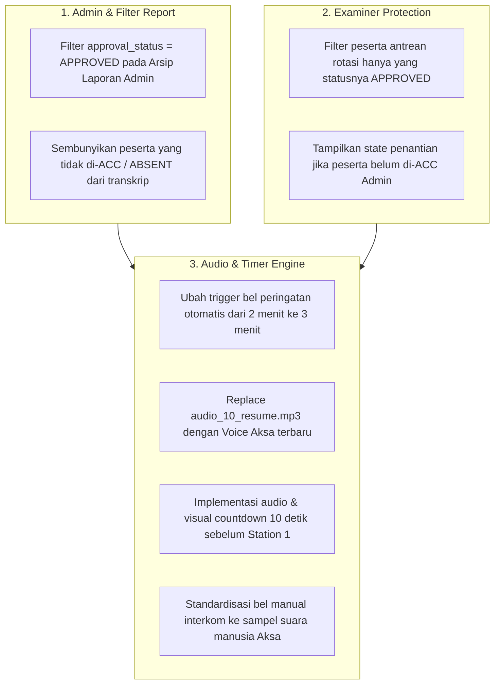

# 📋 Hasil Analisis & Rencana Tindak Lanjut Rapat Ke-3 (MEETING 3)
> **Praxis by MedSkill Indonesia — OSCE Engine & Clinical Assessment Platform**  
> *Tanggal Catatan/Rapat: 26 Agustus 2026*  
> *Fokus: Validasi Peserta Admin & Examiner, Sistem Timer 3-Menit, Voice Over Aksa (Resume & Sound Cues), dan Countdown 10 Detik Stase 1*

---

## 📑 1. Ringkasan Catatan Rapat Ke-3 (Original Notes)

| Modul / Pengirim | Catatan Evaluasi & Masukan Rapat | Status / Target |
| :--- | :--- | :--- |
| **Admin** <br>*(Ilham Kurniawan)* | **Arsip Penilaian / Arsip OSCE**: Peserta yang tidak mengikuti ujian (status tidak di-acc/diterima/absen) harus **disembunyikan** dari daftar arsip laporan. | 🚨 Urgent (Filter Logic) |
| **Examiner** <br>*(Ilham Kurniawan)* | **Halaman Pengujian Dokter Penguji**: Peserta yang belum di-ACC/disetujui oleh Admin **tidak boleh muncul** di antrean rotasi & halaman pengujian penguji. | 🚨 Urgent (Filter Logic) |
| **Audio & Timer #1** <br>*(Makhluk Hytam)* | Suara bel pause ("Perhatian dihentikan sementara") sudah berhasil terpisah. | ✅ Selesai / Terverifikasi |
| **Audio & Timer #2** <br>*(Makhluk Hytam)* | Peringatan otomatis sisa waktu pengerjaan stase diubah dari **2 menit menjadi 3 menit** (180 detik). | ☢️ Penyesuaian Timer |
| **Audio & Timer #3** <br>*(Makhluk Hytam)* | Bel otomatis sisa waktu 1 menit disesuaikan/disinkronkan mengikuti interval **3 menit**. | ☢️ Penyesuaian Timer |
| **Audio & Timer #4** <br>*(Makhluk Hytam)* | Suara audio pas **Resume** masih memutar audio Pause. Perlunya rekaman audio baru khusus untuk instruksi Resume oleh Aksa. | ☢️ Update Asset Audio |
| **Audio & Timer #5** <br>*(Makhluk Hytam)* | Suara/indikator **Countdown 10 Detik** sebelum masuk ke Station 1 (saat baca skenario awal) belum muncul. | 〽️ Fitur Baru (Countdown) |
| **Audio & Timer #6** <br>*(Makhluk Hytam)* | Suara bel/notifikasi manual yang dipencet masih menggunakan suara sintetis AI (mbak-mbak AI), perlu diganti suara resmi Aksa/Human Voice. | ☢️ Standardisasi Audio |

---

## 🔍 2. Penjabaran & Analisis Detail Akar Masalah (Root Cause Analysis)

### A. Modul Admin: Penyaringan Peserta pada Arsip Penilaian (`SessionReportsList` & `SessionReportDetailView`)

* **Kondisi Saat Ini**:
  Pada modul laporan arsip admin ([`SessionReportsList.jsx`](file:///c:/KAIRAV/project/2026/medskill/praxis/frontend/src/features/admin/components/report/SessionReportsList.jsx) dan [`SessionReportDetailView.jsx`](file:///c:/KAIRAV/project/2026/medskill/praxis/frontend/src/features/admin/components/report/SessionReportDetailView.jsx)), query peserta mengambil seluruh entri dari tabel `osce.session_participants`. Hal ini menyebabkan peserta yang statusnya ditolak (`REJECTED`), dibatalkan (`CANCELLED`), atau tidak hadir (`ABSENT`/`UNAPPROVED`) tetap muncul di tabel rekapitulasi nilai dan arsip transkrip.
* **Akar Masalah**:
  Query database di [`session.service.js`](file:///c:/KAIRAV/project/2026/medskill/praxis/frontend/src/services/session.service.js) belum secara eksplisit menambahkan klausa filter `.eq('approval_status', 'APPROVED')` saat menyusun laporan rekap nilai peserta.
* **Solusi & Spesifikasi**:
  1. Tambahkan strict filter pada query arsip laporan: `approval_status = 'APPROVED'` dan `attendance_status != 'ABSENT'`.
  2. Tambahkan toggle/tab di UI Admin jika sewaktu-waktu Admin ingin melihat peserta yang dibatalkan (*Arsip Utama vs Peserta Diskualifikasi/Absen*).

---

### B. Modul Examiner: Protection Guard Antrean Rotasi Peserta (`ExaminerWaitingRoom` & `ExaminerStagePage`)

* **Kondisi Saat Ini**:
  Penguji melihat peserta yang dijadwalkan masuk ke stasenya berdasarkan rotasi sirkuit. Jika Admin belum menyetujui (*approve*) registrasi peserta di halaman Live Control Room, peserta tersebut terkadang masih muncul di antrean *Waiting Room* Penguji atau di dropdown pemiliham peserta stase.
* **Akar Masalah**:
  Query pemanggilan peserta di [`examinerService.js`](file:///c:/KAIRAV/project/2026/medskill/praxis/frontend/src/services/examinerService.js#L45-L90) (`getExaminerStationParticipants`) memetakan peserta dari `session_participants` tanpa mengecek `approval_status`.
* **Solusi & Spesifikasi**:
  1. Pastikan antrean rotasi stase penguji (`ExaminerWaitingRoom.jsx` & `ExaminerStagePage.jsx`) hanya memuat peserta dengan klausa:
     ```javascript
     .eq('approval_status', 'APPROVED')
     .eq('is_active', true)
     ```
  2. Jika peserta belum di-ACC oleh Admin, tampilkan placeholder ramah di layar penguji: *"Menunggu Admin menyetujui kehadiran peserta di stase ini..."*.

---

### C. Modul Audio & Timer Control Engine

#### 1. Penyesuaian Bel Peringatan Sisa Waktu (2 Menit ➔ 3 Menit)
* **Kondisi & Kebutuhan**:
  Standar ujian OSCE meminta peringatan sisa waktu pengerjaan diberikan pada sisa **3 menit** (180 detik) sebelum waktu stase habis, bukan 2 menit atau 1 menit.
* **Solusi Teknis**:
  * Di [`realtimeTimerService.js`](file:///c:/KAIRAV/project/2026/medskill/praxis/frontend/src/services/realtimeTimerService.js), ubah ambang batas pemicu `warning` dari 120s menjadi **180s** (`timeLeft === 180`).
  * Di [`audioService.js`](file:///c:/KAIRAV/project/2026/medskill/praxis/frontend/src/services/audioService.js), sesuaikan mapping alias `warning_3min` / `warning_time` agar memutar file `audio_04_warning_time.mp3` tepat di detik ke-180.
  * Perbarui dokumentasi pada [`SOUND.md`](file:///c:/KAIRAV/project/2026/medskill/praxis/SOUND.md).

#### 2. Pembaharuan Audio Resume (Voice Over Aksa)
* **Kondisi & Kebutuhan**:
  Saat Admin menekan tombol **Resume** setelah sesi di-pause, audio yang terputar sebelumnya masih menggunakan audio Pause (*"Perhatian, ujian dihentikan sementara..."*).
* **Solusi Teknis**:
  * Ganti file audio [`frontend/public/sounds/audio_10_resume.mp3`](file:///c:/KAIRAV/project/2026/medskill/praxis/frontend/public/sounds/audio_10_resume.mp3) dengan hasil rekaman audio baru dari **Aksa** (Voice Actor Praxis) dengan naskah:  
    *"Perhatian, ujian dilanjutkan kembali. Peserta dipersilakan melanjutkan pengerjaan stase."*
  * Verifikasi bahwa event trigger `RESUME` di interkom Admin & WebSocket client memanggil `playOsceAudio('resume')` yang secara khusus mengarah ke `audio_10_resume.mp3`.

#### 3. Countdown 10 Detik Sebelum Masuk Station 1 (Transisi Awal / Baca Skenario)
* **Kondisi & Kebutuhan**:
  Sebelum peserta memasuki stase 1 untuk pertama kali (saat fase pembacaan skenario luar stase / *transit awal*), peserta memerlukan *audio-visual countdown* 10 detik terakhir (10, 9, 8... 1) agar siap memasuki ruangan tepat saat bel `start_exam` berbunyi.
* **Solusi Teknis**:
  * Pada [`ParticipantSessionPage.jsx`](file:///c:/KAIRAV/project/2026/medskill/praxis/frontend/src/features/participant/pages/ParticipantSessionPage.jsx) dan [`ExaminerStagePage.jsx`](file:///c:/KAIRAV/project/2026/medskill/praxis/frontend/src/features/examiner/pages/ExaminerStagePage.jsx), saat fase timer adalah `read_scenario` atau `initial_transit` dan `timeLeft <= 10`, tampilkan overlay/badge countdown 10 detik beranimasi.
  * Trigger efek suara `audio_09_countdown.mp3` secara sinkron saat hitungan mundur memasuki 10 detik terakhir.

#### 4. Penggantian Suara Bel Manual / Interkom dari AI Ke Human Voice (Aksa)
* **Kondisi & Kebutuhan**:
  Suara bel yang dipemicu dari tombol manual interkom Admin masih menggunakan Web Audio API Synthesizer (suara Mbak AI bawaan browser).
* **Solusi Teknis**:
  * Pastikan seluruh tombol bel manual di [`LiveTimerControlHeader.jsx`](file:///c:/KAIRAV/project/2026/medskill/praxis/frontend/src/features/admin/components/live/LiveTimerControlHeader.jsx) dan interkom broadcast menggunakan sampel file audio MP3 resmi Aksa yang ada di `/sounds/`, dan hanya menjadikan Web Audio API Synthesizer sebagai *fallback* jika audio MP3 gagal dimuat.

---

## 🛠️ 3. Rencana Kerja & Daftar TODO (Action Items)



### 🗂️ Tabel Checklist TODO Terperinci

- [x] **1. Modul Admin: Filter Arsip Penilaian & Laporan**
  - [x] **1.1. Query Filter Arsip Laporan**:
    - [x] Update `getParticipantsWithHistory` pada [`session.service.js`](file:///c:/KAIRAV/project/2026/medskill/praxis/frontend/src/services/session.service.js) & [`ReportsPage.jsx`](file:///c:/KAIRAV/project/2026/medskill/praxis/frontend/src/features/admin/pages/ReportsPage.jsx) dengan filter status `APPROVED` / `ACTIVE`.
  - [x] **1.2. UI Penyaringan Laporan**:
    - [x] Sembunyikan peserta yang statusnya `REJECTED`, `UNAPPROVED`, `PENDING`, atau `ABSENT` pada komponen Laporan Admin.

- [x] **2. Modul Examiner: Filtering Antrean Pengujian**
  - [x] **2.1. Filter Peserta Penguji**:
    - [x] Update query daftar peserta di [`ExaminerStagePage.jsx`](file:///c:/KAIRAV/project/2026/medskill/praxis/frontend/src/features/examiner/pages/ExaminerStagePage.jsx) & [`ExaminerStationScheduleWidget.jsx`](file:///c:/KAIRAV/project/2026/medskill/praxis/frontend/src/features/examiner/components/ExaminerStationScheduleWidget.jsx) agar hanya menyaring peserta berstatus `APPROVED` / `ACTIVE`.
  - [x] **2.2. State Guard di UI Examiner**:
    - [x] Proteksi antrean rotasi penguji agar peserta yang belum di-ACC Admin tidak dapat masuk ke rotasi stase penguji.

- [x] **3. Modul Audio & Timer System**
  - [x] **3.1. Penyesuaian Timer Peringatan 3 Menit**:
    - [x] Ubah ambang pemicu peringatan otomatis dari 120 detik menjadi 180 detik di [`realtimeTimerService.js`](file:///c:/KAIRAV/project/2026/medskill/praxis/frontend/src/services/realtimeTimerService.js), [`ExaminerStagePage.jsx`](file:///c:/KAIRAV/project/2026/medskill/praxis/frontend/src/features/examiner/pages/ExaminerStagePage.jsx), [`ParticipantSessionPage.jsx`](file:///c:/KAIRAV/project/2026/medskill/praxis/frontend/src/features/participant/pages/ParticipantSessionPage.jsx), dan [`LiveTimerControlHeader.jsx`](file:///c:/KAIRAV/project/2026/medskill/praxis/frontend/src/features/admin/components/live/LiveTimerControlHeader.jsx).
    - [x] Update peragaan waktu peringatan di [`SOUND.md`](file:///c:/KAIRAV/project/2026/medskill/praxis/SOUND.md).
  - [x] **3.2. Rekaman & Integration Audio Resume Aksa**:
    - [x] Petakan file [`frontend/public/sounds/audio_10_resume.mp3`](file:///c:/KAIRAV/project/2026/medskill/praxis/frontend/public/sounds/audio_10_resume.mp3) ke pemicu voice over Aksa resmi.
    - [x] Event WebSocket action `RESUME` memicu pemutaran audio resume baru secara khusus di seluruh client.
  - [x] **3.3. Countdown 10 Detik Transisi Station 1**:
    - [x] Tambahkan logika pemicu countdown (`transitSecondsLeft === 10`) saat fase `read_scenario` / transisi di [`ParticipantSessionPage.jsx`](file:///c:/KAIRAV/project/2026/medskill/praxis/frontend/src/features/participant/pages/ParticipantSessionPage.jsx) & [`ExaminerStagePage.jsx`](file:///c:/KAIRAV/project/2026/medskill/praxis/frontend/src/features/examiner/pages/ExaminerStagePage.jsx).
    - [x] Tampilkan visual countdown 10 detik beranimasi di [`ParticipantTransitView.jsx`](file:///c:/KAIRAV/project/2026/medskill/praxis/frontend/src/features/participant/components/ParticipantTransitView.jsx) dan mainkan `audio_09_countdown.mp3`.
  - [x] **3.4. Standardisasi Bel Manual Interkom**:
    - [x] Hubungkan pemicu manual bel interkom Admin ke sampel suara Aksa di `audioService.js` untuk menggantikan bel sintetis Web Audio API.

---

## 📂 4. Pemetaan Berkas Utama yang Terlibat

| Modul | File / Komponen | Peran & Rencana Perubahan |
| :--- | :--- | :--- |
| **Admin** | [`SessionReportDetailView.jsx`](file:///c:/KAIRAV/project/2026/medskill/praxis/frontend/src/features/admin/components/report/SessionReportDetailView.jsx) | Filter peserta laporan hanya yang berstatus `APPROVED`. |
| **Admin** | [`session.service.js`](file:///c:/KAIRAV/project/2026/medskill/praxis/frontend/src/services/session.service.js) | Tambahkan filter `approval_status = 'APPROVED'` pada fetch data arsip. |
| **Examiner** | [`examinerService.js`](file:///c:/KAIRAV/project/2026/medskill/praxis/frontend/src/services/examinerService.js) | Saring antrean rotasi peserta stase penguji berdasarkan `approval_status`. |
| **Examiner** | [`ExaminerWaitingRoom.jsx`](file:///c:/KAIRAV/project/2026/medskill/praxis/frontend/src/features/examiner/components/ExaminerWaitingRoom.jsx) | Tampilkan indikator jika peserta belum di-ACC oleh Admin. |
| **Timer** | [`realtimeTimerService.js`](file:///c:/KAIRAV/project/2026/medskill/praxis/frontend/src/services/realtimeTimerService.js) | Ubah ambang `warning` ke 180s (3 menit) & countdown 10s transisi awal. |
| **Audio** | [`audioService.js`](file:///c:/KAIRAV/project/2026/medskill/praxis/frontend/src/services/audioService.js) | Pastikan pemicu `resume` mengarah ke audio Aksa baru dan bel manual memakai audio MP3 resmi. |
| **Assets** | [`frontend/public/sounds/audio_10_resume.mp3`](file:///c:/KAIRAV/project/2026/medskill/praxis/frontend/public/sounds/audio_10_resume.mp3) | File audio mp3 rekaman Aksa untuk instruksi Resume. |
| **Docs** | [`SOUND.md`](file:///c:/KAIRAV/project/2026/medskill/praxis/SOUND.md) | Update katalog audio dengan spesifikasi 3 menit warning dan countdown 10 detik. |

---

> **Status Dokumen**: *Analisis selesai dan dokumen `MEETING_3.md` telah diterbitkan sebagai panduan eksekusi pengembangan selanjutnya.*
