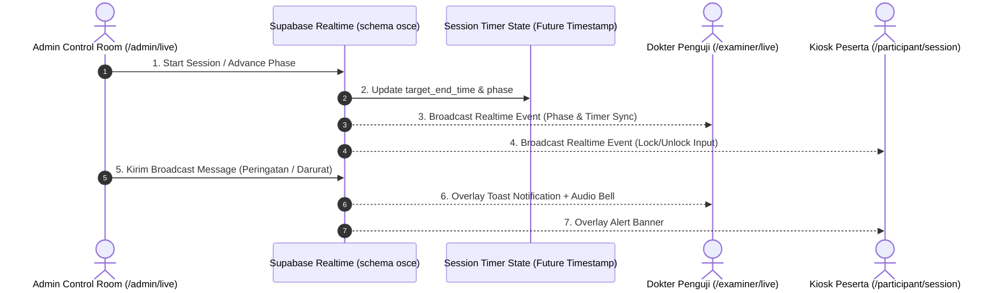
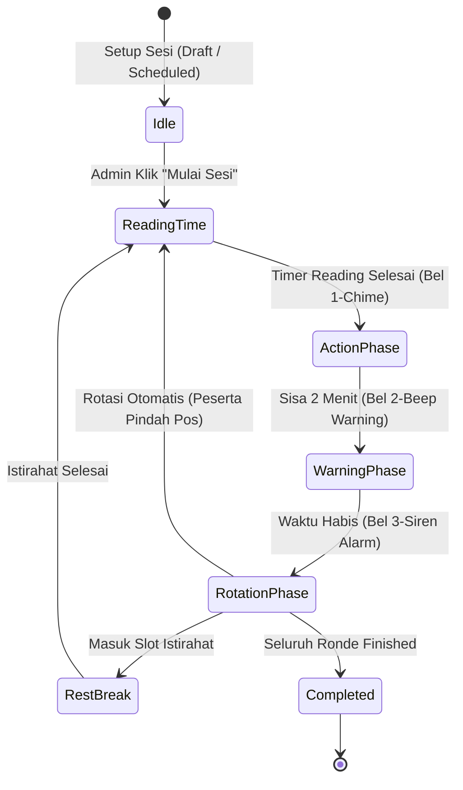

# 🛰️ PLAN DOKUMENTASI LENGKAP: MONITORING LIVE SESI OSCE & SINKRONISASI REAL-TIME

Dokumen ini berisi spesifikasi arsitektur terpadu, alur kerja rotasi, sistem timer server-side, kontrol broadcast darurat, hingga tata kelola antarmuka **Live Control Room OSCE** pada aplikasi MedSkill LMS.

---

## 📐 1. OVERVIEW & TUJUAN MONITORING LIVE

Halaman **Live Monitoring Admin** (`/admin/live` dan `/admin/live/station/:stageId`) dirancang sebagai **Pusat Komando (Control Room)** ujian sirkuit OSCE terpadu. Admin memiliki kendali penuh secara real-time atas:

1. **Master Timer Control**: Memulai, menjeda (pause), meresume, dan melakukan rotasi manual ronde ujian untuk seluruh pos sirkuit secara bersamaan.
2. **Matrix Rotasi Live (Rotational Grid)**: Memantau posisi setiap peserta di setiap stase pada Ronde 1 hingga Ronde N secara otomatis.
3. **Real-time Rubric & Progress Stream**: Memantau pengisian rubrik 0-3 oleh dokter penguji dan lembar jawaban peserta secara langsung.
4. **Sistem Broadcast Pengumuman Real-time**: Mengirimkan notifikasi suara/teks ke layar penguji dan peserta per stase atau seluruh sirkuit.
5. **Web Audio Bell Synthesizer**: Membunyikan bel otomatis (Reading Bell, Warning Bell, Rotation Siren) tanpa ketergantungan file `.mp3` eksternal.

---

## 🏗️ 2. ARSITEKTUR & ALUR DATA REAL-TIME



### ⏱️ Master Timer Algorithm: "Future Timestamp Pattern"
Untuk menghindari ketidakakuratan timer akibat *network latency* atau *browser background tab throttling*, sistem **TIDAK** mengirimkan sisa detik setiap detik. Sebaliknya:
1. Admin menyimpan `target_end_time` (UTC ISO string) di database `osce.session_timer_state`.
2. Setiap client (Admin, Penguji, Peserta) menghitung sisa waktu lokal secara independen:
   $$\text{Remaining MS} = \text{target\_end\_time} - \text{NOW()}$$
3. Timer 100% presisi dan sinkron di semua perangkat.

---

## 🔄 3. ALUR KERJA ROTASI SIRKUIT PER RONDE (LIFE CYCLE)

Setiap ronde ujian sirkuit OSCE berjalan dalam 5 fase otomatis:



### Detail Rincian 5 Fase Rotasi:

| Fase | Durasi Standar | Aktivitas Peserta | Aktivitas Penguji | Notifikasi Bel Audio | Status Input Form |
| :--- | :--- | :--- | :--- | :--- | :--- |
| **1. Reading Time** | 1 Menit (60 dtk) | Membaca skenario klinis di luar pintu ruang stase / kiosk. | Mempersiapkan alat, manekin, dan kunci jawaban. | 🔔 **1-Chime High Bell** (880 Hz) | Form jawaban dikunci (*Read-only*). |
| **2. Action Phase** | 10 - 13 Menit | Melakukan anamnesis, pemeriksaan fisik, dan tindakan medis. | Mengamati & menglik skor rubrik 0-3 pada tablet penguji. | 🔇 Silent | Form jawaban peserta & rubrik **AKTIF**. |
| **3. Warning Phase** | 2 Menit Akhir | Menyelesaikan resep medis dan penutupan konsultasi. | Finalisasi pemberian skor rubrik dan umpan balik. | ⚠️ **2-Beep Warning** (660 Hz) | Badge peringatan sisa 2 menit berkedip. |
| **4. Rotation Time Up** | 2 Menit Transisi | Berpindah ke stase berikutnya `(Pos + 1)`. | Mengirimkan nilai akhir dan mempersiapkan peserta baru. | 🚨 **3-Siren Alarm** (523 - 987 Hz) | Form dikunci otomatis (`auto_lock_answer: true`). |
| **5. Rest Break** | 12 Menit Jeda | Berada di ruang transit istirahat (Rest Room). | Beristirahat dan rekapitulasi data. | ☕ Soft Tone | Pengujian ditangguhkan. |

---

## 🖥️ 4. SPESIFIKASI DOKUMENTASI HALAMAN LIVE MONITOR (`/admin/live`)

Halaman Monitor Live Admin terbagi menjadi 4 modul utama:

### 4.1 Modul 1: Control Bar & Master Timer Panel
Terletak di bagian atas halaman monitor:
- **Badge Status Sesi**: `ONGOING (LIVE)`, `PAUSED`, atau `COMPLETED`.
- **Master Timer Display**: Tampilan jam digital raksasa (contoh: `08:45` dari 12:00).
- **Indikator Fase Active**: Badge warna dinamis (`Reading` = Ungu, `Action` = Hijau, `Warning` = Kuning, `Transition` = Merah).
- **Tombol Kendali Admin**:
  - ▶️ **Mulai / Play**: Memulai timer dari fase `idle` atau `paused`.
  - ⏸️ **Pause**: Menjeda sesi darurat (waktu pembekuan disimpan di `paused_remaining_ms`).
  - ⏩ **Lompati Fase / Paksa Rotasi**: Berpindah langsung ke ronde berikutnya secara manual.
  - 🔔 **Mute / Unmute Bell**: Toggle suara bel sistem pada terminal Admin.
  - 🛑 **Hentikan Sesi**: Menyelesaikan seluruh sirkuit ujian.

---

### 4.2 Modul 2: Layout Tampilan Sirkuit (Grid 8 Pos & Matriks Rotasi)
Admin dapat memilih 2 mode tampilan visual sirkuit:

#### A. Mode Grid Pos Stase (8 Cards)
Menampilkan 8 kartu pos sirkuit (Stase 1 - 7 + Stase Istirahat):
- **Header Card**: Nomor Pos, Judul Kasus Medis, dan Organ System.
- **Dokter Penguji**: Nama Dokter Spesialis & foto avatar.
- **Peserta Ujian Aktif**: Foto, NIM, Nama Mahasiswa yang sedang diuji di pos tersebut pada ronde aktif.
- **Status pengisian Rubrik**: ProgressBar persentase rubrik yang telah dinilai oleh penguji (contoh: `4/4 Item (100%)`).
- **Tautan Cepat**: Tombol `Inspect Stase` untuk membuka layar monitor detail pos (`/admin/live/station/:stageId`).

#### B. Mode Matriks Rotasi Peserta (Candidate Rotation Matrix)
Tabel matriks yang menampilkan pergerakan seluruh peserta dari Ronde 1 hingga Ronde N:
- Baris = Nama Peserta / Gelombang.
- Kolom = Pos Stase 1 s/d Pos Stase N.
- Sel = Nomor Ronde rotasi di mana peserta berada.

---

### 4.3 Modul 3: Sistem Broadcast Real-time & Pesan Darurat

Admin dapat mengirimkan instruksi teks dan notifikasi audio ke seluruh ruangan atau pos tertentu.

#### Tabel Database: `osce.broadcast_messages`
```sql
CREATE TABLE IF NOT EXISTS osce.broadcast_messages (
    id            UUID PRIMARY KEY DEFAULT gen_random_uuid(),
    session_id    UUID NOT NULL REFERENCES osce.sessions(id) ON DELETE CASCADE,
    message       TEXT NOT NULL,
    priority      TEXT DEFAULT 'info',      -- 'info', 'warning', 'urgent'
    target_role   TEXT DEFAULT 'all',       -- 'all', 'participants', 'examiners'
    sent_by       UUID REFERENCES public.profiles(id),
    created_at    TIMESTAMPTZ DEFAULT NOW()
);
```

#### Preset Template Pesan Broadcast Admin:
1. 📢 **Peringatan Waktu**: *"Waktu pengerjaan tersisa 2 menit. Harap selesaikan penulisan resep."*
2. 🚨 **Instruksi Rotasi**: *"Waktu stase telah habis! Harap seluruh peserta segera berpindah ke pos berikutnya."*
3. ☕ **Pengumuman Istirahat**: *"Sesi rotasi Gelombang 1 telah selesai. Peserta menuju ruang transit."*
4. ⚠️ **Instruksi Khusus Penguji**: *"Dokter Penguji dimohon memverifikasi skor rubrik sebelum rotasi."*

---

### 4.4 Modul 4: Layar Detail Inspeksi Stase (`/admin/live/station/:stageId`)

Layar khusus bagi admin untuk menginspeksi 1 pos stase secara mendalam:
- **Tampilan Dual-Pane**:
  - **Pane Kiri**: Skenario kasus, berkas penunjang yang telah dibuka (EKG/Radiologi), dan jawaban resep peserta.
  - **Pane Kanan**: Live scoring feed dari penguji (skor 0, 1, 2, 3 per item rubrik beserta catatan/feedback).

---

## 🔊 5. SPESIFIKASI WEB AUDIO BELL SYNTHESIZER

Sistem bel dikembangkan menggunakan **Web Audio API** bawaan browser (tanpa perlu mendownload file `.mp3`):

```javascript
// Web Audio API Synthesizer Helper
export function playOsceBell(type = "warning") {
  try {
    const AudioContext = window.AudioContext || window.webkitAudioContext;
    if (!AudioContext) return;
    const ctx = new AudioContext();

    if (type === "start") {
      // Single High Chime Bell (Reading Time / Start)
      const osc = ctx.createOscillator();
      const gain = ctx.createGain();
      osc.type = "sine";
      osc.frequency.setValueAtTime(880, ctx.currentTime); // A5 Tone
      gain.gain.setValueAtTime(0.3, ctx.currentTime);
      gain.gain.exponentialRampToValueAtTime(0.001, ctx.currentTime + 1.2);
      osc.connect(gain);
      gain.connect(ctx.destination);
      osc.start();
      osc.stop(ctx.currentTime + 1.2);
    } else if (type === "warning") {
      // Double Beep Warning (2 Minutes Remaining)
      [0, 0.25].forEach((delay) => {
        const osc = ctx.createOscillator();
        const gain = ctx.createGain();
        osc.type = "triangle";
        osc.frequency.setValueAtTime(660, ctx.currentTime + delay); // E5 Tone
        gain.gain.setValueAtTime(0.3, ctx.currentTime + delay);
        gain.gain.exponentialRampToValueAtTime(0.001, ctx.currentTime + delay + 0.18);
        osc.connect(gain);
        gain.connect(ctx.destination);
        osc.start(ctx.currentTime + delay);
        osc.stop(ctx.currentTime + delay + 0.18);
      });
    } else if (type === "rotation") {
      // Triple Siren Alarm (Station Rotation Time Up)
      [0, 0.3, 0.6].forEach((delay, idx) => {
        const osc = ctx.createOscillator();
        const gain = ctx.createGain();
        osc.type = "sawtooth";
        osc.frequency.setValueAtTime(idx === 2 ? 987.77 : 523.25, ctx.currentTime + delay);
        gain.gain.setValueAtTime(0.25, ctx.currentTime + delay);
        gain.gain.exponentialRampToValueAtTime(0.001, ctx.currentTime + delay + 0.22);
        osc.connect(gain);
        gain.connect(ctx.destination);
        osc.start(ctx.currentTime + delay);
        osc.stop(ctx.currentTime + delay + 0.22);
      });
    }
  } catch (err) {
    console.error("Audio Bell playback error:", err);
  }
}
```

---

## 🗂️ 6. FILE MATRIX & INTEGRASI CODEBASE

| Nama File Component / Service | Peran & Deskripsi |
| :--- | :--- |
| `frontend/src/features/admin/pages/LiveMonitorPage.jsx` | Halaman Control Room Admin untuk monitoring sirkuit, master timer, dan broadcast. |
| `frontend/src/features/admin/pages/StationMonitorDetailPage.jsx` | Layar inspeksi detail 1 pos stase live (jawaban peserta + rubrik penguji). |
| `frontend/src/services/live.service.js` | Service Supabase Realtime untuk timer, station states, dan listener `postgres_changes`. |
| `frontend/src/services/broadcast.service.js` | Service untuk mengirim dan mendengarkan pesan broadcast realtime. |
| `migration/008_rotation_and_timer.sql` | Schema tabel `osce.rotation_states` dan `osce.session_timer_state`. |
| `migration/012_broadcast_messages.sql` | Schema tabel `osce.broadcast_messages`. |

---

## 🚀 7. RENCANA EKSEKUSI PENGEMBANGAN

1. **Tahap 1: Sinkronisasi Backend Supabase Realtime**
   - Menghubungkan `LiveMonitorPage.jsx` dengan `osce.session_timer_state` dan `osce.sessions` via `live.service.js`.
2. **Tahap 2: Penguatan Fitur Control Panel & Audio Bell**
   - Mengaktifkan tombol Play, Pause, Next Round, dan Web Audio Bell Synthesizer pada bar timer.
3. **Tahap 3: Implementasi Modal Broadcast Admin**
   - Menambahkan komponen modal pengiriman broadcast dengan template cepat dan integrasi real-time toast pada antarmuka penguji & peserta.
4. **Tahap 4: Verifikasi & Uji Coba Rotasi 8 Station**
   - Memastikan rotasi peserta antar pos berjalan mulus sesuai urutan gelombang.
