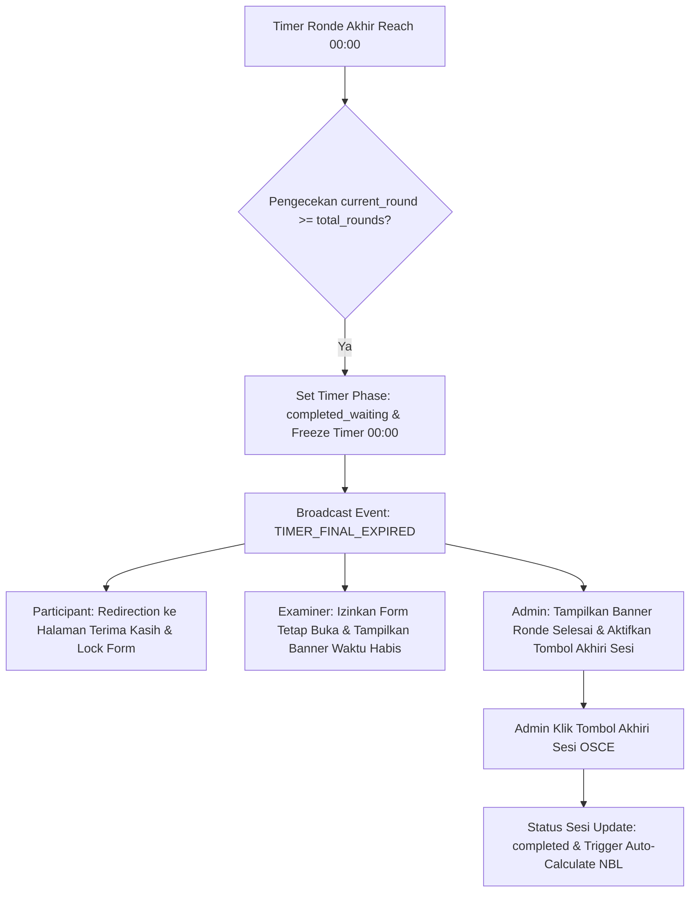

# 📌 Spesifikasi Perbaikan Flow Transisi Akhir Ujian OSCE (End-of-Exam State Spec)

> **Dokumen Catatan & Perbaikan Logika Sistem**  
> *Project: Praxis by MedSkill Indonesia*  
> *Target Modul: Realtime Timer Engine, Participant Session Kiosk, Examiner Grading Room, Admin Live Control Room*

---

## 🚨 Problem Statement (Masalah Saat Ini)

Saat timer ujian OSCE mencapai `00:00` pada **transisi/ronde terakhir** (misalnya Ronde 6 dari 6 Stase):
1. Sistem auto-rolling timer berisiko melakukan *looping* kembali ke Ronde 1 atau bernilai negatif.
2. Tampilan peserta belum konsisten mengunci form dan mengalihkan ke halaman penutup.
3. Dokter Penguji berisiko terganggu atau terkunci sebelum selesai memasukkan penilaian stase terakhir.
4. Admin membutuhkan kepastian indikator bahwa semua ronde telah selesai sebelum mengklik **Akhiri Sesi OSCE**.

---

## 🎯 Expected Behavior (Perilaku yang Diharapkan)

Ketika timer pada ronde/transisi terakhir habis (`remaining_seconds <= 0` pada `current_round == total_rounds`):

### 1. 🎓 Layar Peserta (Participant Flow)
* **Tampilan Halaman Terima Kasih**: Peserta otomatis dialihkan ke halaman ucapan terima kasih (*OSCE Completion / Thank You Screen*).
* **Kunci Total Form Answer (Locking)**: 
  * Seluruh input pengerjaan (Anamnesis, Pemeriksaan Fisik, Penunjang, Diagnosis WDx/DDx, dan Blangko Resep) dikunci total (*read-only*).
  * Peserta tidak dapat kembali ke halaman stase atau mengubah jawaban.
* **Informasi Rangkuman Kehadiran**: Menampilkan status stase yang telah diselesaikan peserta selama sirkuit berlangsung.

### 2. 🩺 Layar Dokter Penguji (Examiner Flow)
* **Fleksibilitas Penilaian (Grading Grace Period)**: Layar penguji **TIDAK** boleh dikunci paksa atau di-redirect secara mendadak saat timer 00:00.
* **Penguji Tetap Bisa Input Skor**:
  * Penguji tetap dapat mengeklik skor rubrik (0-3), memilih *Global Rating Scale* (GRS), dan mengisi *feedback* untuk peserta di ronde terakhir.
  * Tombol `Submit & Lock Score` tetap aktif sampai penguji secara sadar mengunci nilai.
* **Indikator Banner Warn**: Menampilkan banner status:  
  `⏱️ Waktu Ronde Habis — Silakan selesaikan penilaian & submit skor peserta ronde terakhir.`

### 3. 🏛️ Layar Control Room Admin (Admin Flow)
* **Monitoring Kelengkapan Nilai**: Admin dapat memantau status penguncian nilai dari seluruh stase (contoh: *6/6 Penguji Sudah Submit Nilai*).
* **Tombol Kontrol "Akhiri Sesi OSCE" (`Finish Session`)**:
  * Admin memegang wewenang penuh untuk menekan tombol **"Akhiri Sesi OSCE"**.
  * Setelah ditekan, status sesi di database berubah menjadi `completed`/`finished`, saluran WebSocket diputuskan, dan data siap diproses untuk kalkulasi NBL (Borderline Regression Method).

### 4. ⏱️ Tampilan Timer Engine (Global Timer Display)
* **Reset & Freeze di 00:00**: Timer berhenti tepat di angka `00:00` (atau `00:00:00`), tidak bernilai minus (`-00:01`) dan tidak me-reset paksa ke Ronde 1.
* **Label Status Timer**: Berubah menjadi badge transisi:  
  `SESI SELESAI — Menunggu Pengajuan Nilai Penguji & Penutupan Admin`

---

## ⚙️ Rencana Teknis Implementasi (Technical Blueprint)

### Detail Perubahan Berkas Utama:

| File / Component | Lokasi | Perubahan yang Dilakukan |
| :--- | :--- | :--- |
| **`realtimeTimerService.js`** | `@/services/realtimeTimerService.js` | Mencegah `advanceRound` me-reset ke Ronde 1 saat `roundNumber === totalRounds`. Set phase ke `completed_waiting`. |
| **`LiveMonitorPage.jsx`** | `@/features/admin/pages/LiveMonitorPage.jsx` | Menonaktifkan auto-rolling ronde di akhir sesi. Menampilkan status *Ready to Finish* dan tombol *Akhiri Sesi OSCE*. |
| **`ParticipantSessionPage.jsx`** | `@/features/participant/pages/ParticipantSessionPage.jsx` | Menambahkan pengecekan phase `completed_waiting` untuk merender tampilan Terima Kasih dan mengunci seluruh input. |
| **`ExaminerStagePage.jsx`** | `@/features/examiner/pages/ExaminerStagePage.jsx` | Memastikan `is_locked` tidak otomatis `true` hanya karena timer 00:00, sehingga Penguji tetap bisa menyelesaikan grading. |

---

> **Status Catatan**: *Telah diperbaiki & dijabarkan. Siap diimplementasikan pada codebase Praxis.*
