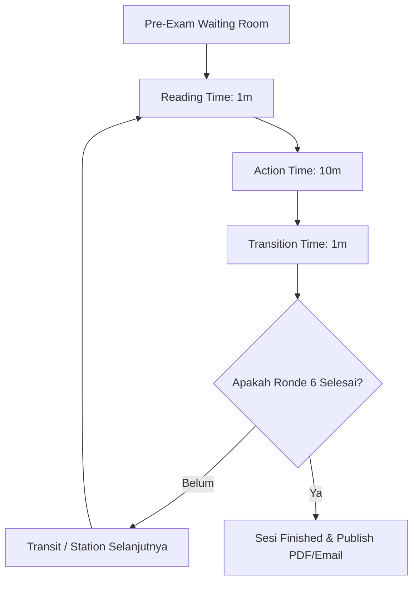

# 📘 Master System Specification & Operational Rules (OSCE-SPEC.md)
**Praxis by MedSkill Indonesia** — *Single Source of Truth Spesifikasi Sistem Ujian OSCE*

---

## 📑 1. Arsitektur Ujian & Sirkuit 6 Stase

### 1.1 Prinsip Dasar Sesi Ujian OSCE
Satu Sesi Ujian **OSCE (Objective Structured Clinical Examination)** menguji kompetensi klinis peserta secara terstandarisasi.
- **Arsitektur Sirkuit 6 Stase Aktif**: Setiap sesi terdiri dari **6 Stase Ujian Keterampilan Medis Aktif** (diuji oleh Dokter Penguji Spesialis pada kasus/simulator pasien).
- **Jeda Rotasi (Break Duration)**: Waktu transisi/istirahat antar-ronde perputaran sirkuit (bukan stase tiruan/Break Station).
- **Timer Stase Baku (12 Menit/Stase)**:
  - **Reading Time**: 1 Menit (Membaca skenario kasus di luar pintu stase).
  - **Action Time**: 10 Menit (Anamnesis, pemeriksaan fisik, penunjang, diagnosis, resep & tindakan klinis).
  - **Transition Time**: 1 Menit (Perpindahan peserta ke stase berikutnya).
- **Pasien Standar**: Setiap stase dilengkapi Pasien Standar (Manusia / AI Simulator) dengan skenario klinis baku.

---

## 🎓 2. Spesifikasi Peran Peserta Ujian (Participant Flow)

### 2.1 Pendaftaran & Waiting Room (`/participant`)
- **Akses & Login**: Login peserta dilengkapi fitur *Lupa Password*.
- **Waiting Room & Briefing**: Peserta membaca briefing tata tertib dan memantau status sesi (*stay in page*) hingga Admin menekan tombol **Start Simulation**.

### 2.2 Kiosk Ujian 4-Halaman Berurutan (`/participant/session/:sessionId`)
Pengerjaan kiosk stase bersifat **Navigasi Satu Arah (One-Way Forward / No Back Button)**:
1. **Halaman 1 (Anamnesis)**: Pembacaan skenario klinis & anamnesis langsung ke pasien standar.
2. **Halaman 2 (Pemeriksaan Fisik)**: Instruksi & pelaksanaan prosedur fisik dan TTV.
3. **Halaman 3 (Checklist Pemeriksaan Penunjang)**:
   - Searchbar & dropdown filter (Radiologi, EKG, Lab).
   - **Logika Output Berkas**:
     - *Dicentang & Ada Data Admin* $\rightarrow$ Muncul berkas gambar (X-Ray/EKG/Lab) + laporan ekspertise.
     - *Dicentang & Tidak Ada Data* $\rightarrow$ Keterangan *"Tidak ada data / Pemeriksaan tidak diindikasikan"*.
     - *Tidak Dicentang* $\rightarrow$ Hasil tidak ditampilkan.
4. **Halaman 4 (Diagnosis & Penulisan Resep)**:
   - **Diagnosis Kerja (WDx)**: 1 Baris input teks.
   - **Diagnosis Banding (DDx)**: 3 Baris input teks.
   - **Blangko Resep Obat (Rx)**: Textarea long text (R/, Signa, Dosis).

### 2.3 Post-Station Transit Waiting Room (`/participant/transit/:sessionId`)
- Timer countdown transit 2 menit (customizable admin) & tombol bypass `[Lanjut ke Stase Selanjutnya]`.

---

## 🩺 3. Spesifikasi Peran Dokter Penguji (Examiner Flow)

### 3.1 Penugasan Stase & Dashboard (`/examiner`)
- Dokter penguji bertugas di **1 Ruang Stase Fisik** dan menguji peserta yang berputar masuk pada tiap ronde.
- **Tampilan Non-Aktif / Standby**: Jika sesi belum `ongoing`, layar penguji menampilkan status standby interaktif.

### 3.2 Side-by-Side Live Scoring & Gold Standard (`/examiner/stage/:stageId`)
- **Side-by-Side Display**: Menyandingkan ketikan *real-time* peserta (WDx, DDx 1-3, Resep Obat, Berkas Penunjang dibuka) secara berdampingan dengan **Kunci Jawaban Baku Admin (Gold Standard Answer Key)**.
- **Rubrik Competency (Skor 0-3)**: Penguji mengeklik skor per item rubrik (0 = Tidak dilakukan, 1 = Minimal, 2 = Cukup, 3 = Sempurna) dilengkapi tooltip deskriptor kriteria.
- **Global Performance Rating (GRS)**: Pilihan holistik (`UNSATISFACTORY`, `BORDERLINE`, `SATISFACTORY`, `SUPERIOR`).
- **Submit & Lock**: Mengunci nilai ronde aktif (`is_locked = true`) dan otomatis mencatat audit trail imutabel.

---

## 🏛️ 4. Spesifikasi Peran Administrator (Admin & Control Room)

### 4.1 Master Live Control Room (`/admin/live`)
- **Master Timer Control**: Tombol `Start Simulation`, `Pause`, `Resume`, `Next Round`.
- **Future Timestamp Timer Sync**: Client menghitung sisa waktu lokal (`target_end_time - Date.now()`), kebal dari latensi dan browser tab throttling.
- **Web Audio Bell Synthesizer**:
  - 🔔 **1-Chime High Bell (880 Hz)**: Akhir Reading Time.
  - ⚠️ **2-Beep Warning (660 Hz)**: Sisa waktu 2 menit.
  - 🚨 **3-Siren Alarm (523 - 987 Hz)**: Akhir Action Time (waktu habis / rotasi).
- **Broadcast Emergency System**: Pengiriman notifikasi teks/audio real-time ke layar peserta & penguji (`osce.broadcast_messages`).

### 4.2 Standard Setting NBL & Ekspor Laporan (`/admin/reports`)
- **Borderline Regression Method (BRM)**: Kalkulasi otomatis Nilai Batas Lulus (NBL) per stase dengan memplot skor terbobot rubrik terhadap nilai GRS.
- **Cetak PDF Transkrip & Auto-Email**: Generasi PDF transkrip hasil dan pengiriman otomatis ke email peserta setelah publish.

---

## 📊 5. Skema Penilaian & Rumus Skor

### 5.1 Rumus Skor Stase Terbobot
$$\text{Total Earned Weighted Score} = \sum_{i=1}^{N} (\text{Poin Given}_i \times \text{Bobot}_i)$$

$$\text{Final Score Percentage (\%)} = \left( \frac{\text{Total Earned Weighted Score}}{\sum (3 \times \text{Bobot}_i)} \right) \times 100$$

### 5.2 Rumus Nilai Akhir Sesi
$$\text{Nilai Akhir Sesi} = \frac{\sum_{k=1}^{6} \text{Persentase Skor Stase}_k}{6}$$

---

## 🚀 6. Rekomendasi Fitur Advance (Kiosk Mode & Resiliensi)

1. **Station Kiosk Mode**: Layar tablet stase tidak butuh login/logout per peserta; identifikasi peserta via QR Code Scan / Quick Dropdown Selector (3 detik).
2. **Offline-First & Auto-Sync**: Keystroke peserta & skor penguji disimpan ke `IndexedDB` lokal (via Dexie.js). Bila koneksi Wi-Fi putus, ujian tetap berjalan dan disinkronkan otomatis saat online.
