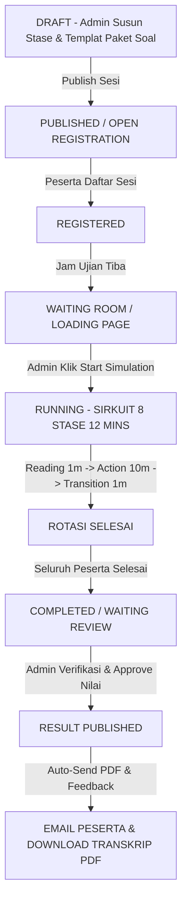

# 📘 Panduan Master & Aturan Operasional Sistem Ujian OSCE (Objective Structured Clinical Examination)
**Praxis by Medskill Indonesia**

---

## 📑 Daftar Isi
1. [Prinsip Dasar & Arsitektur Ujian OSCE](#1-prinsip-dasar--arsitektur-ujian-osce)
2. [Aturan & Alur dari Sisi Peserta Ujian (Participant Rules)](#2-aturan--alur-dari-sisi-peserta-ujian-participant-rules)
3. [Aturan & Alur dari Sisi Dokter Penguji (Examiner Rules)](#3-aturan--alur-dari-sisi-dokter-penguji-examiner-rules)
4. [Aturan & Alur dari Sisi Admin Institusi (Admin Rules)](#4-aturan--alur-dari-sisi-admin-institusi-admin-rules)
5. [End-to-End Lifecycle & Alur Status Sesi Ujian OSCE](#5-end-to-end-lifecycle--alur-status-sesi-ujian-osce)
6. [Struktur Rotasi & Perhitungan Nilai Akhir Sesi](#6-struktur-rotasi--perhitungan-nilai-akhir-sesi)

---

## 1. Prinsip Dasar & Arsitektur Ujian OSCE

1. **Definisi Sesi Ujian OSCE**:
   - Satu Sesi Ujian OSCE dirancang untuk menguji kompetensi klinis komprehensif mahasiswa kedokteran / dokter spesialis.
   - **Arsitektur Sirkuit 8 Stase (6 Stase Aktif + 2 Stase Break)**: Setiap 1 Sesi Ujian OSCE terdiri dari **total 8 stase** yang wajib diikuti oleh setiap peserta secara berurutan dalam *rotasi sirkuit komprehensif*:
     - **6 Stase Keterampilan Medis (Active Exam Stations)**: Diuji langsung oleh Dokter Penguji Spesialis pada kasus medis/simulator pasien.
     - **2 Stase Break / Rest (Break Stations)**: Ruangan istirahat peserta untuk pemulihan sebelum masuk stase berikutnya, serta waktu rekap nilai bagi penguji.
   - **Struktur Timer Baku Per Stase (Total 12 Menit/Stase)**:
     - **Reading Time**: 1 Menit (Membaca skenario di depan stase).
     - **Action Time**: 10 Menit (Pelaksanaan tindakan klinis & penulisan blangko).
     - **Transition Time**: 1 Menit (Jeda rotasi perpindahan ruangan stase).
   - **Manajemen Urutan Stase Berbasis Kanban**: Admin dapat mengubah urutan stase aktif dan stase istirahat secara dinamis melalui antarmuka **Kanban Drag & Drop** pada Dashboard Admin.
   - **Independensi Dokter Penguji**: Setiap stase aktif diuji secara mandiri oleh **Dokter Penguji Spesialis yang berbeda** sesuai bidang keahlian.
   - **Pasien Standar AI / Pasien Standar Real**: Setiap stase aktif dilengkapi Pasien Standar (AI Simulator atau Pasien Manusia) dengan prompt skenario kasus medis yang terstandarisasi.

---

## 2. Aturan & Alur dari Sisi Peserta Ujian (Participant Rules)

### A. Akses Portal & Dashboard Peserta (`/participant`)
1. **Hak Akses Penuh Portal & Lupa Password**:
   - Pengguna dengan role `participant` memiliki hak akses penuh ke Dashboard Peserta kapan saja.
   - Tersedia fitur **Lupa Password (*Forget Password*)** untuk pemulihan akun peserta.
2. **Pendaftaran & Mapping Urutan Peserta**:
   - Peserta mendaftar sesi OSCE terbuka melalui tombol `[Daftar / Ikuti Sesi Ini]`.
   - Data nama peserta tersimpan dalam sistem. Urutan masuk stase dapat berjalan **otomatis** ATAU **peserta memilih namanya sendiri** pada layar stase awal.

### B. Alur Ruang Tunggu & Briefing (`Waiting Room`)
1. Sebelum memasuki ruang stase ujian live, peserta wajib melewati **Layar Ruang Tunggu (`Waiting Room`)**.
2. Layar Ruang Tunggu menampilkan:
   - Lokasi Ruang Tunggu Stase (misal: *Gedung Skill Lab Ruang 101*).
   - Penugasan Gelombang & Rotasi (misal: *Gelombang #1 • Ronde #2 dari 8 Rotasi*).
   - Nama Dokter Penguji Penanggung Jawab & Pasien Standar AI yang bertugas.
   - Tata Tertib & Petunjuk Briefing Peserta.
   - Peserta tetap berada di halaman ini (*stay in waiting page*) hingga Admin menekan tombol **Start Simulation**.

### C. Alur Ruang Ujian Live Stase (`Live Exam Session`)
1. **Navigasi & Sync Countdown Timer (12 Menit Total)**:
   - Topbar menampilkan **Countdown Timer Stase** terbagi menjadi: Reading Time (1m), Action Time (10m), dan Transition (1m).
2. **Blangko 1: Anamnesis & Pemeriksaan Fisik**:
   - Peserta membaca skenario kasus klinis dan melakukan anamnesis/pemeriksaan fisik $\rightarrow$ Klik *"Next"*.
3. **Blangko 2: Checklist Pemeriksaan Penunjang**:
   - Peserta mencentang item pemeriksaan penunjang yang dibutuhkan (EKG, Radiologi, Lab, dll.) $\rightarrow$ Klik *"Next"*.
   - **Logika Output Hasil Penunjang**:
     - *Ceklist Penunjang Benar* $\rightarrow$ Muncul nilai/berkas gambar hasil penunjang.
     - *Ceklist Penunjang Tidak Dicentang* $\rightarrow$ Tidak muncul nilai/hasil.
     - *Ceklist Penunjang Salah* $\rightarrow$ Muncul keterangan *"Tidak ada data"*.
4. **Blangko 3: Diagnosis & Penulisan Resep**:
   - **Diagnosis Kerja (WDx)**: 1 Baris input text diagnosis kerja.
   - **Diagnosis Banding (DDx)**: 3 Baris input text diagnosis banding.
   - **Penulisan Resep Obat**: Blangko kosong *long text* (textarea) untuk penulisan resep medis.
5. **Penyelesaian Stase & Perputaran**:
   - Peserta mengeklik tombol `[Submit]` untuk mengunci jawaban dan berpindah ke stase berikutnya.
   - Rotasi berlanjut ke peserta baru hingga peserta terakhir selesai (**FINISH**).

---

## 3. Aturan & Alur dari Sisi Dokter Penguji (Examiner Rules)

### A. Akses Panel Kontrol Penguji (`/examiner`)
1. Dokter Penguji memilih 1 *"Station"* tempat bertugas dan mengontrol jalannya pengujian dari Dashboard Penguji.
2. Dashboard Penguji menampilkan:
   - Identitas Dokter Penguji (Nama, Gelar Spesialis, Stase Penugasan, Ruang Skill Lab).
   - Halaman Rekap Peserta (Menampilkan rekap awal Peserta #1 yang ter-update *real-time* saat peserta menekan *"Next"* atau *"Submit"*).
   - Tombol *"Next"* atau *"Back"* untuk meninjau rekapan peserta lain.

### B. Proses Penilaian Rubrik Stase & Acuan Kunci Jawaban
1. Selama peserta melakukan simulasi ujian stase, Dokter Penguji mengamati performa peserta dan mengisi **Rubrik Penilaian Baku** (skor 0, 1, atau 2 per indikator).
2. **Tampilan Acuan Kunci Jawaban Baku (Gold Standard Answer Key)**:
   - Dokter Penguji melihat isian **1 WDx + 3 DDx** dan **Blangko Resep** milik peserta secara *real-time*, yang ditampilkan bersisian dengan **Kunci Jawaban Resmi dari Admin** sebagai acuan objektif pemberian skor.
3. **Global Rating Scale (GRS) & Feedback**:
   - Penguji memilih impresi klinis global (`SUPERIOR`, `LULUS`, `BORDERLINE`, `TIDAK LULUS`) dan mengisi kolom umpan balik (*feedback*).
4. **Finalisasi Nilai Stase**:
   - Penguji mengeklik tombol `[Submit]` $\rightarrow$ otomatis *next* ke lembar penilaian peserta selanjutnya sampai peserta terakhir (**FINISH**).

---

## 4. Aturan & Alur dari Sisi Admin Institusi (Admin Rules)

### A. Manajemen Sesi Ujian OSCE & Templat Paket Soal (`/admin`)
1. **Pembuatan Sesi Baru**: Admin membuat Sesi Ujian OSCE baru dengan mengatur Judul, Tanggal, Jam, Lokasi, Timer (1m/10m/1m), dan Kuota.
2. **Templat / Duplikasi Stase (Paket Soal A / B)**:
   - Admin dapat menyimpan stase ke dalam library templat agar dapat diduplikasi secara efisien (misal: Paket Soal A, Paket Soal B).
3. **Manajemen Urutan Stase & Break Berbasis Kanban**:
   - Admin menyusun dan mengatur urutan **6 Stase Aktif** dan **2 Stase Break** secara fleksibel menggunakan antarmuka **Kanban Board (Drag & Drop)**.
4. **Manajemen Kunci Penunjang & Rubrik**:
   - Admin menentukan item penunjang mana yang rilis hasilnya jika dicentang benar oleh peserta.

### B. Monitoring Realtime & Kontrol Sesi Ujian
1. **Kontrol Simulasi**: Admin memegang tombol kontrol utama untuk **Memulai Simulasi (*Start Session*)** dan **Menghentikan Simulasi (*Stop Session*)**.
2. Monitoring pergerakan rotasi seluruh peserta & bel pengingat otomatis.

### C. Evaluasi, Cetak PDF & Autogeneration Email
1. **Review & Publish**: Admin meninjau rekapitulasi nilai akhir peserta setelah seluruh 8 stase completed.
2. **Cetak PDF & Auto Email Feedback**:
   - Hasil nilai & feedback masing-masing stase terekap per peserta dalam bentuk berkas **PDF**.
   - Sistem secara otomatis mengirimkan rekap nilai & feedback PDF ke **Email** masing-masing peserta.

---

## 5. End-to-End Lifecycle & Alur Status Sesi Ujian OSCE

---

## 6. Struktur Rotasi & Perhitungan Nilai Akhir Sesi

### Contoh Tabel Arsitektur Sirkuit 8 Stase OSCE (12 Menit/Stase):
| Stase | Tipe Stase | Sub-Spesialisasi / Status | Judul Kasus / Deskripsi Stase | Penguji Penanggung Jawab | Durasi |
| :---: | :---: | :--- | :--- | :--- | :---: |
| **Stase 1** | Ujian Aktif | Kardiovaskular | STEMI Anteroseptal (Nyeri Dada Infark) | dr. Alexander Budiman, Sp.JP | 12 Mns |
| **Stase 2** | Ujian Aktif | Pulmonologi | Eksaserbasi Akut Asma Bronkial | dr. Maya Indah, Sp.P | 12 Mns |
| **Stase 3** | **ISTIRAHAT** | **Break Station #1** | **Ruang Istirahat & Pemulihan Peserta** | *- (Standby Pengawas)* | **12 Mns** |
| **Stase 4** | Ujian Aktif | Neurologi | Pemeriksaan Saraf Kranial (N. VII & N. XII) | dr. Hendra Wijaya, Sp.N | 12 Mns |
| **Stase 5** | Ujian Aktif | Bedah & Traumatologi | Fraktur Terbuka Femur & Balut Bidai | dr. Budi Santoso, Sp.OT | 12 Mns |
| **Stase 6** | Ujian Aktif | Gastroentero-Hepatologi | Appendicitis Akut (Pemeriksaan Abdomen) | dr. Rina Astuti, Sp.PD | 12 Mns |
| **Stase 7** | **ISTIRAHAT** | **Break Station #2** | **Ruang Istirahat & Pemulihan Peserta** | *- (Standby Pengawas)* | **12 Mns** |
| **Stase 8** | Ujian Aktif | Resusitasi / ACLS | Henti Jantung & Defibrilasi AED | dr. Denny Pratama, Sp.An | 12 Mns |

*(Catatan: Timer 12 menit per stase terbagi menjadi Reading Time 1 m, Action Time 10 m, dan Transition 1 m).*

### Rumus Perhitungan Nilai Akhir Sesi:
$$\text{Nilai Akhir Sesi} = \frac{\sum_{i=1}^{n} \text{Skor Stase Aktif}_i}{n} \quad (n = 6 \text{ Stase Aktif})$$
