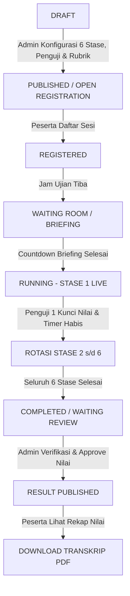

# 📘 Panduan Master & Aturan Operasional Sistem Ujian OSCE (Objective Structured Clinical Examination)
**Praxis by Medskill Indonesia**

---

## 📑 Daftar Isi
1. [Prinsip Dasar & Arsitektur Ujian OSCE](#1-prinsip-dasar--arsitektur-ujian-osce)
2. [Aturan & Alur dari Sisi Peserta Ujian (Participant Rules)](#2-aturan--alur-dari-sisi-peserta-ujian-participant-rules)
3. [Aturan & Alur dari Sisi Dokter Penguji (Examiner Rules)](#3-aturan--alur-dari-sisi-dokter-penguji-examiner-rules)
4. [Aturan & Alur dari Sisi Admin Institusi (Admin Rules)](#4-aturan--alur-dari-sisi-admin-institusi-admin-rules)
5. [End-to-End Lifecycle & Alur Status Sesi Ujian OSCE](#5-end-to-end-lifecycle--alur-status-sesi-ujian-osce)
6. [Struktur Rotasi & Perhitungan Nilai Akhir Sesi](#6-struktur-rotasi--perhitungan-nilai-akhir-sesi)

---

## 1. Prinsip Dasar & Arsitektur Ujian OSCE

1. **Definisi Sesi Ujian OSCE**:
   - Satu Sesi Ujian OSCE dirancang untuk menguji kompetensi klinis komprehensif mahasiswa kedokteran / dokter spesialis.
   - **Minimal 6 Stase Keterampilan Medis**: Setiap 1 Sesi Ujian OSCE terdiri dari **minimal 6 stase** yang wajib diikuti oleh setiap peserta secara berurutan (*rotasi sirkuit komprehensif*).
   - **Independensi Dokter Penguji**: Setiap stase diuji secara mandiri oleh **Dokter Penguji Spesialis yang berbeda** sesuai bidang keahlian (misal: Dokter Spesialis Jantung di Stase Kardiovaskular, Dokter Spesialis Anestesi di Stase Resusitasi, dst.).
   - **Pasien Standar AI / Pasien Standar Real**: Setiap stase dilengkapi Pasien Standar (AI Simulator atau Pasien Manusia) dengan prompt skenario kasus medis yang terstandarisasi.

---

## 2. Aturan & Alur dari Sisi Peserta Ujian (Participant Rules)

### A. Akses Portal & Dashboard Peserta (`/participant`)
1. **Hak Akses Penuh Portal**:
   - Pengguna dengan role `participant` memiliki hak akses penuh ke Dashboard Peserta kapan saja.
   - Apabila peserta **belum terdaftar** pada sesi live aktif, dashboard **TIDAK boleh menampilkan layar kosong (blank error)**. Dashboard tetap menampilkan:
     - Header Identitas Peserta (Nama, NIM, Fakultas Kedokteran, Status Pendaftaran).
     - Ringkasan Kartu Statistik Peserta (Status Pendaftaran, Jumlah Sesi Terbuka, Total Ujian Diikuti, Nilai Rata-Rata).
     - Katalog Sesi Ujian OSCE Terbuka & Tersedia (Daftar sesi yang dapat didaftari).
     - Tabel Riwayat Hasil & Rekap Nilai Ujian OSCE Sebelumnya.
2. **Pendaftaran Sesi Ujian**:
   - Peserta dapat mendaftar sesi OSCE terbuka melalui tombol `[Daftar / Ikuti Sesi Ini]`.
   - Setelah mendaftar, status peserta berubah menjadi `Terdaftar` dan tombol `[Masuk Ujian Live]` akan aktif.

### B. Alur Ruang Tunggu & Briefing (`Waiting Room`)
1. Sebelum memasuki ruang stase ujian live, peserta wajib melewati **Layar Ruang Tunggu (`Waiting Room`)**.
2. Layar Ruang Tunggu menampilkan:
   - Lokasi Ruang Tunggu Stase (misal: *Gedung Skill Lab Ruang 101*).
   - Penugasan Gelombang & Rotasi (misal: *Gelombang #1 • Ronde #2 dari 6 Rotasi*).
   - Nama Dokter Penguji Penanggung Jawab & Pasien Standar AI yang bertugas di stase tersebut.
   - Tata Tertib & Petunjuk Briefing Peserta (persiapan stetoskop/penlight, durasi 15 menit, tata laksana SOP).
   - Banner Countdown Timer Persiapan (misal: 30 detik persiapan).
3. Setelah countdown briefing selesai atau peserta mengeklik tombol `[Masuk ke Ruang Stase Ujian Live]`, peserta berpindah ke Ruang Ujian Live.

### C. Alur Ruang Ujian Live Stase (`Live Exam Session`)
1. **Navigasi & Sync Countdown Timer**:
   - Banner Topbar menampilkan **Countdown Timer Stase** (misal: 15 menit per stase) yang berjalan secara realtime.
2. **Skenario Medis & Instruksi Peserta (Panel Kiri)**:
   - Peserta membaca skenario kasus klinis UGD/Poliklinik dan daftar instruksi tindakan yang harus dikerjakan.
   - **Checklist Kepatuhan Prosedur Klinis**: Peserta dapat mencentang indikator prosedur yang telah dilakukan (misal: Salam, Anamnesis OPQRST, Auskultasi Jantung, Interpretasi EKG).
3. **Simulator Pasien Standar AI & Wawancara Medis (Panel Kanan)**:
   - Peserta melakukan wawancara medis (anamnesis) dan instruksi pemeriksaan secara realtime melalui chat simulator pasien AI.
   - Peserta dapat menggunakan **Quick Prompt Chips** (pertanyaan cepat) atau mengetik respon khusus.
4. **Penyelesaian Stase**:
   - Peserta mengeklik tombol `[Selesaikan Stase Ini]` untuk mengunci jawaban dan mengirimkan hasil ke Dokter Penguji.
   - Peserta kemudian melanjutkan ke stase berikutnya dalam rotasi 6 stase.

### D. Rekapitulasi Hasil & Transkrip PDF Peserta (`/participant/results/:resultId`)
1. Setelah seluruh 6 stase selesai dan nilai dipublikasikan oleh Admin, peserta dapat membuka halaman Detail Hasil.
2. Layar Detail Hasil menampilkan **Rekapitulasi Penilaian 6 Stase Ujian**:
   - Nilai perolehan di setiap stase dari 6 Dokter Penguji Spesialis yang berbeda.
   - Tabel rincian perolehan poin per indikator rubrik.
   - Catatan umpan balik & evaluasi kualitatif dari setiap dokter penguji.
   - Nilai Rata-rata Akumulasi Sesi & Status Kelulusan Final (*SUPERIOR / LULUS / BORDERLINE / TIDAK LULUS*).
3. Tombol **`[Unduh / Cetak Transkrip Nilai (PDF)]`**: Peserta dapat mencetak / menyimpan dokumen transkrip nilai resmi berformat PDF.

---

## 3. Aturan & Alur dari Sisi Dokter Penguji (Examiner Rules)

### A. Akses Panel Kontrol Penguji (`/examiner`)
1. Dokter Penguji yang telah ditugaskan pada suatu stase mengontrol jalannya pengujian dari Dashboard Penguji.
2. Dashboard Penguji menampilkan:
   - Identitas Dokter Penguji (Nama, Gelar Spesialis, Stase Penugasan, Ruang Skill Lab).
   - Status Ujian Live Aktif & Informasi Rotasi Peserta saat ini.
   - **Panel Informasi Istirahat Penguji**: Pemberitahuan jeda istirahat (misal: *Istirahat 10 Menit setiap 3 Penilaian Peserta*).
   - Riwayat Penilaian Peserta Terdahulu (Tabel Riwayat Pengujian).

### B. Proses Penilaian Rubrik Stase
1. Selama peserta melakukan simulasi ujian stase, Dokter Penguji mengamati performa peserta dan mengisi **Rubrik Penilaian Baku**:
   - Skala skor per indikator (0 = Tidak dilakukan, 1 = Perlu perbaikan, 2 = Dikerjakan sempurna).
2. **Global Rating Scale (GRS)**: Dokter Penguji memberikan penilaian impresi klinis global:
   - `SUPERIOR`: Performa sempurna melebihi standar kompetensi.
   - `LULUS`: Memenuhi standar kompetensi klinis secara aman.
   - `BORDERLINE`: Di ambang batas kelulusan.
   - `TIDAK LULUS`: Belum memenuhi standar keselamatan pasien.
3. **Catatan & Umpan Balik Kualitatif**: Dokter Penguji memberikan saran / kritik konstruktif untuk pengembangan kemampuan peserta.
4. **Finalisasi Nilai Stase**: Penguji mengeklik tombol `[Simpan & Kunci Penilaian]` untuk memvalidasi nilai stase peserta tersebut.

### C. Halaman Detail Riwayat Pengujian (`/examiner/history-detail/:historyId`)
1. Dokter Penguji dapat membuka halaman khusus untuk melihat kembali detail lembar rekapitulasi penilaian peserta yang telah selesai diuji sebelumnya.

---

## 4. Aturan & Alur dari Sisi Admin Institusi (Admin Rules)

### A. Manajemen Sesi Ujian OSCE (`/admin`)
1. **Pembuatan Sesi Baru**: Admin membuat Sesi Ujian OSCE baru dengan mengatur Judul, Tanggal, Jam, Lokasi, Jumlah Stase (minimal 6 stase), Durasi per stase, dan Kapasitas Kuota Peserta.
2. **Manajemen Stase & Bank Soal**:
   - Admin menentukan judul stase, skenario klinis, instruksi peserta, prompt AI pasien standar, dan rubrik penilaian baku untuk masing-masing dari 6 stase.
3. **Plotting Dokter Penguji**:
   - Admin menugaskan Dokter Penguji Spesialis untuk setiap stase (1 Dokter Penguji per 1 Stase).
4. **Manajemen Peserta & Plotting Gelombang/Rotasi**:
   - Admin memverifikasi pendaftaran peserta dan menetapkan urutan gelombang rotasi stase.

### B. Monitoring Realtime & Kontrol Sesi Ujian
1. Admin memantau pergerakan rotasi stase seluruh peserta secara realtime (*Master Live Board*).
2. Admin mengendalikan bell penanda rotasi jam stase dan menangani hambatan teknis.

### C. Evaluasi & Publikasi Nilai Akhir
1. Setelah seluruh peserta menyelesaikan 6 stase dan seluruh 6 Dokter Penguji mengunci nilai, Admin melakukan *Review & Approval* nilai akhir.
2. Admin mengeklik tombol `[Publish Result]` untuk mempublikasikan transkrip nilai sehingga dapat diakses oleh peserta di portalnya masing-masing.

---

## 5. End-to-End Lifecycle & Alur Status Sesi Ujian OSCE

### Rincian Alur Lifecycle:
1. **Status `DRAFT`**:
   - Sesi OSCE baru dibuat oleh Admin. Konfigurasi 6 stase, soal skenario, dan penugasan 6 penguji masih dalam tahap penyusunan. Belum terlihat oleh peserta.
2. **Status `PUBLISHED / OPEN REGISTRATION`**:
   - Sesi OSCE dipublikasikan di Katalog Sesi Dashboard Peserta. Peserta dapat mendaftar.
3. **Status `REGISTERED`**:
   - Akun peserta terdaftar pada sesi. Tombol `[Masuk Ujian Live]` disiapkan.
4. **Status `WAITING ROOM / BRIEFING`**:
   - Peserta masuk ke ruang tunggu briefing 30 detik untuk membaca aturan stase, lokasi, penguji, dan pasien AI.
5. **Status `RUNNING (LIVE ROTATION)`**:
   - Ujian live berlangsung. Peserta melewati rotasi 6 Stase (Stase 1 s/d Stase 6). Pada setiap stase, peserta berinteraksi dengan Pasien Standar dan dinilai oleh Dokter Penguji Spesialis stase tersebut.
6. **Status `COMPLETED / WAITING REVIEW`**:
   - Peserta telah menyelesaikan ke-6 stase. Nilai dari 6 penguji telah terkumpul dan sedang diverifikasi oleh Admin Institusi.
7. **Status `RESULT PUBLISHED`**:
   - Nilai dipublikasikan secara resmi. Peserta dapat melihat rekapitulasi 6 stase dan mengunduh Transkrip Nilai PDF.

---

## 6. Struktur Rotasi & Perhitungan Nilai Akhir Sesi

### Contoh Tabel Struktur Rotasi 6 Stase Ujian OSCE:
| Stase | Sub-Spesialisasi | Judul Kasus Medis | Dokter Penguji Spesialis | Durasi |
| :---: | :--- | :--- | :--- | :---: |
| **Stase 1** | Kardiovaskular | STEMI Anteroseptal (Nyeri Dada Infark) | dr. Alexander Budiman, Sp.JP | 15 Mns |
| **Stase 2** | Pulmonologi | Eksaserbasi Akut Asma Bronkial | dr. Maya Indah, Sp.P | 15 Mns |
| **Stase 3** | Neurologi | Pemeriksaan Saraf Kranial (N. VII & N. XII) | dr. Hendra Wijaya, Sp.N | 15 Mns |
| **Stase 4** | Bedah & Traumatologi | Fraktur Terbuka Femur & Balut Bidai | dr. Budi Santoso, Sp.OT | 15 Mns |
| **Stase 5** | Gastroentero-Hepatologi | Appendicitis Akut (Pemeriksaan Abdomen) | dr. Rina Astuti, Sp.PD | 15 Mns |
| **Stase 6** | Resusitasi / ACLS | Henti Jantung & Defibrilasi AED | dr. Denny Pratama, Sp.An | 15 Mns |

### Rumus Perhitungan Nilai Akhir Sesi:
$$\text{Nilai Akhir Sesi} = \frac{\sum_{i=1}^{n} \text{Skor Stase}_i}{n} \quad (n \ge 6)$$

Di mana:
- $n$ = Jumlah total stase dalam sesi (minimal 6 stase).
- $\text{Skor Stase}_i$ = Skor perolehan peserta pada stase ke-$i$ (skala 0 - 100).
- **Penentuan Kelulusan Final**:
  - `SUPERIOR`: Rata-rata Skor $\ge 90.0$ dan tidak ada stase dengan nilai `< 70.0`.
  - `LULUS`: Rata-rata Skor $\ge 75.0$.
  - `BORDERLINE`: Rata-rata Skor $70.0 - 74.9$.
  - `TIDAK LULUS`: Rata-rata Skor $< 70.0$ atau terdapat $\ge 2$ stase tidak lulus.
