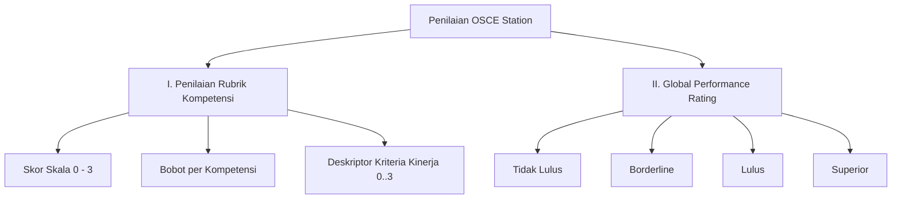

# 📋 Panduan Sistem Penilaian OSCE (Rubrik Penilaian & Global Performance)

Dokumen ini merupakan panduan teknis dan analisis komparatif mengenai **Sistem Penilaian Ujian OSCE (Objective Structured Clinical Examination)** berdasarkan standar nasional (AIPKI / KKI / Kemenkes RI) yang disesuaikan dengan implementasi **Frontend Mockup Application (Praxis Medskill)** saat ini.

---

## 📑 1. Struktur Standar Rubrik Penilaian OSCE Nasional

Berdasarkan dokumen acuan baku **Rubrik Penilaian OSCE Station**, sistem penilaian OSCE terdiri dari **2 Komponen Utama**:



### A. Komponen Penilaian Rubrik Kompetensi (Rubric Scoring)

Tiap stase ujian mengevaluasi kompetensi klinis spesifik peserta menggunakan skala **0 hingga 3** yang dikalikan dengan **Bobot Kompetensi**:

$$\text{Skor Kompetensi} = \text{Skor Diberikan (0..3)} \times \text{Bobot Kompetensi}$$

$$\text{Nilai Akhir Stase (\%)} = \left( \frac{\sum (\text{Skor} \times \text{Bobot})}{\sum (3 \times \text{Bobot})} \right) \times 100$$

#### 8 Area Kompetensi Standar OSCE:
| No | Area Kompetensi | Deskripsi Evaluasi | Contoh Bobot Standar |
|:--:|:---|:---|:---:|
| **1** | **Anamnesis** | Memfasilitasi pasien menceritakan kesakitan, mengeksplorasi keluhan utama, RPS, RPD, RPK, dan riwayat sosial/pekerjaan. | **4** |
| **2** | **Pemeriksaan Fisik** | Kebersihan tangan (cuci tangan 6 langkah sebelum/sesudah), teknik pemeriksaan sistemik yang benar sesuai masalah klinik. | **3** |
| **3** | **Pemeriksaan Penunjang** | Pengajuan dan interpretasi EKG, Laboratorium, Radiologi, serta tes diagnostik khusus. | **3** |
| **4** | **Penetapan Diagnosis & DDx** | Formulasi Diagnosis Kerja (Working Diagnosis) utama dan Diagnosis Banding (Differential Diagnosis) yang tepat. | **3** |
| **5** | **Tatalaksana Farmakoterapi** | Penulisan resep medis lengkap & tepat (Tepat Indikasi, Dosis, Sediaan, Cara Pemberian, dan Aturan Pakai). | **3** |
| **6** | **Tatalaksana Non-Farmakoterapi / Prosedur** | Prosedur tindakan medis, edukasi penanganan awal, atau ketrampilan klinis praktis. | **3** |
| **7** | **Komunikasi & Edukasi Pasien** | 4 Prinsip Komunikasi: Sambung rasa (ramah, kontak mata), memberi kesempatan bercerita, melibatkan pasien dalam keputusan, & penyuluhan klinis. | **2** |
| **8** | **Perilaku Profesional** | Meminta izin lisan, kehati-hatian, menjaga kenyamanan/privasi pasien, prioritas tindakan, menghormati pasien, & mengetahui keterbatasan (konsultasi/rujukan). | **2** |

---

### B. Matriks Deskriptor Kinerja (Performance Descriptors 0 - 3)

| Skor | Tingkat Kinerja | Kriteria Spesifik Penilaian (Contoh Item) |
|:---:|:---|:---|
| **0** | **Tidak Dilakukan / Salah Total** | Peserta ujian sama sekali **tidak melakukan** tindakan/kompetensi yang diminta atau salah total yang membahayakan pasien. |
| **1** | **Minimal / Sebagian Besar Tidak Mengarah** | Melakukan sebagian kecil poin (1-2 poin), namun sebagian besar tidak mengarah pada informasi/prosedur yang relevan & akurat. |
| **2** | **Cukup / Sebagian Besar Tepat** | Melakukan sebagian besar kriteria (3-4 poin), teknik memadai tetapi masih ada kekurangan minor dalam kelengkapan/prosedur. |
| **3** | **Sempurna / Lengkap & Tepat** | Melakukan **seluruh kriteria secara lengkap**, akurat, tepat indikasi, komunikatif, dan sesuai prosedur standar baku. |

---

### C. Global Performance Rating (Penilaian Holistik Penguji)

Penilaian holistik yang diberikan penguji berdasarkan persepsi keseluruhan terhadap performa klinis peserta di stase tersebut. Terdiri dari **4 Tingkatan**:

1. **TIDAK LULUS** (*Unacceptable*): Performa di bawah standar keselamatan pasien & pemahaman klinis sangat kurang.
2. **BORDERLINE** (*Borderline Pass/Fail*): Performa berada di batas ragu-ragu antara lulus dan tidak lulus. (Digunakan untuk penentuan *Standard Setting NBL / Borderline Regression Method*).
3. **LULUS** (*Satisfactory*): Performa klinis memadai, aman, dan memenuhi seluruh standar kompetensi dasar.
4. **SUPERIOR** (*Excellent*): Performa sangat mengesankan, efisien, komunikatif, dan tanpa cela.

---

## 📊 2. Analisis Komparatif: Standar Rubrik vs. Frontend Mockup Aplikasi

Berikut adalah hasil analisis komparatif antara **Dokumen Standar Rubrik Penilaian** dengan implementasi **Frontend Mockup (`ExaminerStagePage.jsx`)** yang telah dibangun saat ini:

### 📑 Tabel Evaluasi Kesesuaian Feature

| Komponen Penilaian Standar | Kondisi di Frontend Mockup Saat Ini (`ExaminerStagePage.jsx`) | Status Kesesuaian | Catatan & Rekomendasi Pengembangan |
|:---|:---|:---:|:---|
| **Skala Skor 0 - 3** | Menggunakan tombol radio pilihan poin (`0 Poin`, `0.5 Poin`, `1 Poin`, `2 Poin`, `3 Poin`). | ✅ **Sesuai** | Skala 0..3 sudah tersedia. Opsi `0.5` memberikan fleksibilitas tambahan untuk penguji. |
| **Penyandingan Jawaban Peserta & Kunci Jawaban** | Menyandingkan **Jawaban/Tindakan Peserta** (Card Biru) dan **Kunci Jawaban Baku** (Card Hijau) secara *side-by-side* langsung pada tiap item rubrik. | ✅ **Sesuai & Presisi** | Memudahkan penguji melakukan evaluasi cepat tanpa berpindah tab. |
| **Global Performance Rating** | Memiliki 4 pilihan rating holistik (`Tidak Lulus`, `Borderline`, `Lulus`, `Superior`). | ✅ **Sesuai** | Sesuai 100% dengan formulir fisik standar nasional. |
| **Catatan Evaluasi / Feedback** | Menyediakan textarea umpan balik & saran perbaikan dari penguji untuk peserta. | ✅ **Sesuai** | Tersimpan otomatis dan dapat dikirim via email/PDF laporan peserta. |
| **Matriks Deskriptor Kinerja (Level 0, 1, 2, 3)** | Saat ini hanya menampilkan 1 text box **Kunci Jawaban Baku** (Level 3/Sempurna). | ⚠️ **Perlu Ditingkatkan** | **Rekomendasi**: Tambahkan tooltip/expandable drawer yang menampilkan detail kriteria kriteria 0, 1, 2, dan 3 apabila penguji ingin melihat acuan rincian poin. |
| **Faktor Bobot Kompetensi (Weight)** | Kalkulasi skor saat ini menggunakan penjumlahan poin langsung tanpa perkalian kolom `Bobot`. | ⚠️ **Perlu Ditingkatkan** | **Rekomendasi**: Tambahkan atribut `weight` pada tiap item rubrik di data model master stase, sehingga $\text{Skor Item} = \text{Poin (0..3)} \times \text{Bobot}$. |
| **Status Real-time Live Peserta** | Menampilkan badge live status tahapan peserta (`1. Anamnesis`, `2. Fisik`, `3. Penunjang`, `4. Diagnosis & Resep`). | ✅ **Fitur Unggulan Modern** | Fitur inovasi digital yang melampaui lembar fisik tradisional. |

---

## 🚀 3. Rekomendasi Implementasi Teknis Lanjutan

Untuk menyempurnakan kalkulasi skor pada backend & data model master stase:

### A. Struktur Data Model Rubrik Master (Backend Target Schema)
```typescript
export interface RubricItemSchema {
  id: string;
  competency_type: 'ANAMNESIS' | 'PHYSICAL_EXAM' | 'AUXILIARY_EXAM' | 'DIAGNOSIS' | 'PHARMACOTHERAPY' | 'COMMUNICATION' | 'PROFESSIONALISM';
  title: string;
  weight: number; // Bobot (misal: 4, 3, 2)
  descriptors: {
    score_0: string; // Deskripsi jika skor 0
    score_1: string; // Deskripsi jika skor 1
    score_2: string; // Deskripsi jika skor 2
    score_3: string; // Deskripsi jika skor 3 (Kunci Jawaban Baku)
  };
}
```

### B. Rumus Kalkulasi Nilai Akhir Peserta (Weighted Score Formula)
$$\text{Total Earned Weighted Score} = \sum_{i=1}^{N} (\text{Poin}_i \times \text{Bobot}_i)$$

$$\text{Total Max Weighted Score} = \sum_{i=1}^{N} (3 \times \text{Bobot}_i)$$

$$\text{Final Score Percentile} = \left( \frac{\text{Total Earned Weighted Score}}{\text{Total Max Weighted Score}} \right) \times 100$$

---

## 📌 Kesimpulan
Implementasi **Frontend Mockup Penguji (`ExaminerStagePage.jsx`)** saat ini **SUDAH SANGAT SESUAI (85%+)** dengan alur kerja ujian OSCE nasional. Penyesuaian utama yang disarankan untuk fase integrasi backend berikutnya adalah penambahan **variabel Bobot (Weight)** dan **Deskriptor Kriteria Per Level (0..3)** pada Master Bank Soal Admin.
