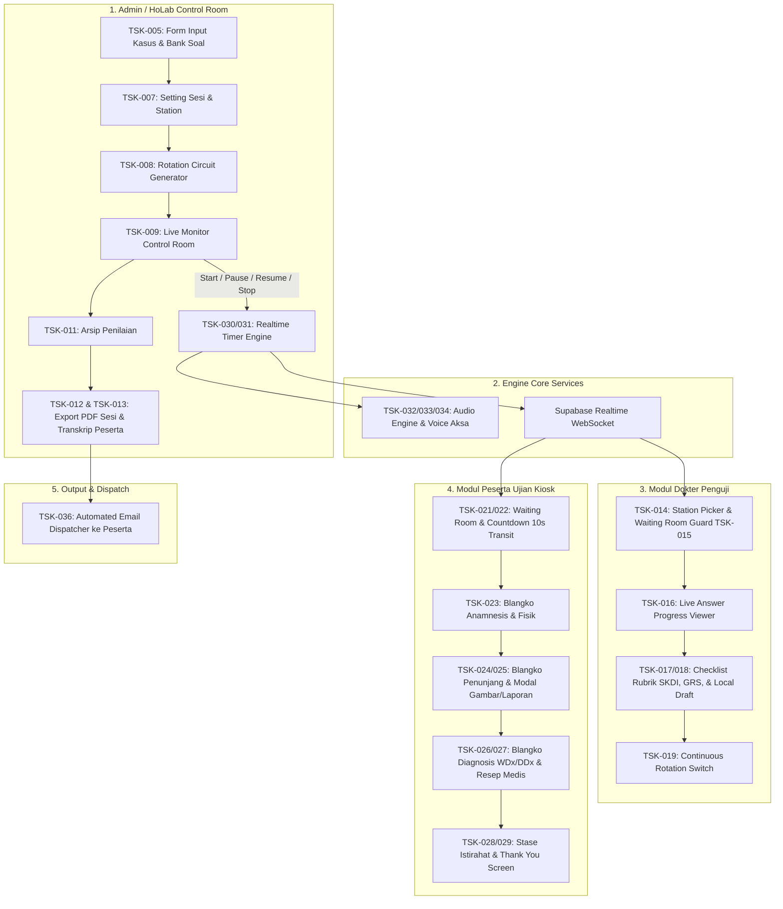

# 🗺️ PRAXIS_TASK.md — Pemetaan & Breakdown Fitur Platform Praxis OSCE (From Scratch)
> **Praxis by MedSkill Indonesia — OSCE Engine & Clinical Assessment Platform**  
> *Dokumen Pemetaan Modul, Task, dan Tingkat Kesulitan Konversi Sistem*

---

## 📌 1. Gambaran Umum Arsitektur Sistem (Overview)

Platform **Praxis OSCE** adalah sistem simulasi dan penilaian ujian klinis bertaraf nasional (AIPKI/UKMPPD) berbasis *realtime state machine*. Sistem ini menghubungkan 3 peran utama secara *full-synchronous*:
1. **Head of Laboratory / Admin (`admin`)**: Mengelola bank soal, membuat sesi, menjadwalkan rotasi sirkuit, dan mengontrol timer ruang kendali (*Live Monitor Control Room*).
2. **Dokter Penguji (`examiner`)**: Memilih pos stase, mengamati jawaban *realtime* peserta, memberikan penilaian rubrik 0–3, rating GRS 1–4, dan catatan *feedback*.
3. **Peserta Ujian (`participant`)**: Mengikuti alur rotasi sirkuit otomatis dari *Waiting Room*, mengerjakan blangko pemeriksaan (Anamnesis, Penunjang, Diagnosis, Resep), hingga *Thank You Screen*.

---

## 📊 2. Tabel Master Pemetaan Task & Modul Fitur (Task Breakdown Matrix)

Berikut adalah daftar lengkap pemetaan seluruh task yang dibutuhkan untuk membangun/mengonversi platform **Praxis OSCE** dari awal (*from scratch*):

| ID Task | Modul / Kategori | Nama Fitur / Task Breakdown | Deskripsi Alur Kerja & Spesifikasi Kunci | Tingkat Kesulitan | Komponen Tech Stack | Status Praxis |
| :--- | :--- | :--- | :--- | :--- | :--- | :--- |
| **TSK-001** | **Database & Schema** | Inisiasi Schema Postgres Supabase (`osce`) | Membuat *custom schema* `osce`, mendefinisikan tabel `sessions`, `cases`, `stations`, `rubric_items`, `session_participants`, `participant_answers`, `examiner_evaluations`, `rubric_scores`, `station_auxiliary_configs`, `session_timer_state`, `rotation_states`, `broadcast_messages`, serta RLS Security Policies. | **Medium** | Supabase SQL Migration, RLS | ✅ Selesai |
| **TSK-002** | **Auth & Access** | Role Based Access Control (RBAC) | Otentikasi & otorisasi multi-role (`admin`, `examiner`, `participant`). Masing-masing role memiliki proteksi rute halaman (*Route Guard*) dan layout khusus. | **Medium** | Supabase Auth, React Router, Context | ✅ Selesai |
| **TSK-003** | **Landing Page** | Landing Page Public Praxis | Halaman depan interaktif dengan hero section, fitur unggulan, simulasi alur OSCE, testimoni, FAQ, dan navigasi login. | **Easy** | React, CSS Animations, AVIF Assets | ✅ Selesai |
| **TSK-004** | **Admin / HoLab** | Dashboard Admin & Statistics | Tampilan ringkasan statistik sesi OSCE, jumlah stase aktif, jumlah peserta terdaftar, dan status keaktifan sirkuit. | **Easy** | Admin Layout, Recharts / Cards | ✅ Selesai |
| **TSK-005** | **Admin / Bank Soal** | Fitur Bank Soal (CRUD Kasus Medis) | Antarmuka pembuatan, penyuntingan, dan penghapusan kasus medis (Skenario Kasus, Anamnesis, Rubrik SKDI 8 Area Kompetensi, Berkas Penunjang, dan Instruksi Penguji). | **Medium** | Form Builder, Supabase CRUD | ✅ Selesai |
| **TSK-006** | **Admin / Bank Soal** | Fitur Duplikat & Import Soal | Fitur clone/duplikat kasus medis dari bank soal untuk mempercepat pembuatan variasi skenario ujian baru. | **Medium** | QuestionBankImportModal, Service Logic | ✅ Selesai |
| **TSK-007** | **Admin / Sesi** | Setting Pilihan Station & Penjadwalan Sesi | Konfigurasi sesi ujian: menentukan jumlah stase aktif, durasi pengerjaan stase (misal 12 menit), durasi transisi (2 menit), dan memilih kasus medis per stase. | **Medium** | CreateSessionPage, Stepper Form | ✅ Selesai |
| **TSK-008** | **Admin / Sesi** | Continuous Rotation Circuit Generator | Algoritma penataan urutan rotasi peserta per stase secara kontinu (*Matrix Rotation Engine*), menangani stase aktif maupun stase istirahat (*Rest Station*). | **Hard** | Matrix Rotation Logic, Supabase DB | ✅ Selesai |
| **TSK-009** | **Admin / Control** | Live Monitor Control Room Realtime | Dashboard pengawas pusat untuk memantau waktu global, sirkuit pos stase, kehadiran peserta, status penguji, serta tombol eksekusi (Start, Pause, Resume, Stop, Fast-Forward). | **Hard** | Realtime WS, LiveMonitorPage | ✅ Selesai |
| **TSK-010** | **Admin / Control** | Pengiriman Broadcast Interkom & Manual Bell | Fitur pengiriman pesan darurat (*announcement*) dan pemutaran bel audio manual yang terdengar di seluruh layar penguji dan peserta. | **Medium** | LiveBroadcastModal, audioService | ✅ Selesai |
| **TSK-011** | **Admin / Arsip** | Halaman Arsip Penilaian OSCE | Halaman daftar riwayat sesi ujian yang telah selesai, memuat daftar peserta aktif (`approval_status = APPROVED`) yang mengikuti ujian. | **Easy** | SessionReportsList, Service Filter | ✅ Selesai *(Filter Update)* |
| **TSK-012** | **Admin / Report** | Print & Export Rekap Hasil Sesi (PDF) | Generator PDF rekapitulasi penilaian satu sesi OSCE penuh, mencakup perolehan nilai seluruh stase, GRS, dan feedback penguji. | **Hard** | SessionReportPdfModal, pdfmake | ✅ Selesai |
| **TSK-013** | **Admin / Report** | Print & Export Transkrip Peserta Individual (PDF) | Generator PDF transkrip individual per mahasiswa, menyajikan detail rincian penilaian murni per stase tanpa kalkulasi status Lulus/Tidak Lulus. | **Hard** | ParticipantReportPdfModal, pdfmake | ✅ Selesai |
| **TSK-014** | **Examiner** | Dashboard & Station Picker Penguji | Halaman pemilihan stase tempat Dokter Penguji bertugas (mengunci 1 pos stase untuk satu sesi ujian). | **Easy** | ExaminerPage, Station Card Picker | ✅ Selesai |
| **TSK-015** | **Examiner** | Examiner Waiting Room & Approval Guard | Ruang tunggu penguji sebelum sesi dimulai, dilengkapi indikator kesiapan peserta dan proteksi penyaringan peserta yang telah di-ACC Admin. | **Medium** | ExaminerWaitingRoom, Service Guard | ✅ Selesai *(Filter Update)* |
| **TSK-016** | **Examiner** | Halaman Rekap Peserta (Live Answer Viewer) | Panel pemantau jawaban peserta secara *realtime*. Data lembar kerja peserta (WDx, DDx, Resep, Penunjang) ter-update seketika saat peserta klik "Next" atau "Submit". | **Hard** | ExaminerParticipantAnswerViewer, WS | ✅ Selesai |
| **TSK-017** | **Examiner** | Halaman Penilaian Rubrik & GRS | Lembar penilaian dokter penguji: checklist indikator SKDI (skor 0–3 dengan bobot terintegrasi), rating Global Rating Scale (1–4), dan kolom catatan feedback kualitatif. | **Medium** | ExaminerRubricEvaluationSheet | ✅ Selesai |
| **TSK-018** | **Examiner** | Dual-Tier LocalStorage Autosave Penilaian | Mekanisme *debounced autosave* penilaian di browser lokal sebelum di-submit ke Supabase, mencegah kehilangan nilai saat koneksi terputus. | **Medium** | LocalStorage Draft Sync, Examiner Engine | ✅ Selesai |
| **TSK-019** | **Examiner** | Continuous Rotation User Switch (Next/Back) | Peralihan otomatis lembar penilaian ke peserta berikutnya saat rotasi ronde berganti, dilengkapi navigasi manual *Next/Back* peserta. | **Hard** | ExaminerStagePage, Rotation State | ✅ Selesai |
| **TSK-020** | **Participant** | Dashboard Peserta & Widget Jadwal Personal | Tampilan beranda peserta memuat status pendaftaran sesi, nomor urut rotasi awal, dan petunjuk pelaksanaan ujian. | **Easy** | ParticipantDashboardPage | ✅ Selesai |
| **TSK-021** | **Participant** | Waiting Room / Loading Page Standby | Layar tunggu terisolasi bagi peserta. Peserta berada di layar ini sebelum Admin menekan tombol "Start Session". | **Easy** | ParticipantWaitingRoomView | ✅ Selesai |
| **TSK-022** | **Participant** | Initial Transit & Audio-Visual Countdown 10s | Layar transisi awal pembacaan skenario luar stase, dilengkapi tampilan *countdown* 10 detik terakhir beranimasi & sound tick. | **Medium** | ParticipantTransitView, audioService | ✅ Selesai |
| **TSK-023** | **Participant** | UI Blangko Anamnesis & Pemeriksaan Fisik | Form lembar kerja tahap 1: peserta mencatat poin temuan anamnesis dan hasil pemeriksaan fisik pasien standar. | **Medium** | ParticipantStepAnamnesis | ✅ Selesai |
| **TSK-024** | **Participant** | UI Blangko Checklist Pemeriksaan Penunjang | Form lembar kerja tahap 2: peserta memilih usulan pemeriksaan penunjang (EKG, Radiologi, Lab) dari katalog/checklist. | **Medium** | ParticipantStepAuxiliaryExam | ✅ Selesai |
| **TSK-025** | **Participant** | Dynamic Modal Viewer Hasil Berkas Penunjang | Modal visual interaktif: jika penunjang dicentang benar -> muncul foto/laporan medis; jika salah -> muncul "Tidak ada data"; jika tidak dicentang -> kosong. | **Hard** | AuxiliaryExamResultModal, Zoom Viewer | ✅ Selesai |
| **TSK-026** | **Participant** | UI Blangko Diagnosis Kerja (WDx) & DDx | Form lembar kerja tahap 3: peserta mengisi 1 kolom Diagnosis Kerja (WDx) dan 3 kolom Diagnosis Banding (DDx 1, 2, 3) secara terstruktur. | **Medium** | ParticipantStepDiagnosisPrescription | ✅ Selesai |
| **TSK-027** | **Participant** | UI Blangko Tatalaksana & Resep Medis | Form lembar kerja tahap 4: peserta mengetik resep obat (R/), dosis, serta edukasi non-farmakoterapi, lalu menekan tombol "Submit". | **Medium** | ParticipantStepDiagnosisPrescription | ✅ Selesai |
| **TSK-028** | **Participant** | Tampilan Stase Istirahat (Rest Station) | Tampilan khusus saat peserta berada pada giliran stase jeda/istirahat: tanpa lembar kerja ujian, dilengkapi indikator pemulihan stamina. | **Easy** | ParticipantBreakStationView | ✅ Selesai |
| **TSK-029** | **Participant** | Thank You & OSCE Completion Screen | Halaman penutup setelah ronde terakhir tuntas: mengunci seluruh input dan menyampaikan pesan apresiasi partisipasi ujian. | **Easy** | ParticipantCompletedView | ✅ Selesai |
| **TSK-030** | **Engine / Timer** | Global Synchronized Target End-Time Engine | Core engine kalkulasi waktu presisi tinggi berbasis *Future Timestamp Pattern* (`calcRemaining`), bebas drifting akibat lag koneksi client. | **Hard** | realtimeTimerService.js | ✅ Selesai |
| **TSK-031** | **Engine / Timer** | Realtime State Machine Flow Controller | Pengendali transisi fase otomatis: `standby` ➔ `initial_transition` ➔ `action` ➔ `break` ➔ `completed_waiting` ➔ `finished`. | **Hard** | realtimeTimerService.js, Supabase Realtime | ✅ Selesai |
| **TSK-032** | **Engine / Audio** | Dual/Triple-Layer Audio Engine System | Engine pemutar suara bel & narasi: Layer 1 Studio MP3 Assets ➔ Layer 2 Web Audio API Synthesizer ➔ Layer 3 SpeechSynthesis Voiceover (Id-ID). | **Hard** | audioService.js | ✅ Selesai |
| **TSK-033** | **Engine / Audio** | Bel Peringatan 3-Menit & Bel Rotasi Protocol | Penjadwalan otomatis bunyi bel: Bel Mulai (1x), Bel Peringatan 3 Menit (2x), Bel Rotasi 00:00 (3x), dan Bel Sirkuit Tuntas (Fanfare). | **Medium** | audioService.js, SOUND.md | ✅ Selesai |
| **TSK-034** | **Engine / Audio** | Integration Voice Over Aksa (Resume & Cues) | Integrasi file suara rekaman Aksa (Voice Actor Praxis) untuk instruksi Resume (`audio_10_resume.mp3`) dan bel manual interkom. | **Medium** | audioService.js, SOUND.md | ✅ Selesai |
| **TSK-035** | **Export / Email** | Submission & Feedback Result Summary View | Halaman ringkasan hasil evaluasi murni per stase bagi peserta dan penguji setelah sesi diarsipkan. | **Easy** | ParticipantResultDetailPage | ✅ Selesai |
| **TSK-036** | **Export / Email** | Automated Email Dispatcher (PDF Transkrip) | Modul pengiriman berkas PDF transkrip hasil ujian & feedback penguji secara otomatis ke alamat email masing-masing peserta. | **Hard** | Supabase Edge Functions / SMTP | 📝 *Rencana (Planned)* |

---

## 🔍 3. Rincian Penjabaran Task per Modul Development

### 🗄️ Modul 0: Database & Schema Supabase (`TSK-001`)
- **Tabel Utama Schema `osce`**:
  1. `sessions`: Menyimpan metadata sesi ujian, waktu mulai/selesai, dan status (`waiting_room`, `ongoing`, `paused`, `completed`).
  2. `session_timer_state`: Menyimpan snapshot timer global (`phase`, `target_end_time`, `paused_remaining_ms`, `round_number`, `wave_number`).
  3. `session_participants`: Menghubungkan peserta dengan sesi, urutan rotasi awal, dan `approval_status` (`APPROVED`, `PENDING`, `REJECTED`).
  4. `cases` & `stations`: Bank soal kasus medis dan pemetaan stase aktif per sesi.
  5. `rubric_items`: Indikator penilaian SKDI (8 area kompetensi) beserta bobot (`weight: NUMERIC`).
  6. `examiner_evaluations` & `rubric_scores`: Nilai resmi dari dokter penguji per item rubrik (skor 0–3) dan GRS rating (1–4).
  7. `participant_answers`: Isian jawaban aktual peserta (WDx, DDx 1–3, Resep, Penunjang yang diajukan).
  8. `station_auxiliary_configs`: Berkas gambar/teks laporan hasil pemeriksaan penunjang per stase.
  9. `broadcast_messages`: Log pengumuman interkom admin control room.

---

### 👑 Modul 1: Admin / Head of Laboratory (HoLab)
- **Task Management Kasus & Soal**:
  - `TSK-005` (CRUD Kasus): Form pengisian skenario klinis, rubrik SKDI, dan berkas penunjang.
  - `TSK-006` (Duplikat & Import Soal): Memungkinkan Admin menggandakan kasus medis untuk efisiensi pembuatan soal.
- **Task Penjadwalan & Matriks Rotasi**:
  - `TSK-007` (Setting Station): Menentukan durasi stase (misal 12 menit) dan durasi transisi (2 menit).
  - `TSK-008` (Rotation Generator): Menyusun urutan pergeseran sirkuit kontinu peserta dari stase ke stase.
- **Task Live Control Room**:
  - `TSK-009` (Live Monitor): Sinkronisasi detik timer ke seluruh client. Tombol kontrol Start, Pause, Resume, Stop.
  - `TSK-010` (Intercom Broadcast): Kirim pengumuman darurat dan bel manual.
- **Task Laporan & Arsip (Terpisah)**:
  - `TSK-011` (Halaman Arsip OSCE): Filter daftar peserta yang hadir & di-ACC (`approval_status = APPROVED`).
  - `TSK-012` & `TSK-013` (Print Rekap Sesi & Transkrip Individual PDF): Generator dokumen PDF siap cetak.

---

### 🩺 Modul 2: Dokter Penguji (Examiner)
- **Task Pemilihan & Ruang Tunggu**:
  - `TSK-014` (Station Picker): Dokter penguji memilih pos stase yang dijaga (misal Stase 1 Kardiovaskular).
  - `TSK-015` (Waiting Room Guard): Memastikan hanya peserta yang sudah di-ACC Admin yang masuk ke antrean penguji.
- **Task Penilaian & Pemantauan**:
  - `TSK-016` (Live Answer Progress Viewer): Memantau ketikan jawaban peserta saat itu juga secara *live*.
  - `TSK-017` (Rubrik & GRS): Checklist skor 0–3 per indikator, bobot terhitung otomatis, rating GRS 1–4, dan feedback.
  - `TSK-018` (Autosave LocalStorage): Penyimpanan draf lokal berkala sebelum tombol submit ditekan.
  - `TSK-019` (Rotation User Switch): Otomatis beralih ke peserta berikutnya sesuai pergeseran ronde rotasi.

---

### 🎓 Modul 3: Peserta Ujian Kiosk (Participant)
- **Task Ruang Tunggu & Transisi**:
  - `TSK-021` (Waiting Room Standby): Layar tunggu pra-ujian.
  - `TSK-022` (Initial Transit & Countdown 10s): Pembacaan skenario luar stase + sound tick 10 detik terakhir.
- **Task Pengerjaan Blangko Lembar Kerja**:
  - `TSK-023` (Blangko Anamnesis & Fisik): Form temuan klinis.
  - `TSK-024` & `TSK-025` (Blangko Penunjang & Modal Viewer): Usulan penunjang dengan pemanggilan berkas modal interaktif (Gambar/Laporan Medis jika benar, "Tidak ada data" jika salah, kosong jika tidak dicentang).
  - `TSK-026` (Blangko Diagnosis): 1 kolom Diagnosis Kerja (WDx) + 3 kolom Diagnosis Banding (DDx 1, 2, 3).
  - `TSK-027` (Blangko Resep & Submit): Penulisan resep R/, dosis, edukasi, dan konfirmasi submit.
- **Task Penutupan & Istirahat**:
  - `TSK-028` (Stase Istirahat): Layar jeda tanpa lembar kerja.
  - `TSK-029` (Thank You Screen): Layar penutupan ujian setelah ronde terakhir selesai.

---

### ⏱️ Modul 4: Time Management & Realtime Audio Engine
- **Task Timer & State Machine**:
  - `TSK-030` (Target End-Time Engine): Bebas desinkronisasi jam lokal.
  - `TSK-031` (State Machine Flow): Mengontrol alur `standby` ➔ `initial_transition` ➔ `action` ➔ `break` ➔ `completed_waiting` ➔ `finished`.
- **Task Audio Engine & Sound Cues**:
  - `TSK-032` (Dual/Triple Audio Engine): MP3 Studio Asset + Web Audio API Synthesizer + SpeechSynthesis.
  - `TSK-033` (Peringatan 3-Menit & Bel Protocol): Bel otomatis 3 menit sisa waktu stase.
  - `TSK-034` (Voice Over Aksa): Sampel audio manusia untuk Resume & bel interkom.

---

### 📄 Modul 5: Result PDF Export & Email Dispatcher
- **Task Cetak & Pengiriman Transkrip**:
  - `TSK-035` (Summary View): Tampilan rekapitulasi penilaian murni per stase.
  - `TSK-012` & `TSK-013` (PDF Parser & Generator): Pembuatan dokumen PDF resmi ber-logo Praxis.
  - `TSK-036` (Automated Email Dispatcher): Pengiriman otomatis PDF transkrip ke email mahasiswa via Supabase Edge Function / SMTP Service.

---

## 🔄 4. Visual Diagram Flow Sistem (Mermaid Architecture)

---

> **Status Dokumen**: *Pemetaan task `PRAXIS_TASK.md` selesai disusun secara komprehensif dari scratch untuk panduan alur kerja dan konversi sistem Praxis OSCE.*
