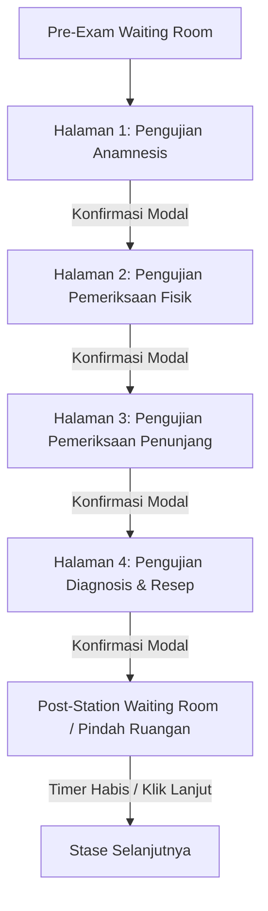

# Catatan Hasil Rapat 3 - Perubahan Alur Multi-Halaman Ujian Peserta & Transit Stase (Praxis OSCE)

Dokumen ini berisi spesifikasi teknis dan acuan alur pengerjaan ujian peserta (*Student Flow*) berbasis multi-tahap/multi-halaman per stase serta mekanisme ruang tunggu antar-stase (*Rotation Waiting Room*).

---

## 1. Ringkasan Perubahan Utama Alur Ujian Peserta

Alur ujian peserta yang sebelumnya berada dalam 1 halaman tunggal (*single scrollable page*) diubah menjadi **Alur Multi-Halaman Berurutan (Stepped Examination Flow)** per stase, diikuti oleh **Ruang Tunggu Perpindahan Stase (Post-Station Waiting Room)**.

---

## 2. Struktur Multi-Halaman Ujian Stase (Active Station Pages)

Setiap stase ujian OSCE offline terdiri dari **4 halaman berurutan**:

### 🔹 Halaman 1: Pengujian Anamnesis
- **Panel Kiri**: Skenario Kasus Medis & Identitas Stase (Tetap).
- **Panel Kanan**: 
  - Tampilan pengenalan kasus anamnesis untuk pengerjaan ujian OSCE secara offline (anamnesis langsung kepada pasien standar / simulator).
  - Tombol **`[Selanjutnya: Pemeriksaan Fisik]`**.
- **Mekanisme**: Menampilkan modal konfirmasi saat peserta menekan tombol `[Selanjutnya]`.

---

### 🔹 Halaman 2: Pengujian Pemeriksaan Fisik
- **Panel Kiri**: Skenario Kasus Medis & Instruksi Stase (Tetap).
- **Panel Kanan**: 
  - Penjelasan & instruksi soal tahap kedua (panduan pemeriksaan fisik pasien, temuan tanda vital, dan prosedur pemeriksaan).
  - Tombol **`[Selanjutnya: Pemeriksaan Penunjang]`**.
- **Mekanisme**: Menampilkan modal konfirmasi saat peserta menekan tombol `[Selanjutnya]`.

---

### 🔹 Halaman 3: Pengujian Pemeriksaan Penunjang
- **Panel Kiri**: Instruksi Stase & Panduan Indikasi Medis (Tetap).
- **Panel Kanan**: 
  - **Formulir Permintaan Checkbox Penunjang (Grid Layout & Control Complete)**:
    - **Control Topbar**: Searchbar pencarian kata kunci & Dropdown Filter Kategori (Radiologi, Hematologi, Enzim, Lain-Lain).
    - **Area Checklist**: Multi-column grid (`grid-cols-2`) item pemeriksaan penunjang berbasis kategori / accordion matching modal baku.
    - Tombol **`[Minta Hasil Pemeriksaan & Lanjut]`**.
- **Alur Modal Sekuensial saat Submit (Result Modal $\rightarrow$ Confirmation Modal)**:
  1. Menekan tombol submit $\rightarrow$ Membuka **Modal Display Hasil Berkas Medis** (menampilkan gambar X-Ray/EKG/Lab & laporan ekspertise dari item yang diminta).
  2. Menekan tombol `[Lanjut ke Diagnosis & Resep]` di dalam Result Modal $\rightarrow$ Membuka **Modal Konfirmasi One-Way Forward**.
  3. Klik `[Ya, Lanjutkan]` $\rightarrow$ Berpindah ke Halaman 4.

---

### 🔹 Halaman 4: Pengujian Diagnosis & Penulisan Resep (Halaman Terakhir Stase)
- **Panel Kiri**: Skenario & Instruksi Stase (Tetap).
- **Panel Kanan**: 
  - Form **Diagnosis Banding** (*Differential Diagnosis*).
  - Form **Diagnosis Kerja** (*Working Diagnosis Utama*).
  - Textbox **Lembar Penulisan Resep Obat** (*Prescription Sheet*).
  - Tombol **`[Selesaikan Stase Ini]`**.
- **Mekanisme**: Menampilkan modal konfirmasi penyelesaian stase sebelum masuk ke Ruang Tunggu Perpindahan Stase.

---

## 3. Modal Konfirmasi Navigasi (Confirmation Modals)

1. **Aturan Umum**: Setiap tindakan menekan tombol `[Next / Selanjutnya]` maupun `[Selesaikan Stase]` **wajib** memunculkan **Modal Konfirmasi**.
2. **Fungsi Modal**:
   - Memastikan peserta tidak tidak sengaja berpindah halaman sebelum menyelesaikan tindakan di tahap tersebut.
   - Pilihan modal: `[Batal / Periksa Kembali]` dan `[Ya, Lanjutkan]`.

---

## 4. Ruang Tunggu Pindah Ruangan Stase (Post-Station Waiting Room)

Setelah menyelesaikan Halaman 4 pada suatu stase:
1. **Fungsi**: Memberikan jeda waktu bagi peserta untuk fisik berpindah ruangan dari stase saat ini ke stase berikutnya.
2. **Fitur Ruang Tunggu**:
   - **Timer Countdown Transit**: Waktu jeda transisi yang **dapat di-custom oleh Admin** (Default: **2 Menit**).
   - **Informasi Stase Berikutnya**: Menampilkan nama stase target, nomor ruang skill lab, dan nama dokter penguji selanjutnya.
   - **Bypass Button**: Tombol **`[Lanjut ke Stase Selanjutnya]`** agar peserta dapat langsung masuk ke stase baru tanpa menunggu timer habis jika sudah siap/berada di ruangan target.

---

## 5. Keputusan Final & Aturan Operasional Terverifikasi

| No | Poin Aturan | Detail Keputusan Final |
| :---: | :--- | :--- |
| **1** | **Timer Continuous Stase (10 Menit)** | Timer 10 menit stase berjalan secara *continuous* di topbar untuk 4 halaman. Tidak ada pembagian waktu khusus per halaman (peserta mandiri membagi waktu). Jika peserta menyelesaikan Halaman 4 sebelum 10 menit habis, stase dianggap langsung selesai dan peserta otomatis masuk ke *Post-Station Waiting Room*. |
| **2** | **Navigasi Satu Arah (No Back Button)** | Navigasi murni **One-Way Forward** (maju searah). Peserta **tidak dapat kembali (*no back button*)** ke halaman/tahapan ujian yang sudah dilewati. |
| **3** | **Monitoring Real-time Dokter Penguji** | Pada dashboard Dokter Penguji (`/examiner`), terdapat **Panel Indikator Tahap Halaman Peserta** (menjelaskan posisi halaman peserta saat ini: Halaman 1, 2, 3, atau 4) serta **Tampilan Rekap Keseluruhan Jawaban** untuk evaluasi penguji. |

---
*Catatan ini diperbarui dan difinalisasi pada 6 Agustus 2026 sebagai acuan utama pengembangan alur pengerjaan peserta OSCE Praxis Medskill.*
