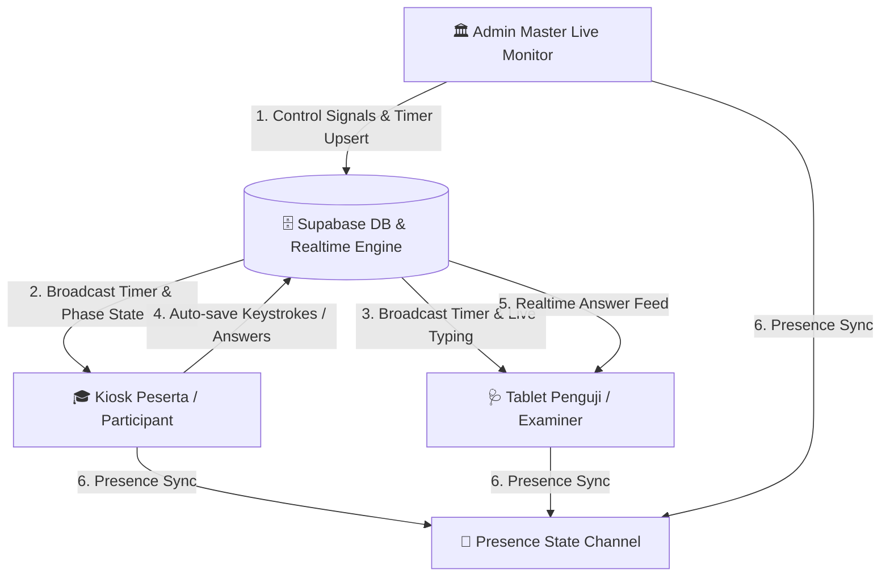
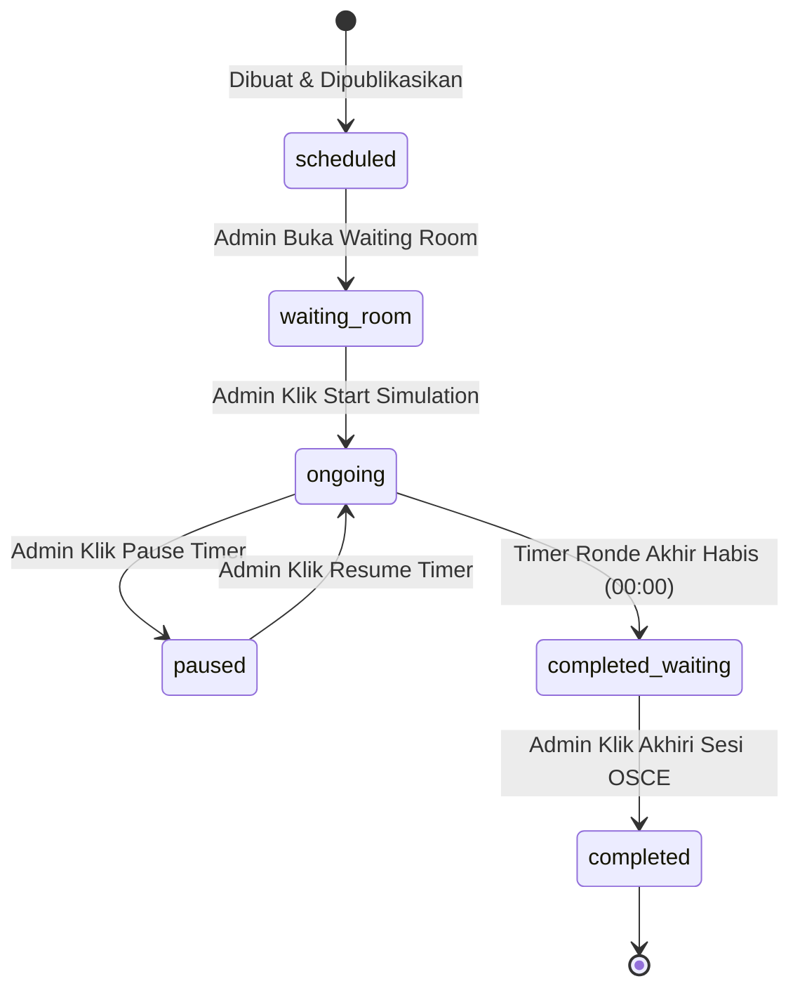
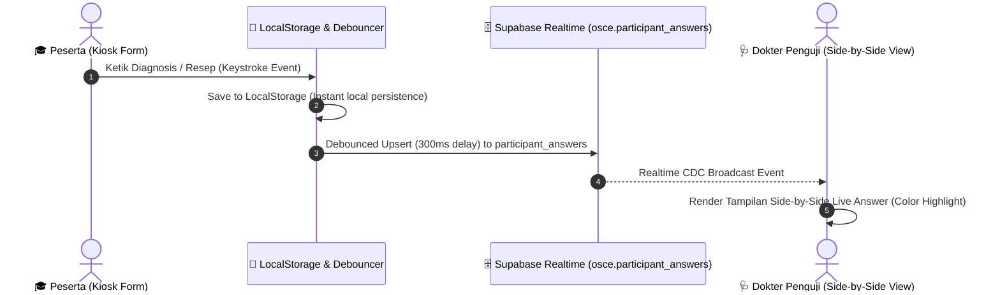

# ⚡ Spesifikasi Realtime Status & Arsitektur Sinkronisasi Sistem Ujian OSCE (REALTIME.md)

> **Praxis by MedSkill Indonesia** — *Single Source of Truth Dokumentasi Fitur Realtime, Timer Engine, State Machine, dan Presence Tracking*

---

## 📑 Daftar Isi
1. [Prinsip & Arsitektur Utama Realtime](#1-prinsip--arsitektur-utama-realtime)
2. [Pola Sinkronisasi Timer (Future Timestamp Pattern)](#2-pola-sinkronisasi-timer-future-timestamp-pattern)
3. [Skema Saluran Supabase Realtime (Channels)](#3-skema-saluran-supabase-realtime-channels)
4. [Life-Cycle Status Sesi & Matriks Peran (State Machine)](#4-life-cycle-status-sesi--matriks-peran-state-machine)
5. [Fitur Presence Tracking (Waiting Room & Live Online Status)](#5-fitur-presence-tracking-waiting-room--live-online-status)
6. [Sistem Broadcast Notifikasi & Audio Bell Synthesizer](#6-sistem-broadcast-notifikasi--audio-bell-synthesizer)
7. [Side-by-Side Live Typing Sync (Peserta ↔ Penguji)](#7-side-by-side-live-typing-sync-peserta--penguji)
8. [Matriks Event, Payload, & Penanganan Diskonsepsi (Resiliensi Jaringan)](#8-matriks-event-payload--penanganan-diskonsepsi-resiliensi-jaringan)

---

## 1. 🏗️ Prinsip & Arsitektur Utama Realtime

Sistem Ujian **OSCE Praxis** mengusung arsitektur *low-latency realtime synchronization* berbasis **Supabase Realtime Engine (WebSockets)** untuk menghubungkan 3 aktor utama secara *multi-tenant* dan terisolasi per sesi:



### Pilar Arsitektur:
1. **Zero-Latency WebSocket Direct Broadcast**: Mengirim instruksi bel audio dan notifikasi darurat tanpa menunggu proses penulisan (*write-to-disk*) database.
2. **Postgres Changes CDC (Change Data Capture)**: Sinkronisasi otomatis saat terjadi perubahan data pada tabel `osce.sessions`, `osce.session_timer_state`, `osce.broadcast_messages`, dan `osce.participant_answers`.
3. **Presence Engine**: Melakukan pendaftaran dan pelacakan status pengguna online secara independen per sesi ujian (`osce-presence:<sessionId>`).

---

## 2. ⏱️ Pola Sinkronisasi Timer (Future Timestamp Pattern)

Sistem tidak mengandalkan *server tick countdown* per detik (karena boros *query* database dan rentan *network latency jitter*). Sebagai gantinya, Praxis menggunakan **Future Timestamp Pattern**:

$$\text{Remaining Seconds} = \max\left(0, \left\lfloor \frac{T_{\text{target\_end\_time}} - T_{\text{local\_now}}}{1000} \right\rfloor\right)$$

### Keunggulan Pattern:
- **Kebal dari Tab Throttling**: Jika browser peserta/penguji diminimalkan (background tab) atau mengalami *sleep*, saat layar dibuka kembali, sisa waktu dihitung ulang secara presisi dari `target_end_time`.
- **Kebal Latensi Jaringan**: Mengurangi beban server hingga **99.8%**, karena server hanya menulis data *timer state* saat terjadi pergantian fase/ronde.
- **Handling Pause**: Saat Admin menekan tombol `Pause`, sistem mencatat `paused_remaining_ms`. Saat `Resume` ditekan, sistem menghitung `target_end_time` baru (`NOW() + paused_remaining_ms`).

---

## 3. 📡 Skema Saluran Supabase Realtime (Channels)

Setiap sesi ujian aktif menggunakan 2 nama saluran (*channel topics*) utama:

### 3.1 Channel 1: `osce-session:<sessionId>`
Digunakan untuk sinkronisasi state data, timer, dan komunikasi broadcast.

| Tipe Handler | Event Filter / Event Name | Sumber Tabel / Source | Deskripsi & Fungsi |
| :--- | :--- | :--- | :--- |
| `postgres_changes` | `SCHEMA: osce, TABLE: sessions` | `osce.sessions` | Mendeteksi perubahan status sesi (`waiting_room`, `ongoing`, `paused`, `completed`). |
| `postgres_changes` | `SCHEMA: osce, TABLE: session_timer_state` | `osce.session_timer_state` | Sinkronisasi `target_end_time`, `phase`, `round_number`, `wave_number`. |
| `postgres_changes` | `SCHEMA: osce, TABLE: broadcast_messages` | `osce.broadcast_messages` | Fallback penerimaan pengumuman teks dari Admin. |
| `postgres_changes` | `SCHEMA: osce, TABLE: participant_answers` | `osce.participant_answers` | Live feed ketikan peserta ke tablet Dokter Penguji. |
| `broadcast` | `announcement` | Direct WebSocket | Pengumuman instan Admin dengan deduplikasi pesan. |
| `broadcast` | `play_bell` | Direct WebSocket | Pemicu bel audio otomatis/manual di seluruh perangkat. |
| `broadcast` | `session_finished` | Direct WebSocket | Signal darurat penutupan sesi ujian. |

### 3.2 Channel 2: `osce-presence:<sessionId>`
Digunakan untuk pelacakan kehadiran *realtime* (siapa yang sedang membuka halaman sesi).

```json
{
  "user_id": "usr_99812371",
  "full_name": "dr. Ahmad Ridwan, Sp.PD",
  "role": "examiner",
  "specialty": "Penyakit Dalam",
  "nim": "",
  "email": "ahmad.ridwan@medskill.id",
  "online_at": "2026-08-20T00:25:00.000Z"
}
```

---

## 4. 🔄 Life-Cycle Status Sesi & Matriks Peran (State Machine)

Status sesi ujian mengontrol alur navigasi dan hak akses di seluruh antarmuka:



### Matriks Perilaku Peran Berdasarkan Status Sesi:

| Status Sesi (`status`) | Layar Admin (`/admin/live`) | Layar Peserta (`/participant/session/:id`) | Layar Penguji (`/examiner/stage/:id`) |
| :--- | :--- | :--- | :--- |
| `published` / `scheduled` | Menampilkan opsi *Buka Waiting Room*. | Menampilkan info jadwal & instruksi pra-ujian. | Standby mode, menampilkan jadwal stase tugas. |
| `waiting_room` | Menampilkan *Live Presence Counter* (Peserta & Penguji online). Tombol *Start Simulation* aktif. | Membuka *Waiting Room & Briefing Page*. Memutar video/instruksi. | Standby Waiting Room Stase. Menampilkan daftar peserta yang siap. |
| `ongoing` / `running` | Master Live Control Room aktif (Timer running, Bell control, Broadcast). | Kiosk Ujian 4-Halaman aktif. Timer stase berjalan. | Side-by-Side Scoring Room aktif. Live typing peserta muncul real-time. |
| `paused` | Banner PAUSED muncul. Tombol *Resume* aktif. | Banner PAUSED. Input form dikunci sementara. Timer beku. | Banner PAUSED. Scoring dikunci sementara. Timer beku. |
| `completed_waiting` | Indikator *Semua Ronde Selesai*. Tombol *Akhiri Sesi OSCE* aktif. | **Dialihkan ke Halaman Terima Kasih**. Form dikunci total (*read-only*). | **Grading Grace Period**. Penguji tetap bisa menyelesaikan scoring ronde 6. |
| `completed` / `finished` | Sesi ditutup. Laporan hasil & kalkulasi NBL siap di-generate. | Tampilan hasil ujian / transkrip nilai (jika di-publish). | Kembali ke Dashboard Penguji / Riwayat Evaluasi. |

---

## 5. 👥 Fitur Presence Tracking (Waiting Room & Live Online Status)

Sistem Presence memanfaatkan WebSocket Presence State dari Supabase Realtime Engine:

1. **Auto-Join**: Saat pengguna membuka halaman sesi, fungsi `joinPresence(sessionId, userState, onSync)` dipanggil.
2. **Deduplikasi**: Sistem memfilter *duplicate heartbeat* berdasarkan `user_id` atau `email` untuk mencegah kalkulasi ganda jika pengguna membuka multiple tab.
3. **Presence Sync Callback**:
   - **Admin**: Memantau daftar lengkap nama, NIM, dan peran pengguna yang aktif di sesi tersebut.
   - **Penguji**: Melihat status kehadiran peserta yang ditugaskan di pos stasenya.
4. **Auto-Leave**: Ketika tab browser ditutup atau navigasi keluar halaman, Supabase secara otomatis mengirim event `leave` dan memperbarui daftar online pengguna lain dalam waktu < 2 detik.

---

## 6. 🔔 Sistem Broadcast Notifikasi & Audio Bell Synthesizer

Sistem pengingat waktu dan pengumuman menggunakan kombinasi **Audio Bell Synthesizer (Web Audio API)** dan **Broadcast Toast System**:

### 6.1 Jenis Bel Audio (Synthesizer Frequencies)
Tanpa membutuhkan file MP3 eksternal yang rentan gagal di-load, sistem memicu osilator audio browser:

* 🔔 **Bel 1x High Chime (880 Hz - Pitch A5)**:
  * *Dipemicu*: Akhir Reading Time / Mulai Action Time.
  * *Durasi*: 1.2 detik (Sine wave decay).
* ⚠️ **Bel 2x Warning Beep (660 Hz - Pitch E5)**:
  * *Dipemicu*: Sisa Waktu Stase 2 Menit.
  * *Durasi*: 2x Beep (Triangle wave, interval 0.25s).
* 🚨 **Bel 3x Siren Rotation Bell (523 Hz $\rightarrow$ 987 Hz)**:
  * *Dipemicu*: Akhir Action Time / Rotasi Perpindahan Stase.
  * *Durasi*: 3x Tone (Sawtooth wave).

### 6.2 Broadcast Peringatan Teks (Admin Message Broadcast)
Admin dapat mengirim pengumuman darurat via modal broadcast:
- **Target Role**: `all` (Semua Layar), `examiners` (Penguji Saja), `participants` (Peserta Saja).
- **Auto-Dismiss**: Toast notifikasi broadcast bertahan selama 5 detik disertai efek suara *chime*.

---

## 7. 📝 Side-by-Side Live Typing Sync (Peserta ↔ Penguji)

Salah satu fitur unggulan sistem OSCE ini adalah sinkronisasi ketikan jawaban peserta secara *live* ke layar Dokter Penguji:



### Mekanisme Resiliensi:
1. **Instant Local Save**: Setiap *keystroke* langsung disimpan di `localStorage` lokal peserta untuk mencegah kehilangan data jika koneksi internet terputus.
2. **Debounced DB Sync**: Pengiriman ke Supabase `participant_answers` di-debounce selama 300ms untuk menghemat bandwidth.
3. **Gold Standard Comparison**: Layar Penguji menampilkan ketikan peserta di sisi kiri dan **Kunci Jawaban Baku (Gold Standard)** di sisi kanan secara berdampingan.

---

## 8. 🛡️ Matriks Event, Payload, & Penanganan Diskonsepsi (Resiliensi Jaringan)

### 8.1 Contoh Event Payload utama (`osce.session_timer_state`)

```json
{
  "event": "UPDATE",
  "schema": "osce",
  "table": "session_timer_state",
  "commit_timestamp": "2026-08-20T00:26:00Z",
  "new": {
    "session_id": "c7a8109d-4e2b-4560-998f-123456789abc",
    "phase": "action",
    "target_end_time": "2026-08-20T00:38:00.000Z",
    "paused_remaining_ms": null,
    "round_number": 3,
    "wave_number": 1,
    "updated_at": "2026-08-20T00:26:00.000Z"
  }
}
```

### 8.2 Strategi Resiliensi & Anti-Disruption

| Potensi Masalah | Dampak | Penanganan Otomatis Sistem |
| :--- | :--- | :--- |
| **Koneksi Wi-Fi Putus Saat Ujian** | Peserta/Penguji kehilangan jaringan internet. | Data tersimpan di `localStorage`. Saat Wi-Fi kembali terhubung, sistem melakukan *auto-reconnect* WebSocket & *auto-sync* data yang tertunda. |
| **Browser Tab Sleep / Minimize** | Timer JavaScript (`setInterval`) mengalami throttling. | Saat tab diakses kembali, *Future Timestamp Pattern* menghitung ulang sisa waktu langsung dari `target_end_time` (tanpa ada selisih lag). |
| **Pembersihan Channel Ganda** | Error `cannot add callbacks after subscribe()`. | Helper `cleanupChannel(name)` selalu dipanggil sebelum meng-instansiasi saluran WebSocket baru. |
| **Mati Lampu / Power Cut Server** | Sesi terhenti di tengah jalan. | State sesi tersimpan di PostgreSQL. Saat server menyala kembali, Admin tinggal menekan tombol *Resume Timer*. |

---

> **Dokumentasi Resmi Sistem Realtime OSCE Praxis**  
> *Terakhir diperbarui: 2026-08-20 — Status: Fully Active & Synchronized*
