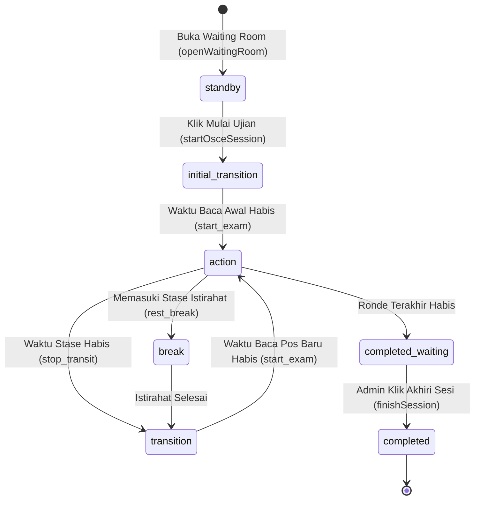

# 🔊 SOUND.md — Panduan Komprehensif: Audio Engine, Broadcast Realtime, Sinkronisasi Sesi OSCE, & Manajemen Tim

> **Praxis by MedSkill Indonesia — OSCE Engine & Clinical Assessment Platform**  
> *Dokumentasi Resmi Terintegrasi: Arsitektur Audio, Broadcast Interkom, Sinkronisasi Realtime, & Manajemen Koordinasi Tim Ujian*  
> *Terakhir diperbarui: 27 Agustus 2026*

Dokumen ini disusun sebagai **Single Source of Truth (SSOT)** untuk mengeliminasi kerancuan integrasi operasional sistem OSCE Praxis yang menghubungkan 4 pilar utama:
1. **📢 Sistem Broadcast Pengumuman & Interkom Darurat**
2. **⏱️ Sistem Realtime Sesi OSCE (Timer State, Lifecycle, & Rotasi Stase)**
3. **🔔 Audio Engine (Tri-Layer Fallback: MP3 Studio, Web Audio Synthesizer, & TTS Voiceover)**
4. **👥 Manajemen Tim & Koordinasi Peran Ujian (Admin Control Room, Dokter Penguji, & Peserta)**

---

## 🗺️ 1. Peta Arsitektur Terintegrasi (Broadcast ↔ Realtime ↔ Sound ↔ Tim)

Berikut adalah diagram alur bagaimana koordinasi antar peran dan aksi Admin di Control Room didistribusikan secara realtime ke perangkat Dokter Penguji dan Peserta, serta memicu efek suara (*sound cues*):

```mermaid
sequenceDiagram
    autonumber
    actor Admin as 🏛️ Admin / Tim Control Room
    participant RT as ⚡ Supabase Realtime (WebSocket & Presence)
    participant DB as 🗄️ PostgreSQL (osce schema)
    actor Examiner as 🩺 Tim Dokter Penguji
    actor Participant as 🎓 Peserta Ujian

    %% Skenario 1: Presence & Waiting Room
    rect rgb(240, 245, 255)
    Note over Admin, Participant: 1. FASE PRESENSI TIM & WAITING ROOM
    Examiner->>RT: joinPresence('examiner', specialty, fullName) ➔ Channel osce-presence
    Participant->>RT: joinPresence('participant', nim, fullName) ➔ Channel osce-presence
    RT-->>Admin: Sync Presence State (Live Counter Tim Online)
    Admin->>DB: openWaitingRoom(sessionId) / status='waiting_room'
    Admin->>RT: Broadcast play_bell('waiting_room')
    RT-->>Examiner: Event 'play_bell' ➔ playOsceAudio('waiting_room')
    RT-->>Participant: Event 'play_bell' ➔ playOsceAudio('waiting_room')
    end

    %% Skenario 2: Start Sesi & Rotasi Sirkuit
    rect rgb(245, 255, 245)
    Note over Admin, Participant: 2. START UJIAN & TIMER ROTASI SIRKUIT
    Admin->>DB: startOsceSession() ➔ phase='initial_transition', target_end_time=NOW()+120s
    DB-->>Examiner: CDC update session_timer_state ➔ Local Tick Start + Render Pasien Pos
    DB-->>Participant: CDC update session_timer_state ➔ Local Tick Start + Buka Lembar Kasus
    end

    %% Skenario 3: Countdown & Warning Timer
    rect rgb(255, 250, 240)
    Note over Examiner, Participant: 3. OTOMATISASI COUNTDOWN & PERINGATAN WAKTU (Local Tick)
    Participant->>Participant: Local Timer sisa 180s (3 Menit) ➔ playOsceAudio('warning_3min')
    Examiner->>Examiner: Local Timer sisa 180s (3 Menit) ➔ playOsceAudio('warning_3min')
    Participant->>Participant: Local Timer sisa 10s ➔ playOsceAudio('countdown')
    Participant->>Participant: Local Timer sisa 00:00 (Stase Habis) ➔ playOsceAudio('stop_transit')
    end

    %% Skenario 4: Targeted Broadcast Admin ke Tim
    rect rgb(255, 240, 245)
    Note over Admin, Participant: 4. BROADCAST INTERKOM DARURAT / INSTRUKSI TIM
    Admin->>RT: Direct WebSocket send({ event: 'announcement', target_role: 'examiners' })
    Admin->>DB: INSERT into osce.broadcast_messages (Fallback & Log)
    RT-->>Examiner: Banner muncul khusus Penguji + playOsceAudio('admin_broadcast')
    Note right of Participant: Layar Peserta tetap tenang (Targeting Role)
    end
```

---

## 👥 2. Manajemen Tim & Struktur Peran Ujian OSCE

Sistem Praxis OSCE membagi wewenang dan alur kerja ke dalam matriks tim yang saling terhubung secara *real-time*:

### 2.1 Matriks Peran Tim & Tanggung Jawab Operasional

| Peran Tim (*Role*) | Akses Antarmuka | Tugas & Tanggung Jawab Utama | Sinyal Audio & Realtime yang Diterima |
| :--- | :--- | :--- | :--- |
| **🏛️ Admin / Tim Control Room** | `/admin/live` & Dashboard Admin | - Mengontrol Master Timer ujian (Start, Pause, Resume, Stop).<br>- Memantau presensi tim penguji & peserta.<br>- Mengirim broadcast teks darurat & memicu bel manual.<br>- Memantau grid penilaian stase secara live. | - Suara feedback aksi admin (Pause/Resume).<br>- Suara bel kontrol manual. |
| **🩺 Tim Dokter Penguji (*Examiner*)** | `/examiner/stage/:sessionId` | - Standby di pos stase yang ditugaskan.<br>- Mengamati interaksi klinis & ketikan live peserta.<br>- Memberikan skor rubrik medis (Skor 0-3, Global Rating).<br>- Merekap nilai sebelum waktu ronde berakhir. | - Bel `waiting_room`, `start_exam`, `warning_3min`, `stop_transit`, `resume`.<br>- Audio `admin_broadcast` (jika target `all` atau `examiners`). |
| **🎓 Peserta Ujian (*Participant*)** | `/participant/session/:sessionId` | - Menempati pos stase awal sirkuit.<br>- Membaca instruksi skenario saat waktu transisi.<br>- Mengisi lembar anamnesis, diagnosis, resep, dan terapi.<br>- Berpindah pos stase saat bel rotasi berbunyi. | - Bel `waiting_room`, `start_exam`, `warning_3min`, `countdown`, `stop_transit`, `rest_break`, `finish_exam`.<br>- Audio `admin_broadcast` (jika target `all` atau `participants`). |
| **🏢 Panitia / Koordinator Stase** | `/admin/sessions` & Monitor | - Menyiapkan sarana prasarana pos & manekin/pasien standar.<br>- Mengonfirmasi kesiapan dokter penguji di setiap stase. | - Notifikasi kehadiran via Presence Grid. |

---

### 2.2 Skema Database Penugasan Tim (*Team Assignment Schema*)

Penugasan tim diatur melalui tabel relasional PostgreSQL schema `osce`:

1. **Penugasan Penguji ke Stase (`osce.session_examiners`)**:
   ```sql
   -- Mapping Penguji ke Stase tertentu dalam Sesi Ujian
   CREATE TABLE osce.session_examiners (
       id UUID PRIMARY KEY DEFAULT gen_random_uuid(),
       session_id UUID NOT NULL REFERENCES osce.sessions(id) ON DELETE CASCADE,
       station_id UUID NOT NULL REFERENCES osce.stations(id) ON DELETE CASCADE,
       user_id UUID NOT NULL REFERENCES auth.users(id),
       specialty VARCHAR(100),
       status VARCHAR(20) DEFAULT 'assigned', -- 'assigned', 'checked_in', 'active'
       created_at TIMESTAMPTZ DEFAULT NOW(),
       UNIQUE(session_id, station_id, user_id)
   );
   ```

2. **Penugasan Peserta ke Stase Awal (`osce.session_participants`)**:
   ```sql
   -- Mapping Peserta ke Pos Stase Awal Sirkuit
   CREATE TABLE osce.session_participants (
       id UUID PRIMARY KEY DEFAULT gen_random_uuid(),
       session_id UUID NOT NULL REFERENCES osce.sessions(id) ON DELETE CASCADE,
       user_id UUID NOT NULL REFERENCES auth.users(id),
       starting_station_number INT NOT NULL, -- Stase awal (1 s/d N)
       registration_number VARCHAR(50),
       status VARCHAR(20) DEFAULT 'registered',
       created_at TIMESTAMPTZ DEFAULT NOW(),
       UNIQUE(session_id, user_id)
   );
   ```

---

### 2.3 Formula Algoritma Rotasi Tim Sirkuit Ujian
Pada setiap pergantian ronde ($R$), sistem menghitung secara otomatis peserta mana yang sedang berada di stase penguji ($S$) tanpa memerlukan input manual:

$$\text{Target Starting Station } S_0 = \left(\left(S - 1 - (R - 1) \bmod N + N\right) \bmod N\right) + 1$$

*Keterangan*:
- $S$ = Nomor stase tempat Dokter Penguji bertugas ($1 \dots N$).
- $R$ = Nomor ronde aktif yang sedang berjalan ($1 \dots \text{total\_rounds}$).
- $N$ = Jumlah total stase aktif dalam sirkuit ujian.
- $S_0$ = Nomor stase awal peserta yang dicocokkan ke daftar `session_participants`.

---

### 2.4 Sistem Presensi Tim Realtime (`osce-presence:<sessionId>`)
Pelacakan kehadiran seluruh tim dilakukan menggunakan Supabase Presence API di [`realtimeTimerService.js`](file:///c:/KAIRAV/project/2026/medskill/praxis/frontend/src/services/realtimeTimerService.js#L227-L281):

- **Struktur State Pengguna**:
  ```json
  {
    "user_id": "9b1deb4d-3b7d-4bad-9bdd-2b0d7b3dcb6d",
    "full_name": "dr. Siti Rahma, Sp.A",
    "role": "examiner",
    "specialty": "Ilmu Kesehatan Anak",
    "nim": "",
    "email": "siti.rahma@medskill.id",
    "online_at": "2026-08-27T19:45:00.000Z"
  }
  ```
- **Deduplikasi Presensi**: Menghindari hitungan ganda jika satu penguji/peserta membuka lebih dari satu tab browser melalui filter unik `user_id` / `email`.
- **Indikator Live Monitor**: Komponen [`LiveOnlinePresenceGrid.jsx`](file:///c:/KAIRAV/project/2026/medskill/praxis/frontend/src/features/admin/components/live/LiveOnlinePresenceGrid.jsx) menampilkan kartu identitas seluruh anggota tim online dengan *status badge* berwarna (Ungu = Penguji, Amber = Admin, Hijau = Peserta).

---

## 📢 3. Sistem Broadcast (Pengumuman & Interkom Darurat)

Sistem Broadcast memungkinkan Tim Control Room mengirimkan instruksi darurat atau pengumuman teks ke seluruh peserta dan dokter penguji.

### 3.1 Alur Pengiriman & Dual-Channel Dispatcher
Untuk menjamin pesan terkirim seketika tanpa jeda database (0ms latency), fungsi `sendBroadcast()` di [`realtimeTimerService.js`](file:///c:/KAIRAV/project/2026/medskill/praxis/frontend/src/services/realtimeTimerService.js#L516-L580) menerapkan **Dual-Channel Dispatcher**:

1. **Jalur Cepat (Direct WebSocket Broadcast)**:  
   Mengirim event `announcement` langsung melalui WebSocket Supabase channel `osce-session:<sessionId>`.
2. **Jalur Persistensi (PostgreSQL CDC Fallback)**:  
   Menyimpan pesan ke tabel `osce.broadcast_messages` agar tercatat dalam riwayat log audit dan diterima oleh klien yang baru terhubung ulang (*reconnect*).

### 3.2 Mekanisme Anti-Duplikasi (Deduplication)
Karena klien mendengarkan kedua jalur (WebSocket + DB CDC), klien berpotensi menerima pesan yang sama 2 kali.  
Hal ini dicegah di [`subscribeToSession`](file:///c:/KAIRAV/project/2026/medskill/praxis/frontend/src/services/realtimeTimerService.js#L128-L145) menggunakan **Text-Signature Deduplication** selama **6 detik**:

```javascript
// Cuplikan Logika Deduplikasi di realtimeTimerService.js
const seenBroadcastKeys = new Set();
const triggerBroadcast = (rawPayload) => {
  const msgData = rawPayload.payload || rawPayload;
  const msgText = String(msgData.message || msgData.text || "").trim();
  if (!msgText) return;

  const dedupeKey = `text:${msgText.toLowerCase()}`;
  if (seenBroadcastKeys.has(dedupeKey)) return; // Mencegah popup / audio dobel

  seenBroadcastKeys.add(dedupeKey);
  setTimeout(() => seenBroadcastKeys.delete(dedupeKey), 6000);

  onBroadcast(msgData);
};
```

### 3.3 Pemisahan Tegas: Broadcast Khusus vs Otomatisasi Timer
> [!IMPORTANT]
> **Prinsip Desain Broadcast**:
> 1. **Broadcast HANYA untuk Pesan Khusus / Darurat**: Digunakan saat Tim Control Room perlu memberikan instruksi ad-hoc kepada Dokter Penguji atau Peserta (misal: kendala teknis, instruksi tetap di pos, atau pengecekan rubrik).
> 2. **HANYA Menggunakan Efek Suara `@broadcast` (`admin_broadcast`)**: Setiap kali broadcast dikirim, perangkat penerima HANYA memutar chime interkom *Ding-Dong* penarik perhatian.
> 3. **TIDAK Berisi Peringatan Waktu / Rotasi**: Notifikasi sisa 3 menit, countdown 10 detik, bel mulai stase, dan bel rotasi telah berjalan **100% otomatis** oleh mesin timer lokal & global (`warning_3min`, `stop_transit`, `start_exam`), sehingga modal broadcast murni menyajikan template pengumuman darurat.

### 3.4 Matriks Target Penerima Broadcast Berdasarkan Peran Tim

| Nilai `target_role` | Layar Peserta | Layar Dokter Penguji | Layar Admin | Efek Suara | Skenario Penggunaan |
| :--- | :---: | :---: | :---: | :--- | :--- |
| `all` | ✅ Muncul | ✅ Muncul | ✅ Muncul | `admin_broadcast` (Chime Interkom) | Pengumuman khusus umum ke seluruh tim (misal: "Harap tenang dan tetap di pos masing-masing"). |
| `examiners` / `penguji` | ❌ Diabaikan | ✅ Muncul | ✅ Muncul | `admin_broadcast` (Chime Interkom) | Instruksi khusus tim penilai (misal: "Dokter Penguji dimohon memeriksa kelengkapan rubrik penilaian ujian"). |
| `participants` / `peserta` | ✅ Muncul | ❌ Diabaikan | ✅ Muncul | `admin_broadcast` (Chime Interkom) | Instruksi khusus kandidat (misal: "Peserta harap menunggu instruksi selanjutnya dari panitia"). |

---

## ⏱️ 4. Sistem Realtime Sesi OSCE (Timer, Lifecycle, & Rotasi)

### 4.1 Pola Future Timestamp Pattern (Anti Tab-Sleep & Anti Latensi)
Sistem **tidak mengirimkan detak timer per detik dari server** ke database (karena membebani server dan rentan lag koneksi). Sebagai gantinya, server hanya mencatat titik akhir waktu (`target_end_time`):

$$\text{Sisa Detik (rem)} = \max\left(0, \left\lfloor \frac{T_{\text{target\_end\_time}} - T_{\text{Date.now()}}}{1000} \right\rfloor\right)$$

- **Saat Tab Browser Tertidur (*Sleep/Throttling*)**: Ketika layar dibuka kembali, sisa waktu langsung dihitung secara presisi dari selisih waktu sekarang dengan `target_end_time`.
- **Saat Sesi Dijeda (*Pause*)**: Sistem menyimpan `paused_remaining_ms`.
- **Saat Sesi Dilanjutkan (*Resume*)**: Sistem membuat `target_end_time` baru = `NOW() + paused_remaining_ms`.

### 4.2 Siklus Fase Sesi (*State Machine*)



### 4.3 Daftar Fungsi API Realtime Utama di [`realtimeTimerService.js`](file:///c:/KAIRAV/project/2026/medskill/praxis/frontend/src/services/realtimeTimerService.js)

| Nama Fungsi | Parameter | Target Tabel / Channel | Efek & Aksi Sistem |
| :--- | :--- | :--- | :--- |
| [`openWaitingRoom(sessionId)`](file:///c:/KAIRAV/project/2026/medskill/praxis/frontend/src/services/realtimeTimerService.js#L290) | `sessionId` | `osce.sessions`<br>`osce.session_timer_state` | Mengubah status sesi ke `waiting_room`, memicu bel & audio `waiting_room`. |
| [`startOsceSession(...)`](file:///c:/KAIRAV/project/2026/medskill/praxis/frontend/src/services/realtimeTimerService.js#L330) | `sessionId, durationMinutes, transitionMinutes` | `osce.sessions`<br>`osce.session_timer_state` | Mengubah status ke `ongoing`, menghitung `target_end_time`, dan memulai rotasi. |
| [`pauseTimer(...)`](file:///c:/KAIRAV/project/2026/medskill/praxis/frontend/src/services/realtimeTimerService.js#L427) | `sessionId, remainingSeconds, extra` | `osce.session_timer_state` | Membekukan timer, menyimpan `paused_remaining_ms`, dan broadcast sinyal jeda. |
| [`resumeTimer(...)`](file:///c:/KAIRAV/project/2026/medskill/praxis/frontend/src/services/realtimeTimerService.js#L471) | `sessionId, remainingSeconds, extra` | `osce.session_timer_state` | Menghitung `target_end_time` baru, memutar audio `resume`, dan melanjutkan hitungan. |
| [`sendBroadcast(...)`](file:///c:/KAIRAV/project/2026/medskill/praxis/frontend/src/services/realtimeTimerService.js#L516) | `sessionId, message, priority, targetRole` | WebSocket `announcement`<br>`osce.broadcast_messages` | Mengirim banner pengumuman instan dan memicu chime audio broadcast. |
| [`sendBellBroadcast(...)`](file:///c:/KAIRAV/project/2026/medskill/praxis/frontend/src/services/realtimeTimerService.js#L587) | `sessionId, bellType` | WebSocket `play_bell` | Memicu pemutaran audio bel tertentu secara serentak di semua perangkat. |
| [`finishSession(sessionId)`](file:///c:/KAIRAV/project/2026/medskill/praxis/frontend/src/services/realtimeTimerService.js#L640) | `sessionId` | `osce.sessions`<br>WebSocket `session_finished` | Menutup sesi, mengunci form penilaian, memutar audio `finish_exam`. |
| [`joinPresence(...)`](file:///c:/KAIRAV/project/2026/medskill/praxis/frontend/src/services/realtimeTimerService.js#L227) | `sessionId, userState, onSync` | Saluran `osce-presence:<sessionId>` | Mendaftarkan kehadiran anggota tim realtime (online/offline tracker). |

---

## 🔔 5. Katalog & Spesifikasi Audio Lengkap (`audioService.js`)

Sistem audio OSCE MedSkill Praxis menggunakan **Pure Local MP3 Audio Engine**:
- **100% Berasal dari Folder Publik Lokal**: Seluruh file audio disimpan di `/frontend/public/sounds/*.mp3`.
- **Nol Aset Eksternal**: Dilarang dan tidak ada pemanggilan URL/CDN luar atau sintesis buatan di luar aset publik.
- **Peringatan Waktu**: Eksklusif hanya menggunakan **Peringatan 3 Menit** (`warning_3min`).

```
                                ┌──────────────────────────────────────────────┐
                                │     Event Timer / Realtime WebSocket         │
                                └──────────────────────┬───────────────────────┘
                                                       │
                                                       ▼
                                      Pure Local MP3 Audio Engine
                                ┌──────────────────────────────────────────────┐
                                │          /public/sounds/*.mp3                │
                                │   (100% Local Studio Audio Assets)           │
                                └──────────────────────────────────────────────┘
```

### 5.1 Tabel Katalog Aset Audio MP3 (`/public/sounds/`)

| No | Key Audio (`audioService.js`) | File Aset MP3 | Pemicu (*Trigger Point*) | Naskah Voiceover (Bahasa Indonesia) |
| :---: | :--- | :--- | :--- | :--- |
| **1** | `start_osce` / `waiting_room` | `audio_01_start_osce.mp3` | Admin membuka ruang tunggu atau saat sesi OSCE dimulai. | *"Selamat datang di Ujian OSCE MedSkill. Peserta ujian dipersilakan menempatkan diri di depan pintu stase masing-masing."* |
| **2** | `read_scenario` | `audio_02_read_scenario.mp3` | Transisi rotasi pos / membaca skenario di luar stase. | *"Silakan membuka dan membaca instruksi skenario kasus di luar pintu stase."* |
| **3** | `start_exam` | `audio_03_start_exam.mp3` | Selesai waktu membaca & peserta masuk ke ruang stase (Action Time mulai). | *"Waktu membaca selesai. Silakan memasuki ruang stase dan mulailah ujian."* |
| **4** | `warning_3min` | `audio_04_warning_3min.mp3` | Timer stase tersisa **3 Menit** (180 detik) pada fase ujian berjalan. | *"Perhatian, waktu ujian stase tersisa tiga menit lagi."* |
| **5** | `stop_transit` | `audio_05_stop_transit.mp3` | Timer stase mencapai **00:00** (waktu pengerjaan stase selesai). | *"Waktu ujian stase telah selesai. Peserta dipersilakan keluar dari ruangan dan berpindah ke pos stase berikutnya."* |
| **6** | `rest_break` | `audio_06_rest_break.mp3` | Peserta berada di stase istirahat (*Rest Station*). | *"Anda memasuki stase istirahat. Silakan memulihkan stamina di area sirkuit."* |
| **7** | `finish_exam` | `audio_07_finish_exam.mp3` | Seluruh rangkaian ronde OSCE tuntas selesai. | *"Seluruh rangkaian ujian OSCE telah selesai. Terima kasih atas partisipasi Anda, dipersilakan meninggalkan lokasi ujian."* |
| **8** | `pause` | `audio_08_pause.mp3` | Admin menekan tombol **Jeda (Pause)** saat sesi ujian berlangsung. | *"Perhatian dari Panitia Control Room. Sesi ujian dihentikan sementara."* |
| **9** | `countdown` | `audio_09_countdown.mp3` | Detik **10s hingga 1s terakhir** sebelum stase berganti. | *Sound tick-tock countdown 10 detik* |
| **10** | `resume` | `audio_10_resume.mp3` | Admin menekan tombol **Lanjutkan (Resume)** setelah jeda. | *"Perhatian, ujian dilanjutkan kembali. Peserta dipersilakan melanjutkan pengerjaan."* |
| **11** | `admin_broadcast` / `broadcast` | `broadcast.mp3` | Admin mengirim pengumuman broadcast teks darurat via modal broadcast. | *Chime Interkom Interrupter (Ding-Dong) + "Perhatian dari Panitia Control Room."* |

---

## 🛠️ 6. Matriks Pemicu Suara di Kode Frontend

Berikut adalah daftar lokasi baris kode di mana audio dipicu pada antarmuka masing-masing tim:

| File Sumber | Baris / Fungsi | Pemicu (*Condition Trigger*) | Kunci Audio yang Diputar |
| :--- | :--- | :--- | :--- |
| [`ParticipantSessionPage.jsx`](file:///c:/KAIRAV/project/2026/medskill/praxis/frontend/src/features/participant/pages/ParticipantSessionPage.jsx#L743-L753) | `useEffect` (Timer Tick) | `roundSecondsLeft === 180` | `warning_3min` |
| [`ParticipantSessionPage.jsx`](file:///c:/KAIRAV/project/2026/medskill/praxis/frontend/src/features/participant/pages/ParticipantSessionPage.jsx#L745) | `useEffect` (Timer Tick) | `roundSecondsLeft === 10` atau `transitSecondsLeft === 10` | `countdown` |
| [`ParticipantSessionPage.jsx`](file:///c:/KAIRAV/project/2026/medskill/praxis/frontend/src/features/participant/pages/ParticipantSessionPage.jsx#L746) | `useEffect` (Timer Tick) | `roundSecondsLeft === 0` | `stop_transit` |
| [`ParticipantSessionPage.jsx`](file:///c:/KAIRAV/project/2026/medskill/praxis/frontend/src/features/participant/pages/ParticipantSessionPage.jsx#L749) | `useEffect` (Timer Tick) | `transitSecondsLeft === 0` | `start_exam` |
| [`ParticipantSessionPage.jsx`](file:///c:/KAIRAV/project/2026/medskill/praxis/frontend/src/features/participant/pages/ParticipantSessionPage.jsx#L751) | `useEffect` (Timer Tick) | `viewMode === "completed"` | `finish_exam` |
| [`ParticipantSessionPage.jsx`](file:///c:/KAIRAV/project/2026/medskill/praxis/frontend/src/features/participant/pages/ParticipantSessionPage.jsx#L699) | `onBroadcast` | Admin kirim pesan broadcast ke peserta | `admin_broadcast` |
| [`ExaminerStagePage.jsx`](file:///c:/KAIRAV/project/2026/medskill/praxis/frontend/src/features/examiner/pages/ExaminerStagePage.jsx#L755-L758) | `useEffect` (Timer Tick) | `prevRem > 180 && rem <= 180` | `warning_3min` |
| [`ExaminerStagePage.jsx`](file:///c:/KAIRAV/project/2026/medskill/praxis/frontend/src/features/examiner/pages/ExaminerStagePage.jsx#L756) | `useEffect` (Timer Tick) | `prevRem > 10 && rem <= 10` | `countdown` |
| [`ExaminerStagePage.jsx`](file:///c:/KAIRAV/project/2026/medskill/praxis/frontend/src/features/examiner/pages/ExaminerStagePage.jsx#L757) | `useEffect` (Timer Tick) | `prevRem > 0 && rem === 0` | `stop_transit` |
| [`ExaminerStagePage.jsx`](file:///c:/KAIRAV/project/2026/medskill/praxis/frontend/src/features/examiner/pages/ExaminerStagePage.jsx#L643) | `onBroadcast` | Admin kirim pesan broadcast ke penguji | `admin_broadcast` |
| [`LiveMonitorPage.jsx`](file:///c:/KAIRAV/project/2026/medskill/praxis/frontend/src/features/admin/pages/LiveMonitorPage.jsx) | `handleTogglePause()` / `handleStartOsce()` | Admin klik Mulai, Jeda (Pause), atau Lanjutkan (Resume) | `waiting_room`, `pause`, `resume` |
| [`realtimeTimerService.js`](file:///c:/KAIRAV/project/2026/medskill/praxis/frontend/src/services/realtimeTimerService.js#L153-L166) | Channel `play_bell` | Menerima sinyal bel otomatis serentak via WebSocket | Sesuai `payload.bell_type` (`start`, `warning`, `rotation`, `pause`, `resume`, dll.) |

---

## 🛡️ 7. Penanganan Masalah Umum & Panduan Anti-Kerancuan (Troubleshooting)

### Q1: Mengapa audio tidak berbunyi otomatis di perangkat tim penguji / peserta?
> **Penyebab**: Kebijakan *Browser Autoplay Policy* memblokir pemutaran audio otomatis sebelum pengguna melakukan interaksi (klik/tap) pada halaman web.  
> **Solusi**:  
> 1. Pada halaman Waiting Room / Login, pengguna diwajibkan mengklik tombol *"Masuk Ruang Ujian"* atau *"Cek Audio"*. Interaksi ini membuka kunci (*unlock*) `AudioContext` browser.
> 2. `audioService.js` memiliki penanganan `.catch()` yang otomatis mengaktifkan fallback Web Audio API Synthesizer dan Speech Synthesis jika file MP3 ditolak browser.

### Q2: Apakah bel audio berbunyi dobel saat Admin menekan tombol broadcast?
> **Tidak**. `audioService.js` memiliki mekanisme *throttle* otomatis selama **6 detik** per kunci audio. Selain itu, `subscribeToSession` memfilter pesan duplikat dari WebSocket dan Database CDC secara bersamaan.

### Q3: Jika tab browser penguji di-minimize atau komputer sleep, apakah timernya tertinggal?
> **Tidak**. Karena sistem menggunakan **Future Timestamp Pattern** (`target_end_time - Date.now()`), saat tab dibuka kembali, sisa detik dihitung ulang seketika ke waktu riil server tanpa mengalami desinkronisasi.

### Q4: Bagaimana cara Admin Control Room mengetahui ada dokter penguji yang terputus koneksi?
> **Melalui Live Presence Grid**. Jika koneksi penguji terputus > 2 detik, Supabase Presence secara otomatis meng-update daftar online di [`LiveOnlinePresenceGrid.jsx`](file:///c:/KAIRAV/project/2026/medskill/praxis/frontend/src/features/admin/components/live/LiveOnlinePresenceGrid.jsx) dan Admin dapat mengirim broadcast interkom darurat atau menekan tombol Pause jika diperlukan.

---

> 🏛️ **Praxis OSCE Engineering Team**  
> *Sistem Audio, Realtime, Broadcast, dan Manajemen Tim teruji sinkron & siap untuk simulasi skala nasional.*
