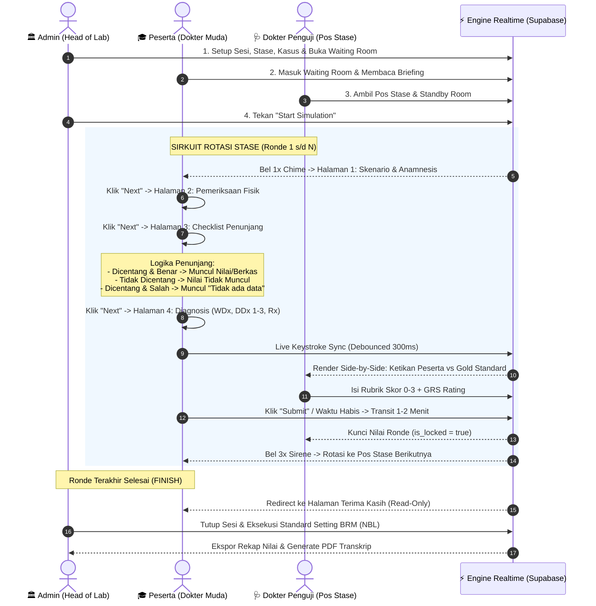

# 📋 Dokumentasi Spesifikasi Fitur & Plotting Task (fitur.md)
**HoLab Praxis — MedSkill OSCE Platform (Phase 1)**  
*Dokumentasi Teknis, Dekomposisi Task Granular, Alur Sistem Terpadu & Acceptance Criteria*  
**PIC:** Fauzan | **Target Release:** Sprint P1 2026 | **Arsitektur:** React + Supabase (Schema `osce`) + WebSockets Realtime

---

## 📑 Daftar Isi
1. [Ringkasan Eksekutif & Metadata Proyek](#1-ringkasan-eksekutif--metadata-proyek)
2. [Pemetaan Alur Pengguna Terintegrasi (End-to-End User Flow)](#2-pemetaan-alur-pengguna-terintegrasi-end-to-end-user-flow)
   - [2.1 Alur Peserta Ujian (Participant Flow)](#21-alur-peserta-ujian-participant-flow)
   - [2.2 Alur Dokter Penguji (Examiner Flow)](#22-alur-dokter-penguji-examiner-flow)
   - [2.3 Alur Administrator / Head of Lab (Admin Flow)](#23-alur-administrator--head-of-lab-admin-flow)
3. [Dekomposisi Detail Fitur & Task List Granular](#3-dekomposisi-detail-fitur--task-list-granular)
   - [TASK-01: Admin CRUD (Master Sesi, Stase, Bank Soal, User)](#task-01-admin-crud-create-read-update-delete)
   - [TASK-02: Landing Page & Portal Publik](#task-02-landing-page--portal-publik)
   - [TASK-03: Role-Based Access Control (RBAC: Admin, Penguji, Peserta)](#task-03-role-based-access-control-rbac)
   - [TASK-04: Dashboard Admin (Overview, Sesi & Kuota Stase)](#task-04-dashboard-admin)
   - [TASK-05: Dashboard Penguji (Station Assignment & Overview Rotasi)](#task-05-dashboard-penguji)
   - [TASK-06: User Interface Blangko Diagnosis Kerja (WDx)](#task-06-user-interface-blangko-diagnosis-kerja-wdx)
   - [TASK-07: User Interface Blangko Diagnosis Banding (DDx 1-3) & Resep](#task-07-user-interface-blangko-diagnosis-banding-ddx--resep)
   - [TASK-08: Live Monitor Realtime Multi-Aktor (Admin ↔ Penguji ↔ Peserta)](#task-08-live-monitor-realtime-multi-aktor)
   - [TASK-09: Time Management Stase & Audio Bell Synthesizer](#task-09-time-management-stase--audio-bell-synthesizer)
   - [TASK-10: OSCE Continuous Rotation User Switch Engine](#task-10-osce-continuous-rotation-user-switch-engine)
   - [TASK-11: Submission Result & Feedback Assessment Engine](#task-11-submission-result--feedback-assessment-engine)
   - [TASK-12: Result PDF Parser, Transkrip & Borderline Regression NBL](#task-12-result-pdf-parser-transkrip--borderline-regression-nbl)
4. [Matriks Checklist Tracking Task & Status Sprint](#4-matriks-checklist-tracking-task--status-sprint)

---

## 1. 🎯 Ringkasan Eksekutif & Metadata Proyek

Platform **Praxis by MedSkill Indonesia** dirancang khusus untuk memfasilitasi ujian **OSCE (Objective Structured Clinical Examination)** berstandar nasional kedokteran (UKMPPD / SOP Fakultas Kedokteran). Sistem ini menghubungkan 3 peran utama dalam satu sirkuit multi-stase sinkron:
- **Administrator (Head of Laboratory)**: Mengontrol master data, parameter rotasi stase, peluncuran simulasi (*Master Timer Engine*), serta publikasi nilai akhir.
- **Dokter Penguji (Examiner)**: Menilai keterampilan klinis peserta secara objektif menggunakan lembar rubrik terbobot dan memantau ketikan jawaban peserta secara *Side-by-Side Realtime*.
- **Peserta Ujian (Participant)**: Menjalankan sirkuit rotasi stase, membaca skenario, meminta pemeriksaan penunjang bersyarat, serta menginput diagnosis dan resep obat dalam kiosk interaktif satu arah (*one-way forward*).

```
┌─────────────────────────────────────────────────────────────────────────────┐
│                          ARSITEKTUR SIRKUIT OSCE                           │
├──────────────────────┬──────────────────────────────┬───────────────────────┤
│    ADMIN CONTROL     │        EXAMINER DESK         │   PARTICIPANT KIOSK   │
│                      │                              │                       │
│  • Master Timer      │  • Station Lock              │  • Skenario Kasus     │
│  • Realtime Presence │  • Live Keystroke View       │  • Penunjang Dinamis  │
│  • Bell / Broadcast  │  • Rubrik 0-3 + GRS Scoring  │  • WDx + DDx 1-3 + Rx │
│  • BRM NBL Standard  │  • Immutable Audit Log       │  • Transit Countdown  │
└──────────────────────┴──────────────────────────────┴───────────────────────┘
```

---

## 2. 🔄 Pemetaan Alur Pengguna Terintegrasi (End-to-End User Flow)

Berikut adalah dekonstruksi alur operasional yang tercantum pada board perancangan:



---

## 3. 🧩 Dekomposisi Detail Fitur & Task List Granular

---

### TASK-01: Admin CRUD (Create, Read, Update, Delete)
* **Kategori / Modul:** Modul Manajemen Master Laboratorium & Kasus OSCE  
* **Tingkat Kesulitan:** `Medium` | **Estimasi:** 1 Hari | **PIC:** Fauzan | **Status:** ✅ Completed

#### 📌 Deskripsi & Konteks Bisnis
Menyediakan antarmuka terpusat bagi Administrator (Head of Laboratory) untuk mengelola master data laboratorium, paket simulasi ujian, stase stasioner, serta bank soal klinis tanpa perlu manipulasi database secara manual.

#### ⚙️ Spesifikasi Teknis & Database
* **Tabel Database Terkait:** `osce.sessions`, `osce.stations`, `osce.rubric_items`, `osce.question_bank`, `osce.station_auxiliary_configs`.
* **Frontend Components:** `frontend/src/pages/admin/CreateSessionPage.jsx`, `frontend/src/pages/admin/CasesPage.jsx`, `frontend/src/components/admin/AdminAuxiliaryExamBuilder.jsx`.
* **Service:** `sessionService.js`, `questionBankService.js`.

#### 📋 Dekomposisi Sub-Fitur Granular
1. **CRUD Master Sesi OSCE**:
   - Pembuatan sesi baru dengan konfigurasi judul, deskripsi, tanggal/waktu mulai, durasi per stase, durasi transit, dan kapasitas gelombang.
   - Edit parameter sesi selama status masih `scheduled` atau `draft`.
   - Soft-delete atau pembatalan sesi ujian.
2. **CRUD Master Stase & Ruangan**:
   - Pembuatan 6 s/d 8 pos stase per sesi (termasuk penandaan Stase Istirahat `is_break = true`).
   - Konfigurasi judul stase, nomor pos fisik, nama pasien simulator/standar, dan instruksi klinis.
3. **CRUD Bank Soal & Rubrik Kompetensi**:
   - Repositori bank soal independen (`osce.question_bank`).
   - Konfigurasi rubrik kompetensi per kasus (Anamnesis, Fisik, Penunjang, Diagnosis, Resep, Komunikasi/Edukasi, Perilaku Profesional) dengan bobot nilai (*weight*).
   - Definisi deskriptor rubrik 4-level (Skor 0, 1, 2, 3) per item.
4. **CRUD Pemeriksaan Penunjang (Auxiliary Exams)**:
   - Katalog penunjang (Laboratorium Darah, Urin, Feses, Radiologi X-Ray/CT, EKG, Patologi).
   - Upload berkas media gambar penunjang ke Supabase Storage bucket `osce-media`.
   - Konfigurasi teks ekspertise medis dan status indikasi kasus (`is_available = true/false`).

---

### TASK-02: Landing Page & Portal Publik
* **Kategori / Modul:** Portal Pengguna & Publik  
* **Tingkat Kesulitan:** `Easy` | **Estimasi:** 1 Hari | **PIC:** Fauzan | **Status:** ✅ Completed

#### 📌 Deskripsi & Konteks Bisnis
Halaman beranda utama yang menyajikan pengenalan ekosistem platform MedSkill Praxis, informasi jadwal simulasi ujian OSCE terdekat, alur pendaftaran dokter muda, serta gateway autentikasi.

#### 📋 Dekomposisi Sub-Fitur Granular
1. **Hero Section & Branding**: Visualisasi profesional bertema kedokteran modern dengan call-to-action (CTA) utama *Masuk ke Kiosk Ujian* dan *Portal Penguji*.
2. **Katalog Simulasi Aktif**: Daftar sesi ujian OSCE yang sedang dibuka atau dijadwalkan.
3. **Panduan SOP Ujian OSCE**: Ringkasan tata tertib sirkuit rotasi stase, aturan pengerjaan form satu arah, dan instruksi bel audio.
4. **Quick Access Barcode / Token Scanner**: Opsi input cepat Token Sesi bagi peserta di area laboratorium.

---

### TASK-03: Role-Based Access Control (RBAC)
* **Kategori / Modul:** Keamanan, Autentikasi & Otorisasi  
* **Tingkat Kesulitan:** `Medium` | **Estimasi:** 1 Hari | **PIC:** Fauzan | **Status:** ✅ Completed

#### 📌 Deskripsi & Konteks Bisnis
Sistem pembagian hak akses granular berbasis 3 aktor utama untuk memastikan kerahasiaan skenario soal, integritas penilaian penguji, dan pembatasan wewenang admin.

#### ⚙️ Matriks Hak Akses & Route Guard

| Role | Target Route | Hak Akses Utama | Larangan Akses |
| :--- | :--- | :--- | :--- |
| **Admin** | `/admin/*` | Full CRUD, Kontrol Timer Live, Standard Setting BRM, Broadcast Darurat, Ekspor Nilai. | Form ujian peserta. |
| **Penguji (Examiner)** | `/examiner/*` | Memilih pos stase tugas, melihat live typing peserta, memberi nilai rubrik 0-3, submit & lock skor. | Modifikasi skenario stase, reset timer global. |
| **Peserta (Participant)** | `/participant/*` | Waiting room, kiosk 4-halaman stase, request penunjang, input diagnosis/resep, transit countdown. | Melihat kunci jawaban/rubrik, membuka stase peserta lain. |

#### 📋 Dekomposisi Sub-Fitur Granular
1. **Supabase Auth Integration**: Otentikasi email/password terintegrasi dengan tabel profil `public.profiles`.
2. **Protected Route Wrapper**: Middleware React Router (`ProtectedRoute.jsx`) yang memverifikasi kecocokan role pengguna sebelum merender halaman.
3. **Row-Level Security (RLS) PostgreSQL**: Penegakan aturan keamanan di level database pada 19 tabel schema `osce` (Peserta hanya bisa membaca jawaban miliknya, Penguji hanya bisa menginput nilai stasenya, Admin memiliki akses bypass).

---

### TASK-04: Dashboard Admin
* **Kategori / Modul:** Modul Administrator  
* **Tingkat Kesulitan:** `Easy` | **Estimasi:** 1 Hari | **PIC:** Fauzan | **Status:** ✅ Completed

#### 📌 Deskripsi & Konteks Bisnis
Pusat komando operasional bagi Head of Laboratory untuk memantau ringkasan statistik ujian, status persiapan sesi, plotting kuota peserta & penguji per gelombang.

#### 📋 Dekomposisi Sub-Fitur Granular
1. **Statistik Metrik Utama**: Total sesi ujian diselenggarakan, jumlah stase aktif, total peserta terdaftar, dan tingkat kelulusan rata-rata.
2. **Tabel Manajemen Sesi OSCE**: List sesi dengan filter status (`scheduled`, `waiting_room`, `ongoing`, `paused`, `completed_waiting`, `completed`).
3. **Plotting Peserta & Penguji Wizard**:
   - Alokasi peserta ke nomor urut Starting Station ($S_0$).
   - Penugasan Dokter Penguji Spesialis ke nomor stase spesifik.
   - Algoritma acak (*randomize*) alokasi peserta untuk mencegah kolusi.
4. **Aksi Cepat (Quick Actions)**: Tombol *Buka Waiting Room*, *Buka Control Room*, *Duplikasi Sesi*, dan *Ekspor Laporan*.

---

### TASK-05: Dashboard Penguji
* **Kategori / Modul:** Modul Dokter Penguji  
* **Tingkat Kesulitan:** `Easy` | **Estimasi:** 1 Hari | **PIC:** Fauzan | **Status:** ✅ Completed

#### 📌 Deskripsi & Konteks Bisnis
Halaman antarmuka khusus dokter penguji untuk memilih stase tempat bertugas, melihat daftar rotasi peserta yang akan masuk ke posnya, dan mengecek kesiapan rubrik penilaian.

#### 📋 Dekomposisi Sub-Fitur Granular
1. **Station Claiming & Selector**: Penguji memilih 1 pos stase tugas dari daftar stase yang tersedia pada sesi aktif.
2. **Jadwal Rotasi Peserta Stase**: Tampilan urutan peserta (Ronde 1 s/d N) yang akan masuk ke pos stase penguji tersebut berdasarkan rumus rotasi sirkuit.
3. **Status Kesiapan (Standby Room)**: Indikator kesiapan koneksi penguji (*Presence status*) sebelum Admin menekan *Start Simulation*.
4. **Preview Skenario & Rubrik Kasus**: Penguji dapat membaca pedoman kasus klinis, anamnesis standar, pemeriksaan fisik baku, dan deskriptor poin rubrik sebelum simulasi dimulai.

---

### TASK-06: User Interface Blangko Diagnosis Kerja (WDx)
* **Kategori / Modul:** Kiosk Ujian Peserta (Halaman 4)  
* **Tingkat Kesulitan:** `Medium` | **Estimasi:** 2-3 Hari | **PIC:** Fauzan | **Status:** ⏳ In Progress / Open

#### 📌 Deskripsi & Konteks Bisnis
Antarmuka input diagnosis kerja utama (*Working Diagnosis*) pada Halaman 4 Kiosk Peserta yang wajib diisi secara akurat berdasarkan temuan anamnesis, pemeriksaan fisik, dan hasil penunjang yang diperoleh.

#### ⚙️ Spesifikasi Fungsional & UI/UX
* **Komponen Input:** Single-line structured text input dengan penanda nomor baku.
* **Placeholder:** `1. [Diagnosis Kerja Utama / Working Diagnosis (WDx)]`.
* **Sinkronisasi Data:** Keystroke auto-save ke `localStorage` instan dan debounced sync (300ms) ke field `osce.participant_answers.working_diagnosis`.
* **State Behavior:** Field otomatis terkunci (*read-only*) saat waktu stase habis atau saat berada di Stase Istirahat (`is_break = true`).

#### 📋 Dekomposisi Sub-Fitur Granular
1. **Standardized Input Formatting**: Input teks dengan proteksi sanitasi karakter dan auto-trim whitespace.
2. **Live Keystroke Indicator**: Indikator visual halus (badge hijau *"Tersimpan"*) yang menandakan data berhasil di-sync ke database.
3. **Side-by-Side Examiner Binding**: Menghubungkan input peserta dengan layar penguji secara realtime untuk disandingkan dengan kunci jawaban baku (*Gold Standard Answer Key*).

---

### TASK-07: User Interface Blangko Diagnosis Banding (DDx 1-3) & Resep
* **Kategori / Modul:** Kiosk Ujian Peserta (Halaman 4)  
* **Tingkat Kesulitan:** `Medium` | **Estimasi:** 2-3 Hari | **PIC:** Fauzan | **Status:** ⏳ In Progress / Open

#### 📌 Deskripsi & Konteks Bisnis
Formulir terstruktur bagi peserta untuk menginput tepat **3 Diagnosis Banding (Differential Diagnosis / DDx)** dan **Lembar Penulisan Resep Obat (Prescription / Rx)** secara terpisah dan terorganisir.

#### ⚙️ Logika Bisnis & Input Fields
1. **Diagnosis Banding 1 (`differential_dx_1`)**: Placeholder `2. [Diagnosis Banding 1]`
2. **Diagnosis Banding 2 (`differential_dx_2`)**: Placeholder `3. [Diagnosis Banding 2]`
3. **Diagnosis Banding 3 (`differential_dx_3`)**: Placeholder `4. [Diagnosis Banding 3]`
4. **Blangko Resep Obat (`prescription_text`)**:
   - Area teks multi-baris (*textarea*) untuk penulisan format standar R/ (Nama Obat, Bentuk Sediaan, Dosis/Kekuatan, Jumlah/Iterasi, Signa/Petunjuk Pakai, Paraf).

#### 📋 Dekomposisi Sub-Fitur Granular
1. **Input Grid Multi-Row**: Layout responsif 3 kolom input DDx yang rapi dan seragam.
2. **Template Bantuan Resep Obat**: Tombol cepat untuk memasukkan format boilerplate `R/ ... S ... dd ... tab ... pc`.
3. **Penanganan Auto-Save & Debounce**: Pengiriman data gabungan `differential_dx_1`, `differential_dx_2`, `differential_dx_3`, dan `prescription_text` ke `osce.participant_answers`.

---

### TASK-08: Live Monitor Realtime Multi-Aktor
* **Kategori / Modul:** Engine Realtime & Central Control Room  
* **Tingkat Kesulitan:** `Hard` | **Estimasi:** 3-4 Hari | **PIC:** Fauzan | **Status:** ⏳ In Progress / Open

#### 📌 Deskripsi & Konteks Bisnis
Infrastruktur WebSocket dua arah berbasis Supabase Realtime Engine yang menghubungkan Admin, Penguji, dan Seluruh Peserta secara simultan selama simulasi berlangsung dengan latensi mendekati nol (*sub-100ms*).

```
┌──────────────────────────────────────────────────────────────────────────────┐
│                    SALURAN REALTIME (CHANNELS) PRAXIS                        │
├────────────────────────────────┬─────────────────────────────────────────────┤
│  osce-session:<sessionId>      │  • Timer updates (target_end_time, phase)   │
│                                │  • Participant keystrokes (live feed)       │
│                                │  • Audio bell broadcast triggers            │
│                                │  • Emergency broadcast messages             │
├────────────────────────────────┼─────────────────────────────────────────────┤
│  osce-presence:<sessionId>     │  • Online / Offline presence heartbeats     │
│                                │  • Active station tracking per participant  │
└────────────────────────────────┴─────────────────────────────────────────────┘
```

#### 📋 Dekomposisi Sub-Fitur Granular
1. **Master Live Monitor Grid (`LiveMonitorPage.jsx`)**:
   - Matriks tabel realtime yang menampilkan status seluruh stase (Pos 1 s/d 8).
   - Status setiap peserta (Nama, Stase aktif, Halaman pengerjaan saat ini, Status koneksi online/offline).
   - Status dokter penguji (Nama, Nilai sudah disubmit / belum, Status penguncian skor).
2. **Side-by-Side Live Typing Engine**:
   - Menghantarkan ketikan teks peserta (WDx, DDx 1-3, Resep) ke layar dokter penguji saat peserta mengetik tanpa perlu me-refresh browser.
3. **Emergency Broadcast System**:
   - Admin dapat mengirim pesan teks darurat ke seluruh layar atau ke role spesifik (`all`, `examiners`, `participants`) yang muncul sebagai toast overlay.
4. **Presence Tracking & Disconnection Handling**:
   - Deteksi otomatis peserta/penguji yang terputus koneksi Wi-Fi dengan indikator visual merah (*offline alert*).

---

### TASK-09: Time Management Stase & Audio Bell Synthesizer
* **Kategori / Modul:** Timer Engine & Sistem Audio SOP OSCE  
* **Tingkat Kesulitan:** `Hard` | **Estimasi:** 3 Hari | **PIC:** Fauzan | **Status:** ⏳ In Progress / Open

#### 📌 Deskripsi & Konteks Bisnis
Engine sinkronisasi waktu terpusat yang mengatur siklus 12 menit per stase (1m Reading, 10m Action, 1m Transition) dilengkapi generator audio bel dan narasi suara otomatis sesuai standar UKMPPD/FK.

#### ⚙️ Arsitektur Future Timestamp Pattern
$$\text{Remaining Seconds} = \max\left(0, \left\lfloor \frac{T_{\text{target\_end\_time}} - T_{\text{local\_now}}}{1000} \right\rfloor\right)$$
* **Keunggulan:** Kebal terhadap *background tab throttling*, latensi jaringan, atau sleep perangkat.

#### 📋 Pemetaan Sinyal Audio & Voiceover Standar OSCE Kedokteran

| Phase / State | Pemicu Waktu | Sinyal Bel | Frekuensi Synthesizer | Narasi Voiceover Indonesia |
| :--- | :--- | :--- | :--- | :--- |
| **Waiting Room** | Admin buka sesi | 🔔 Chime 1x | 880 Hz (A5) | *"Peserta ujian dipersilakan menempatkan diri di depan pintu stase masing-masing."* |
| **Reading Time** | Awal jeda 1 menit | 📖 Ting 1x | 1046 Hz (C6) | *"Silakan membuka dan membaca instruksi skenario kasus di luar pintu stase."* |
| **Start Action** | Detik 00:00 Reading | 🔔🔔 2-Tone | 880 Hz $\rightarrow$ 1174 Hz | *"Waktu membaca selesai. Silakan memasuki ruang stase dan mulailah ujian."* |
| **Warning 2 Min** | Sisa 120 Detik | ⚠️ Warning 2x | 660 Hz (E5) | *"Perhatian, waktu ujian stase tersisa dua menit lagi."* |
| **Rotation Transit** | Detik 00:00 Action | 🚨 Sirene 3x | 523 Hz $\rightarrow$ 987 Hz | *"Waktu ujian stase telah selesai. Peserta dipersilakan berpindah ke pos berikutnya."* |
| **Rest Station** | Masuk Stase Break | ☕ Soft Chime | 587 Hz (D5) | *"Anda memasuki stase istirahat. Silakan memulihkan stamina di area sirkuit."* |
| **Finish Exam** | Akhir Ronde Terakhir| 🎉 Fanfare | Multi-Chord | *"Seluruh rangkaian ujian OSCE telah selesai. Terima kasih atas partisipasi Anda."* |

#### 📋 Dekomposisi Sub-Fitur Granular
1. **Web Audio API Oscillator Engine**: Generator bel independen tanpa dependensi file eksternal (anti gagal load).
2. **Voiceover Player Layer**: Modul audio playback pendamping (`audioService.js`) untuk memutar narasi MP3 SOP medis.
3. **Kontrol Master Admin**: Tombol `Start Simulation`, `Pause Timer`, `Resume Timer`, dan `Skip Phase / Next Round`.

---

### TASK-10: OSCE Continuous Rotation User Switch Engine
* **Kategori / Modul:** Rolling Circuit Engine & Matrix Switcher  
* **Tingkat Kesulitan:** `Hard` | **Estimasi:** 3-4 Hari | **PIC:** Fauzan | **Status:** ⏳ In Progress / Open

#### 📌 Deskripsi & Konteks Bisnis
Algoritma matematika untuk memutar posisi seluruh peserta ($P_1 \dots P_N$) secara berkelanjutan searah jarum jam (*clockwise rotation*) melewati stase klinis aktif dan stase istirahat (*rest stations*) tanpa tabrakan antrean.

#### ⚙️ Formulasi Matematika Rotasi Pos Stase
1. **Posisi Stase Peserta $P_k$ pada Ronde $R$**:
   $$\text{Station Position}(P_k, R) = \left( (S_0 - 1 + (R - 1)) \bmod 8 \right) + 1$$
2. **Peserta yang Diuji Penguji di Stase $S$ pada Ronde $R$**:
   $$S_0 = \left( (S - 1 - (R - 1)) \bmod 8 + 8 \right) \bmod 8 + 1$$

#### 📋 Matriks Rotasi 8 Peserta × 8 Ronde

| Peserta | Starting ($S_0$) | Ronde 1 | Ronde 2 | Ronde 3 | Ronde 4 | Ronde 5 | Ronde 6 | Ronde 7 | Ronde 8 |
| :--- | :---: | :---: | :---: | :---: | :---: | :---: | :---: | :---: | :---: |
| **P1** | Pos 1 | **Stase 1 (U1)** | **Stase 2 (U2)** | **Stase 3 (U3)** | ☕ *Rest A (4)* | **Stase 5 (U4)** | **Stase 6 (U5)** | **Stase 7 (U6)** | ☕ *Rest B (8)* |
| **P2** | Pos 2 | **Stase 2 (U2)** | **Stase 3 (U3)** | ☕ *Rest A (4)* | **Stase 5 (U4)** | **Stase 6 (U5)** | **Stase 7 (U6)** | ☕ *Rest B (8)* | **Stase 1 (U1)** |
| **P3** | Pos 3 | **Stase 3 (U3)** | ☕ *Rest A (4)* | **Stase 5 (U4)** | **Stase 6 (U5)** | **Stase 7 (U6)** | ☕ *Rest B (8)* | **Stase 1 (U1)** | **Stase 2 (U2)** |
| **P4** | Pos 4 | ☕ *Rest A (4)* | **Stase 5 (U4)** | **Stase 6 (U5)** | **Stase 7 (U6)** | ☕ *Rest B (8)* | **Stase 1 (U1)** | **Stase 2 (U2)** | **Stase 3 (U3)** |
| **P5** | Pos 5 | **Stase 5 (U4)** | **Stase 6 (U5)** | **Stase 7 (U6)** | ☕ *Rest B (8)* | **Stase 1 (U1)** | **Stase 2 (U2)** | **Stase 3 (U3)** | ☕ *Rest A (4)* |
| **P6** | Pos 6 | **Stase 6 (U5)** | **Stase 7 (U6)** | ☕ *Rest B (8)* | **Stase 1 (U1)** | **Stase 2 (U2)** | **Stase 3 (U3)** | ☕ *Rest A (4)* | **Stase 5 (U4)** |
| **P7** | Pos 7 | **Stase 7 (U6)** | ☕ *Rest B (8)* | **Stase 1 (U1)** | **Stase 2 (U2)** | **Stase 3 (U3)** | ☕ *Rest A (4)* | **Stase 5 (U4)** | **Stase 6 (U5)** |
| **P8** | Pos 8 | ☕ *Rest B (8)* | **Stase 1 (U1)** | **Stase 2 (U2)** | **Stase 3 (U3)** | ☕ *Rest A (4)* | **Stase 5 (U4)** | **Stase 6 (U5)** | **Stase 7 (U6)** |

#### 📋 Dekomposisi Sub-Fitur Granular
1. **Dynamic Pos Switch Engine**: Otomatis mengganti ID stase aktif dan skenario di browser peserta saat ronde berganti tanpa perlu re-login.
2. **Special Rest Station Handling**:
   - Mendeteksi `is_break = true`.
   - Mengunci seluruh form input peserta (disabled).
   - Menampilkan kartu istirahat dan countdown menuju ronde berikutnya.
3. **Pengalihan Otomatis Penguji**: Layar dokter penguji otomatis me-refresh data dan menyajikan form penilaian untuk peserta yang baru masuk pada ronde tersebut.
4. **Auto-Redirect Sesi Selesai**: Saat Ronde 8 selesai, sistem secara otomatis mengunci seluruh form dan mengarahkan peserta ke Halaman Terima Kasih.

---

### TASK-11: Submission Result & Feedback Assessment Engine
* **Kategori / Modul:** Sistem Penilaian & Feedback Penguji  
* **Tingkat Kesulitan:** `Easy` s/d `Medium` | **Estimasi:** 2 Hari | **PIC:** Fauzan | **Status:** ⏳ In Progress / Open

#### 📌 Deskripsi & Konteks Bisnis
Modul evaluasi terstandarisasi bagi dokter penguji untuk menilai performa peserta per stase dengan rubrik kompetensi terbobot, Global Rating Scale (GRS), serta catatan feedback kualitatif.

#### ⚙️ Skema & Rumus Penilaian
1. **Poin Rubrik Terbobot (Skor 0-3)**:
   - `0` = Tidak dilakukan sama sekali.
   - `1` = Dilakukan sebagian / minimal / tidak sistematis.
   - `2` = Dilakukan cukup / memadai namun belum sempurna.
   - `3` = Dilakukan secara sempurna, sistematis & profesional.
2. **Rumus Skor Stase**:
   $$\text{Earned Score} = \sum (\text{Poin Given}_i \times \text{Bobot}_i)$$
   $$\text{Station Percentage (\%)} = \left( \frac{\text{Earned Score}}{\sum (3 \times \text{Bobot}_i)} \right) \times 100$$
3. **Global Performance Rating (GRS)**:
   - `UNSATISFACTORY`, `BORDERLINE`, `SATISFACTORY`, `SUPERIOR`.
4. **Catatan Feedback Kualitatif**: Textarea untuk feedback perbaikan keterampilan klinis bagi peserta.

#### 📋 Dekomposisi Sub-Fitur Granular
1. **Interactive Tooltip Deskriptor 4-Level**: Menampilkan panduan kriteria objektif saat kursor menyentuh tombol skor 0, 1, 2, atau 3.
2. **Submit & Immutable Lock**: Tombol submit mengunci data (`is_locked = true`) dan memicu pencatatan log audit di `osce.audit_logs`.
3. **Side-by-Side Kunci Jawaban vs Jawaban Peserta**:
   - Membandingkan `working_diagnosis` peserta vs `answer_key_diagnosis`.
   - Membandingkan `prescription_text` peserta vs `answer_key_prescription`.
   - Menampilkan berkas penunjang apa saja yang di-request peserta.

---

### TASK-12: Result PDF Parser, Transkrip & Borderline Regression NBL
* **Kategori / Modul:** Modul Laporan, Parsing Transkrip & Standard Setting NBL  
* **Tingkat Kesulitan:** `Hard` | **Estimasi:** 3 Hari | **PIC:** Fauzan | **Status:** ⏳ In Progress / Open

#### 📌 Deskripsi & Konteks Bisnis
Modul analitik pasca-ujian yang menghitung Nilai Batas Lulus (NBL) per stase menggunakan **Borderline Regression Method (BRM)**, menghasilkan transkrip nilai terperinci per peserta, serta mem-parse hasil ke dokumen PDF berstandar akademik.

#### ⚙️ Formulasi Borderline Regression Method (BRM)
1. **Regresi Linier Sederhana**: Memplot Skor Checklist Terbobot ($Y$) terhadap Nilai Holistik GRS ($X$ di mana Borderline = 2.0):
   $$\hat{Y} = \beta_0 + \beta_1 X$$
2. **Nilai Batas Lulus (NBL / Cut-Off Score)**:
   $$\text{NBL Stase} = \beta_0 + \beta_1(2.0)$$
3. **Penentuan Kelulusan**:
   Peserta dinyatakan **LULUS (PASS)** jika:
   - $\text{Skor Stase Peserta} \ge \text{NBL Stase}$ pada minimal 4 dari 6 stase aktif, **DAN**
   - Nilai Akhir Sesi $\ge$ NBL Global Rata-rata.

#### 📋 Dekomposisi Sub-Fitur Granular
1. **Automated BRM Calculation Engine**: Kalkulasi otomatis nilai batas lulus per stase segera setelah seluruh evaluasi penguji terkunci.
2. **Transkrip Nilai & Radar Chart Kompetensi**:
   - Rincian nilai per stase (Anamnesis, Pemeriksaan Fisik, Penunjang, Diagnosis, Resep, Komunikasi).
   - Visualisasi grafik radar kekuatan/kelemahan kompetensi klinis peserta.
   - Rekap catatan feedback dokter penguji.
3. **PDF Generator & Parser Module**:
   - Pembuatan dokumen PDF resmi transkrip nilai OSCE (`Praxis_Transcript_<NIM>_<Session>.pdf`).
   - Format cetak ramah printer (*print-ready CSS* / PDF Parser library).
4. **Auto-Email Dispatcher**: Pengiriman berkas transkrip PDF langsung ke email peserta terdaftar setelah status sesi di-publish oleh Admin.

---

## 4. 📊 Matriks Checklist Tracking Task & Status Sprint

Tabel berikut merangkum seluruh task hasil plotting, tingkat kesulitan, estimasi, PIC, dan status verifikasi:

| No | Kode Task | Nama Fitur / Modul | Tingkat Kesulitan | Estimasi | Target Selesai | PIC | Status |
|:--:|:---|:---|:---:|:---:|:---:|:---:|:---:|
| **1** | `TASK-01` | **Admin CRUD (Master Sesi, Stase, Bank Soal, User)** | `Medium` | 1 Hari | 12/07/2026 | Fauzan | ✅ Completed |
| **2** | `TASK-02` | **Landing Page & Portal Publik** | `Easy` | 1 Hari | 12/07/2026 | Fauzan | ✅ Completed |
| **3** | `TASK-03` | **Role Based Access Control (Admin, Penguji, User)** | `Medium` | 1 Hari | 12/07/2026 | Fauzan | ✅ Completed |
| **4** | `TASK-04` | **Dashboard Admin (Overview & Kuota Stase)** | `Easy` | 1 Hari | 12/07/2026 | Fauzan | ✅ Completed |
| **5** | `TASK-05` | **Dashboard Penguji (Station Claim & Schedule)** | `Easy` | 1 Hari | 12/07/2026 | Fauzan | ✅ Completed |
| **6** | `TASK-06` | **User Interface Blangko Diagnosis Kerja (WDx)** | `Medium` | 2 Hari | 01/08/2026 | Fauzan | ⏳ In Progress |
| **7** | `TASK-07` | **User Interface Blangko Diagnosis Banding (DDx 1-3) & Resep** | `Medium` | 2 Hari | 01/08/2026 | Fauzan | ⏳ In Progress |
| **8** | `TASK-08` | **Live Monitor Realtime (Admin ↔ Penguji ↔ Peserta)** | `Hard` | 4 Hari | Sprint P1 | Fauzan | ⏳ In Progress |
| **9** | `TASK-09` | **Time Management Stase & Audio Bell Synthesizer** | `Hard` | 3 Hari | Sprint P1 | Fauzan | ⏳ In Progress |
| **10**| `TASK-10` | **OSCE Continuous Rotation User Switch Engine** | `Hard` | 4 Hari | Sprint P1 | Fauzan | ⏳ In Progress |
| **11**| `TASK-11` | **Submission Result & Feedback Assessment Engine** | `Easy-Med` | 2 Hari | Sprint P1 | Fauzan | ⏳ In Progress |
| **12**| `TASK-12` | **Result PDF Parser, Transkrip & Borderline Regression NBL** | `Hard` | 3 Hari | Sprint P1 | Fauzan | ⏳ In Progress |

---

> **Dokumen Resmi Spesifikasi Fitur HoLab Praxis P1**  
> *Single Source of Truth untuk Rekayasa Perangkat Lunak & Tracking Eksekusi Tim Pengembang.*
